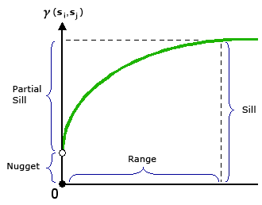
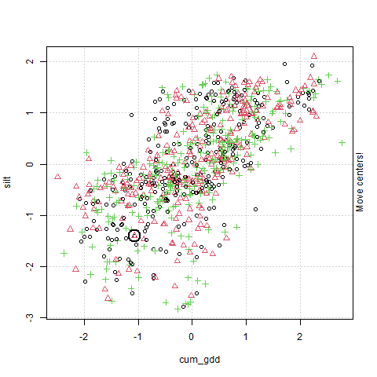

--- 
title: "Data Science for Agricultural Professionals"
author: "Marin L. Harbur"
date: "`r Sys.Date()`"
site: bookdown::bookdown_site
documentclass: book
bibliography: [book.bib]
biblio-style: apalike
link-citations: yes
toc-title: "Table of Contents"
github-repo: 'https://github.com/mharbur/ds-oct21c'
description: "Practical statistics for those involved in agronomy and related agricultural sciences."
---


# Preface{-}
## Welcome{-}
Welcome to Data Science for Agricultural Professionals.  I have written these course materials for a few reasons.  First, it is my job.  The more powerful motivation, however, was to write a guide that satisfied the following criteria:
- covers basic statistics used in reporting results from hybrid trials and other controlled experiments
- also addresses data science tools used to group environments and make predictions
- introduced students to R, an open-source statistical language that you can use after your studies at Iowa State University and can use without installing on your laptop, or using a VPN connection, which your work laptop may not allow.

I also wanted to develop a text that presented statistics around the situations in which you are most likely to encounter data: 
- yield maps used by farmers and agronomists
- side-by-side or split-field trials used often at the retail level
- smaller-plot controlled experiments used in seed breeding and other product development
- rate recommendation trials for fertilizers and crop protection products
- fertilizer prediction maps
- decision support tools

I began my career as an a university researcher and professor, but in 2010 entered the private sector, working first in retail as a technical agronomist for a regional cooperative and then as a data scientist for a major distributor, developing product data and insights for a team of researchers and agronomists.  In seeing how data were used at the retail and industry levels, I gained an appreciation for what areas of statistics were more often used than others.

What is important to the agricultural professional, in my experience, is data literacy and a basic ability to run analyses.  It is easy, after years in the field, to lose skills gained as an undergraduate.  My hope is that all of you upon completing this course will look at statistics you receive (from any source, but especially manufacturers) a little more critically. If you are involved in field research, I hope you will understand how to better layout and more creatively analyze field trials 

I wanted to develop a reference that appreciated not all of us are mathematical progedies, nor do we have flawless memories when it comes to formula.  At the risk of redudancy, I will re-explain formulas and concepts -- or at least provide links -- so you aren't forever flipping back and forth trying to remember sums of squares, standard  errors, etc.  I am committed to making this as painless as possible.

## R-language{-}
In this course, we will use the R language to summarise data, calculate statistics, and view trends and relationships in data.  R is open-source (free) and incredibly versatile.  I have used multiple languages, including SAS and SPSS, in my career; in my opinion, R is not only the cheapest, but the best, and I now use it exclusively and almost daily in my work.  

R also has personal connections to Iowa State: Hadley Wickam, Carson Seivert, two authors of the R language, are Iowa State graduates.

We will use an application called R-Studio to work with R language.  R Studio allows you to write and save scripts (code) to generate analyses.  It also allows you to intersperse Markdown (html code) in between your statistical output so that you can explain and discuss your results.  The beauty of Markdown is your report and your  statistics are together in a single file; no cutting and pasting is needed between documents.

R is all about having options, and so with R-Studio you have the option of installing it on your laptop or, in case you are using a work laptop without administrative priviledges, you can also use a cloud site, R-Studio Cloud, to work with R and save your work.

I know that for most of you R (and coding itself) will be a new experience.  I am sure the idea of coding will intimidate many of you.  To head off your anxiety as much as possible, I offer this: I understand that coding is challenging.  I spend my days making mistakes, searching for bugs, and looking up how to do something for the umpteenth time.  If something confuses you, that is normal.

But I can also assure you that you will likely have an easy time remembering what functions to use.  In other words, which code to use will not be the problem.  Most of your bugs will be due to mispellings, forgetting to close a parentheses, or referring to a dataset by the wrong name, e.g. "soy_data" instead of "soybean_data".  And you will get better at avoiding these mistakes over time -- there is not more to learn, just practice.  Our exercises in R will be designed to give you that practice, and introduce new functions as slowly as possible.

At the end of this course, you will have not only your completed work, but the course materials themselves as a resource from which you can borrow code for future projects.  There is no shame in copying lines of codes (or whole chunks of code) into your own original analyses.  All of us data scientists do that, and it is one of the best ways to continue learning. 

R is supported by many great books which may be accessed for free online, or purchased online for very reasonable prices. These may be used as references during the course, but also to continue learning for years to come. These include many references from bookdown.org:

* Introduction to Data Science: although there are many "Introduction to R" books, this one closely matches how we approach it in Agronomy 513. (https://rafalab.github.io/dsbook/)
* R Graphics Cookbook: a comprehensive explanation of how to create just about any plot you could ever imaging in R, mainly  using the ggplot package. (https://r-graphics.org/)
* Geocomputation with R: The best book I have found for learning how to work with spatial data.  (https://geocompr.robinlovelace.net/)
* Hands-On Machine Learning with R: I have not read this book, but it appears to be a robust and beautifully-illustrated guid to machine learning concepts in R.  (https://bradleyboehmke.github.io/HOML/)


<!--chapter:end:index.Rmd-->

---
editor_options: 
  markdown: 
    wrap: 72
---

# Population Statistics

## Populations

Almost every statistics text begins with the concept of a
**population**. A population is the complete set of individuals to which
you want to predict values. Let's dwell on this concept, as it is
something that did not hit home for me right away in my career. Again,
the population is all of the individuals for which you are interested in
making a prediction. What do we mean by individuals? Not just people --
individuals can plants, insects, disease, livestock or, indeed, farmers.

Just as important as what individuals are in a population is its extent.
What do you want the individuals to represent? If you are a farmer, do
you want to apply the data from these individuals directly to
themselves, or will you use them to make management decisions for the
entire field, or all the fields in your farm? Will you use the results
this season or to make predictions for future seasons? If you are an
animal nutritionist, will you use rations data to support dairy
Herefords, or beef Angus?

If you are a sales agronomist, will you use the data to support sales on
one farm, a group of farms in one area, or across your entire sales
territory? If you are in Extension, will the individuals you measure be
applicable to your entire county, group of counties, or state? If you
are in industry like me, will your results be applicable to several
states?

This is a very, very critical question, as you design experiments -- or
as you read research conducted by others. To what do or will the results
apply? Obviously, an Iowa farmer should not follow the optimum planting
date determined for a grower in North Carolina, nor should an Ohio
farmer assume our pale clays will be as forgiving as the dark, mellow
loam of southern Minnesota.

Drilling down, you might further consider whether research was conducted
in areas that have similar temperature or rainfall, how different the
soil texture might be to the areas to which you want to apply results.
At the farm level, you might ask how similar the crop rotation, tillage,
or planting methods were to that operation. At the field level, you
might wonder about planting date or the hybrid that was sown.

When you use the results from set of individuals to make predictions
about other individuals, you are making inferences -- you are using
those data to make predictions, whether it be for that same field next
month or next year, or for other locations (areas in a field, fields in
a farm, counties, or states). When we speak of an inference space, then,
that is the total group of individuals to which you will apply your
results. Or, in another word, your population.

In summary, one of the most critical skills you can apply with data
science has no formula and, indeed, little to do with math (at least in
our application). It is to ask yourself, will my experiment represent
the entire population in which I am interested? Indeed, one field trial
likely will not address the entire population in which you are
interested -- it is up to you to determine the population to which you
are comfortable applying those results.

In fact, statistics or data science done without this "domain" knowledge
whether a dataset is useful or experimental results are reasonable can
be disastrous. Just because a model fits one dataset very well or
treatments are significantly different does not mean they should be used
to make decisions. Your competency as an agronomic data scientist
depends on everything you learn in your program of study. Soil science,
crop physiology, and integrated pest management, to name just a few
subjects, are as much a prerequisite as any math course you have taken.

In some cases all of the individuals in a population can be measured --
in such case, we will use the basic statistics described in this unit.
The yield map we will analyze in this unit is a loose example of a case
where we can measure

In most cases, however, it is not physically or financially feasible to
measure all individuals in a population. In that case, subsets of the
population, called samples, are used to estimate the range of
individuals in a population.

## Case Study: Yield Map

For our first case study, we will use a situation where every individual
in our population can be measured: a single soybean field in central
Iowa. In this case, yield data were gathered using a combine monitor. In
case you don't live and breathe field crops like me, combines (the
machines that harvest grain) are usually equipped with a scale that
repeatedly weighs grain as the combine moves across the field. The
moisture of the grain is also recorded. These data are combined with
measures of the combine speed and knowledge of the number of rows
harvested at once to calculate the yield per area of grain, adjusted to
the market standard for grain moisture.

Almost all of you have seen a yield map somewhat like the one below. In
this map, blue circles represent lower yields, while yellow and orange
circles represent higher yields.

```{r echo=FALSE, message=FALSE, warning=FALSE}
library(sf)
library(tidyverse)
library(rcompanion)


yield = st_read("data-unit-1/merriweather_yield_map/merriweather_yield_map.shp", quiet=TRUE)

plot(yield["yield_bu"])
  
```

We will learn in the Exercises portion of this lesson how to create a
map like this using just a few lines of code.

Each dataset has a structure -- the way data are organized in columns
and rows. To get a sense of the structure of our soybean dataset, we can
examine the first 6 rows of the dataset using R.

```{r echo=FALSE}
library(kableExtra)
head(yield) %>%
  kbl()


```

Each row in the above dataset is a **case**, sometimes called an
**instance**. It is an single observation taken within a soybean field.
That case may contain one or more **variables**: specific measurements
or observations recorded for each case. In the dataset above, variables
include *DISTANCE*, *SWATHWIDTH*, *VRYIELDVOL*, *Crop*, *WetMass*, and
many others.

The two most important to us in this lesson are *yield_bu* and
*geometry*. That this dataset has a column named geometry indicates it
is a special kind of dataset called a **shape file** -- a dataset in
which the measures are geo-referenced. That is, we know where on Earth
these measurements were taken. The geometry column in this case
identifies a point with each observation.

## Distributions

At this point, we have two options any time we want to know about
soybean yield in this field. We can pull out this map or the complete
dataset (which has over 6,500 observations) and look at try to
intuitively understand the data. Or we can use statistics which, in a
sense, provide us a formula for approximating the values in our dataset
with just a few numbers.

A **distribution** describes the range of values that occur within a
given variable. What is the range of values in our measured values? In
this example, what are the highest and lowest yields we observed? What
ranges of values occur more frequently? Many times, we want to see
whether the distribution of one

### Histograms

Before we get into the math required to generate these statistics,
however, we should look at the shape of our data. What is the range of
values in our measured values? In this example, what are the highest and
lowest yields we observed? What ranges of values occur more frequently?
Do the observed values make general sense?

One of the easiest and most informative things for us to do is to create
a particular bar chart known as a **histogram**.

```{r echo=FALSE, message=FALSE, warning=FALSE}
histogram = hist(yield$yield_bu, breaks = 12)

```

In the histogram above, each bar represents range of values. This range
is often referred to as a *bin*. The lowest bin includes values from 50
to 59.0000. The next bin includes values from 60 to 69.9999. And so on.
The height of each bar represents the **frequency** within each range:
the number of individuals in that population that have values within
that range.

Each bin can also be defined by its **midpoint**. The midpoint is the
middle value in each range. For the bin that includes values from 50 to
50.9999, the midpoint is 55. For the bin that includes values from 60 to
60.9999, the midpoint is 65.

In the plot above, the midpoint for each bar is indicated by the orange
bar beneath it.

```{r echo=FALSE, message=FALSE, warning=FALSE}
x = histogram$mids
y = histogram$counts
hist_data = cbind(x,y) %>%
  as.data.frame()

ggplot(hist_data, aes(x=x, y=y)) +
  geom_bar(stat="identity", fill = "white", color="black", width=5) +
  geom_rug(color="orange", sides = "b", cex=2)


```

There are many ways in which we can draw a histogram -- and other
visualizations -- in R. We will learn more in this course about an R
package called `ggplot2`, which can create just about any plot you might
imagine. Here is a simple taste:

```{r}

ggplot(data=yield, aes(x=yield_bu)) +
  geom_histogram(breaks=seq(50, 110, 10), fill="tomato", color="black")
```

Varying the *bin width* provides us with different perspectives on our
distribution. Wide bins, which each include a greater range of values,
will provide more gross representations of the data, while narrower bins
will provide greater detail. When bins are too narrow, however, there
may be gaps in our histogram where no values occur within particular
bins.

Throughout this course, I have created interactive exercises to help you
better visualize statistical concepts. Often, they will allow you to
observe how changing the variables or the number of observations can
affect a statistical test or visualization.

These exercises are located outside of this textbook. To access them,
please follow links like that below. The exercises may take several
seconds to launch and run in your browser. I apologize for their
slowness -- this is the best platform I have found to date.

Please click on the link below to open an application where you can vary
the bin width and see how it changes your perspective:

<https://marin-harbur.shinyapps.io/01-app-histogram/>

### Percentiles

We can also use **percentiles** to describe the values of a variable
more numerically. Percentiles describe how values the proportional
spread of values, from lowest to highest, within a distribution. To
identify percentiles, the data are numerically ordered (ranked) from
lowest to highest. Each percentile is associated with a number; the
percentile is the percentage of all data equal to or less than that
number. We can quickly generate the 0th, 25th, 50th, and 75th, and 100th
percentile in R:

```{r}
summary(yield$yield_bu)

```

This returns six numbers. The 0th percentile (alternatively referred to
as the minimum) is 55.12 -- this is the lowest yield measured in the
field. The 25th percentile (also called the 1st Quartile) is 74.96. This
means that 25% of all observations were equal to 74.96 bushels or less.
The 50th percentile (also known as the median) was 80.62, meaning half
of all observations were equal to 80.62 bushels or less. 75% of
observations were less than 85.44, the 75th percentile (or 3rd
quartile). Finally, the 100th percentile (or maximum yield) recorded for
this field was 104.95.

We are now gaining a better sense of the range of observations that were
most common. But we can describe this distribution with even fewer
numbers.

### Normal Distribution Model

Let's overlay a curve, representing the **normal distribution**, on our
histogram. You have probably seen or heard of this curve before. Often
it is called a *bell curve*; in school, it is the *Curve* that many
students count on to bring up their grades. We will learn more about
this distribution in *Lesson 2*.

```{r echo=FALSE, message=FALSE, warning=FALSE}
plotNormalHistogram(yield$yield_bu, breaks = 10)
```

In a perfect scenario, our curve would pass through the midpoint of each
bar. This rarely happens with real-world data, and especially in
agriculture. The data may be slightly **skewed**, meaning there are more
individuals that measure above the mean than below, or vice versa.

In this example, our data do not appear skewed. Our curve seems a little
too short and wide to exactly fit the data. This is a condition called
**kurtosis**. No, kurtosis doesn't mean that our data stink; they are
just more spread out or compressed than in a "perfect" situation.

No problem. We can -- and should -- conclude it is appropriate to fit
these data with a normal distribution. If we had even more data, the
curve would likely fit them even better.

Many populations can be handily summarized with the normal distribution
curve, but we need to know a couple of statistics about the data. First,
we need to know where the center of the curve should be. Second, we need
to know the width or dispersion of the curve.

### Measures of Center

To mathamatically describe our distribution, we first need a **measure
of center**. The two most common measures of center are the arithmetic
mean and median. The **mean** is the sum of all observations divided by
the number of observations.

$$\displaystyle \mu = \frac{\sum x_i}{n}$$ The $\mu$ symbol (a u with a
tail) signifies the true mean of a population. The $\sum$ symbol (the
character next to $x_i$ which looks like the angry insect alien from *A
Quiet Place*) means "sum". Thus, anytime you see the $\sum$ symbol, we
are summing the variable(s) to its right. $x_i$ is the value $x$ of the
ith individual in the population. Finally, n is the number of
individuals in the population.

For example, if we have a set of number from 1:5, their mean can be
calculated as:

$$
\frac{1+2+3+4+5}{5} = 3
$$ The mean yield for our field is about 80.09 bushels per acre. This
isrepresented by the red line in the histogram below.

```{r echo=FALSE, message=FALSE, warning=FALSE}
ggplot(data=yield, aes(x=yield_bu)) +
  geom_histogram(breaks=seq(50, 110, 10), fill="grey", color="black") +
  geom_vline(xintercept = mean(yield$yield_bu), color = "red", size=1.5)

```

Earlier, you were introduced to the median. As discussed, the **median**
is a number such that half of the individuals in the population are
greater and half are less. If we have an odd number of individuals, the
median is the "middle" number as the individuals are ranked from
greatest to least.

$$ \{1,2,3,4,5\} \\ median = 3 $$

If we have an even number of measures, the median is the average of the
middle two individuals in the ranking:

$$\{1,2,3,4,5,6\} \\ median = 3.5 $$

Let's add a blue line to our histogram to represent the median.

```{r echo=FALSE, message=FALSE, warning=FALSE}
ggplot(data=yield, aes(x=yield_bu)) +
  geom_histogram(breaks=seq(50, 110, 10), fill="grey", color="black") +
  geom_vline(xintercept = mean(yield$yield_bu), color = "red", size=1.5) +
  geom_vline(xintercept = median(yield$yield_bu), color = "blue", size=1.5)

```

As you can see, they are practically identical. When the mean and median
are similar, the number of individuals measuring greater and less than
the mean are roughly equivalent. In this case, our data can be
represented using the normal distribution.

We also need a statistic that tells us how wide to draw the curve. That
statistic is called a measure of dispersion, and we will learn about it
next.

### Measures of Dispersion

To describe the spread of a population, we use one of three related
**measures of disperson**: sum of squares, variance, and standard
deviation. Although there is a little math involved in these three
statistics, please make yourself comfortable with their concepts because
they are *very* important in this course. Almost every statistical test
we will learn during this course is rooted in these measures of
population width.

#### Sum of Squares

The first measure of population width is the **sum of squares**. This is
the sum of the squared differences between each observation and the
mean. The sum of squares of a measurement x is:

$$\displaystyle S_{xx} = (x_i - \mu)^2$$

Where again $x_i$ is the value $x$ of the $ith$ individual in the
population and $\mu$ is the true mean of a population.

Why do we square the differences between the observations and means?
Simply, if we were to add the unsquared differences they would add to
exactly zero. Let's prove this to ourselves. Let's again use the set of
numbers (1, 2, 3, 4, 5). We can measure the distance of each individual
from the mean by subtracting the mean from it. This difference is called
the residual.

```{r}
sample_data = data.frame(individuals = c(1,2,3,4,5))

library(janitor)
first_resid_table = sample_data %>%
  mutate(mean = 3) %>%
  mutate(residual = individuals - mean) %>%
  mutate(mean = as.character(mean)) 

first_resid_totals = data.frame(individuals = "Total",
                                mean = "",
                                residual = sum(first_resid_table$residual))

first_resid_table %>%
  rbind(first_resid_totals) %>%
  kbl()
```

The first column of the above dataset contains the individual
observations. The second column contains the population mean, repeated
for each observation. The third column is the residuals, which are
calculated by subtracting each observed value from the population mean.

And if we sum these residuals we get zero.

$$ (-2) + (-1) + (0) + (+1) + (+2) = 0 $$

Let's now do this with our field data. The number of residuals (almost
6800) is too many to visualize at once, so we will pick 20 at random.

```{r, sample_yield_residuals}
set.seed(080921)
yield_sample = data.frame(yield = sample(yield$yield_bu, 10))

second_resid_table = yield_sample %>%
  mutate(yield = round(yield,2),
         mean = round(mean(yield),2),
         residual = yield-mean) 

second_resid_totals = data.frame(yield = "Total",
                                mean = "",
                                residual = sum(second_resid_table$residual))

second_resid_table %>%
  rbind(second_resid_totals) %>%
  kbl()


```

If we sum up all the yield residuals, we get -0.04. Not exactly zero,
but close. The difference from zero is the result of rounding errors
during the calculation.

The sum of squares is calculated by squaring each residual and then
summing the residuals. For our example using the set (1, 2, 3, 4, 5):

```{r}
first_squares_table = first_resid_table %>%
  mutate(square = residual^2)

first_squares_totals = data.frame(individuals = "Total",
                                mean = "",
                                residual = "",
                                square = sum(first_squares_table$square))
first_squares_table %>%
  rbind(first_squares_totals) %>%
  kbl()
```

And for our yield data:

```{r}
second_squares_table = second_resid_table %>%
  mutate(square = round(residual^2,2)) %>%
  mutate(residual = round(residual, 2))

second_squares_totals = data.frame(yield = "Total",
                                mean = "",
                                residual = "",
                                square = sum(second_squares_table$square))
second_squares_table %>%
  rbind(second_squares_totals) %>%
  kbl()


```

#### Variance

The sum of squares helps quantify spread: the larger the sum of squares,
the greater the spread of observations around the population mean. There
is one issue with the sum of squares, though: since the sum of square is
derived from the differences between each observation and the mean, it
is also related to the number of individuals overall in our population.
In our example above, the sum of squares was 10.

Now, let's generate a dataset with two 1s, two 2s, two 3s, two 4s, and
two 5s:

```{r}
first_squares_table = first_resid_table %>%
  mutate(square = residual^2)

double_squares_table = first_squares_table %>%
  rbind(first_squares_table)

double_squares_totals = data.frame(individuals = "Total",
                                mean = "",
                                residual = "",
                                square = sum(double_squares_table$square))

double_squares_table %>%
  rbind(double_squares_totals) %>%
  kbl()

```

You will notice the sum of squares increases to 20. The spread of the
data did not change: we recorded the same five values. The only
difference is that we observed each value twice.

The moral of this story is this: given any distribution, the sum of
squares will always increase with the number of observations. Thus, if
we want to compare the spread of two different populations with
different numbers of individuals, we need to adjust our interpretation
to allow for the number of observations.

We do this by dividing the sum of squares, $S_{xx}$ by the number of
observations, $n$. In essence, we are calculating an "average" of the
sum of squares. This value is the variance, $\sigma^2$.

$$\sigma^2 = \frac{S_{xx}}{n}$$ We can calculate the variance as
follows.

In our first example, the set {1,2,3,4,5} had a sum of squares of 10. in
that case, the variance would be:

$$\frac{10}{5} = 2
$$

In our second example, the set {1,2,3,4,5,1,2,3,4,5} had a sum of
squares of 20. In that example, the variance would be

$$
\frac{20}{10} = 2
$$

As you can see, the variance is not affected by the size of the dataset,
only by the distribution of its values.

Later on in this course, we will calculate the variance a little
differently:

$$\sigma^2 = \frac{S_{xx}}{n-1}$$ *n-1* is referred to as the **degrees
of freedom**. We use degrees of freedom when we work with samples
(subsets) of a population. In this unit, however, we are working with
populations, so we will not worry about those.

#### Standard Deviation

Our challenge in using the variance to describe population spread is
it's units are not intuitive. When we square the measure we also square
the units of measure. For example the variance of our yield is measured
in units of bushels^2^. Wrap your head around that one. Our solution is
to report our final estimate of population spread in the original units
of measure. To do this, we calculate the square root of the variance.
This statistic is called the standard deviation, $\sigma$.

$$\sigma = \sqrt{(\sigma^2)}$$

For the dataset {1,2,3,4,5}, the sum of squares is 10, the variance 2,
and the standard deviation is:

$$\sigma = \sqrt{2} = 1.4 $$

For our yield dataset, the sum of squares is 957.29, and based on 10
observations. Our variance is therefore:

$$\sigma^2 = \frac{957.29}{10} = 9.57 \text{ bushels}^2 \text{ / acre}^2$$

Our sum of squares is :

$$ \sqrt{9.57 \text{ bushels}^2 \text{ / acre}^2} = 3.09
\text{ bushels / acre } $$

That is enough theory for this first week of class. The remainder of
this lesson will focus on introducing you to **RStudioCloud**.

<!--chapter:end:01-Introduction-and-Population-Statistics.Rmd-->

# Distributions and Probability

In this unit we will continue with the **normal distribution model** introduced in the previous unit. As you will recall, the normal distribution is a symmetrical curve that represents the frequency with which individuals with different particular measured values occur in a population.

The peak of the curve is located at the population mean, $\mu$. The width of the curve reflects how spread out other individuals are from the mean. We learned three ways to measure this spread: the sum of squares, the variance, and the standard deviation. These statistics can roughly be thought of as representing the sums of the squared differences, the average of the squared distances, and the distances presented in the original units of measure. These four statistics -- mean, sum of squares, variance, and standard deviation -- are among the most important you will learn in this course.

## Case Study

This week, we will continue to work with the Iowa soybean yield dataset introduced to us in Unit 1.

```{r include=FALSE}
library(sf)
library(tidyverse)
library(rcompanion)


yield = st_read("data-unit-2/merriweather_yield_map/merriweather_yield_map.shp")

```

Here again is the structure of this dataset:

```{r}

head(yield)

```

And here is the map of the field:

```{r}
library(sf)
plot(yield["yield_bu"])
```

## The Normal Distribution Model

Mean, sum of squares, variance, and standard deviation are so important because they allow us to reconstruct the normal distribution model. Before we go further, what is a **model**? Is it frightening we are using that term already in the *second chapter of this text*???

Models can be very complex, but in there essence they all have the following in common: they are simplified representations of reality. No, that doesn't mean that models are "fake" (SMH). It means that they summarize aspects of data, both measured and predicted. The normal distribution model describes the relationship between the values of individuals and how frequently they appear in the population. The model is useful because we can use it to approximately reconstruct the dataset at any time by knowing just two things about the original dataset -- its mean and its standard deviation.

### The Bell Curve

The normal distribution curve is often referred to as the *bell curve*, since it is taller in the middle and flared on either side. This shape reflects the tendency of measures within many populations to occur more frequently near the population mean than far from it. Why does this occur and how do we know this?

As agronomists, we can reflect on what it takes to produce a very good -- or very bad crop. For a very good crop, many factors need to coincide: temperature, precipitation, soil texture, rate of nitrogen mineralization, proper seed singulation (spacing during planting), pest control, and hybrid or variety selection, to name just a few. In a typical season or within a field, we might optimize a few of these factors, but the possibility of optimizing every one is exceedingly rare. Thus, if we are measuring yield, measures near the mean yield will occur more frequently. Extremely high yields will occur less frequently.

Conversely, very low yields require we manage a crop very badly or that catastrophic weather conditions occur: a hailstorm, flood, or tornado. A frost at exactly the wrong time during seed germination or, in corn, excessive heat or a drought during pollination or grain fill. A planter box running out of seed or a fertilizer nozzle jamming. These things do occur, but less frequently.

The distribution of individuals around the mean is also a the result of measurement inaccuracies. Carl Friedrich Gauss, who introduced the normal distribution model, showed that it explained the variation among his repeated measurements of the position of stars in the sky. All measurements of continuous data (those that can be measured with a ruler, a scale, a graduated cylinder, or machine) have variation -- we use the term **accuracy** to explain their variation around the population mean.

### Distribution and Probability

Some areas of mathematics like geometry and algebra identify theorems: consistent, proven relationships between variables. In statistics, however, we typically solve for the **probability** that one or more variables are have a given value or range of values. To be more specific, most of the statistical tests we will learn can be reduced to the probability that a particular value is observed in a population. These probabilities include:

-   that a given value or mean is observed for a population; we calculate this using the *normal distribution*.

-   that the the difference between two treatments is not zero; we calculate this using a *t-Test* or *Least Significant Difference* test.

-   that a value will be observed in one variable, given a specific value of another variable; we calculate this using *Linear Regression*.

-   that the spread of individual measures in a population is better predicted by treatment differences than random variation; we calculate this using an *F-test* and *Analysis of Variance*)

Each of these probabilities is calculated from a distribution -- the frequency with which individuals appear in a population. Another way of stating this is that probability is the proportion of individuals in a population that are expected to have values within a given range. Examples could include:

-   the proportion of individual soybean yield measurements, within one field, that are less than 65 bushels per acre

-   the proportion of individual corn fields that have an an average less than 160 bushels per acre

-   the proportion of trials in which the difference between two treatments was greater than zero

-   the proportion of observations in which the actual crop yield is greater than that predicted from a regression model

### Probability and the Normal Distribution Curve

Probability can be calculated as the proportion of the area underneath the normal distribution that corresponds to a particular range of values. We can visualize this, but first we need to construct the normal distribution curve for our soybean field.

We need just two statistics to construct our distribution curve: the mean and standard deviation of our yield. In the last lesson, we learned how easily these both can be calculated in R:

```{r}
library(muStat)
yield_mean = mean(yield$yield_bu)
yield_sd = stdev(yield$yield_bu, unbiased = FALSE)

# to see the value of yield_mean and yield_sd, we just run their names in our code
yield_mean
yield_sd
```

In this lesson's exercise section, we will learn to use R to construct the distribution curve for any population, given the population mean and population standard deviation.

```{r}
library(fastGraph)
plotDist("dnorm", yield_mean, yield_sd)
```

Let's now shade the area underneath the normal curve corresponding to X values from 70 - 80. This area will represent the proportion of the population where individuals were measured to have values between 70 and 80 bushels. We will use a function in R called `shadeDist` to do this. You will learn more about this function this lesson in the exercise section.

```{r}

shadeDist(xshade=c(70,80), ddist = "dnorm", yield_mean, yield_sd, lower.tail = FALSE)


```

Pretty cool, huh? The red area is the proportion of the soybean yield population that was between 70 and 80 bushels/acre. At the top of the output, `shadeDist` has also reported the proportion of the curve represented by that area, which it has labelled *Probability*. The probability in this case is 0.3722. What does that number mean?

The total area of the curve is 100%, or 1.0000. The proportion of the area under the curve that corresponds with yields from 70 to 80 bushels, then, is 37.22 percent of the area. This means that 37.22 percent of the individuals in our yield population had values from 70 and 80 bushels

But wait a second -- why is R using the term *Probability*? Think of it this way. Imagine you sampled 1000 individuals from our population. If 37.22 percent of our individuals have values from 70 to 80 bushels, then about 37% of the individuals in your sample should have values from 70 to 80 bushels. In other words, there is a 37% probability that any individual you select, at random, from the population will have a value from 70 to 80 bushels.

Let's test this. Let's randomly sample 1000 individuals from our population. Then lets count the number of individuals that have yields between 70 and 80 bushels. For the curious, this is how we do this in R. We will run three lines of R code to do this:

-   First, use the `set.seed()` function to specify a certain point in the population where R will begin sampling. R uses an algorithm to choose samples. This is not quite the same thing as random sampling -- be setting a seed, we ensure that we can generate the same "random" set in the future should we need to. Our seed number can be any numeric value; in this case, the date this section was revised.

-   Second, use the `sample` function to randomly sample our population and return a vector of those numbers.

-   Third, use the `subset` function to subset our data into those that meet logical conditions and return a dataframe or vector.

-   Fourth, use the `length` function to count the number of observations.

For everyone else, just understand this is how we came up with the sample of 1000 individuals.

```{r}

# 1) set seed
set.seed(081521)

# 2) take sample
yield_sample = sample(yield$yield_bu, 1000)

# "yield_sample >=70 & yield_sample <=80 tells it to only include measures from 70 to 80 in the subset

# 3) Subset data into values between 70 and 80
yield_subset = subset(yield_sample, yield_sample >=70 & yield_sample <=80)

# 4) Count number of samples in subset
length(yield_subset)
```

Our sample had 1000 individuals. 353, or 35.3%, were had yields between 70 and 80 bushels/acre.

Is the proportion predicted by the normal distribution curve exactly that of the actual population? No. The normal distribution curve is, after all, a model -- it is an approximation of the actual population. In addition, our sample is a subset of the population, not a complete accounting.

We will talk more about sampling in the next unit.

## The Z-Distribution

The relationship between probability and the normal distribution curve is based on the concept of the Z-distribution. In essence, the **Z-distribution** describes a normal distribution curve with a population mean of 0 and a standard deviation of 1.

```{r echo=FALSE}
plotDist("dnorm", 0, 1)
```

The Z-distribution helps us understand how probability relates to standard deviation in a normal distribution, regardless of the nature of a study or its measurement units.

For example, the proportion of a population within one standard deviation of the mean is about 68 percent:

```{r echo=FALSE, message=FALSE, warning=FALSE}
shadeDist(xshade=c(-1, 1), ddist = "dnorm", 0, 1, lower.tail = FALSE)
```

Similarly, the proportion of a population within 1.96 standard deviations of the mean is about 95 percent:

```{r echo=FALSE, message=FALSE, warning=FALSE}
shadeDist(xshade=c(-1.96, 1.96), ddist = "dnorm", 0, 1, lower.tail = FALSE)
```

Conversely, the proportion of a population beyond 1.96 standard deviations from the mean is about 5 percent.

```{r echo=FALSE, message=FALSE, warning=FALSE}
shadeDist(xshade=c(-1.96, 1.96), ddist = "dnorm", 0, 1, lower.tail = TRUE)
```

We refer to the upper and lower ends of the distribution as **tails**. In a normal distribution we would expect about 2.5% of observations to less than -1.96 standard deviations of the mean.

```{r echo=FALSE, message=FALSE, warning=FALSE}
shadeDist(xshade=-1.96, ddist = "dnorm", 0, 1, lower.tail = TRUE)
```

And 2.5% of the population to be more than +1.96 above the mean:

```{r echo=FALSE, message=FALSE, warning=FALSE}
shadeDist(xshade=1.96, ddist = "dnorm", 0, 1, lower.tail = FALSE)
```

### Important Numbers: 95% and 5%

Above we learned that 95% of a normal distribution is between 1.96 standard deviations of the mean, and that 5% of a normal distribution is outside this range. Perhaps these numbers sound familiar to you. Have you ever seen results presented with a 95% confidence interval? Have you ever read that two treatments were significantly different at the *P=0.05* level?

For population statistics, the normal distribution is the origin of those numbers. As we get further into this course, we will learn about additional distributions -- *t* and *F* -- and the unique statistical tests they allow. But the concept will stay the same: identifying whether observed statistical values are more likely to occur (i.e., within the central 95% of values expected in a distribution), or whether the values are unusual (occurring in the remaining 5%).

```{r echo=FALSE, message=FALSE, warning=FALSE}
set.seed(051520)

output = matrix(ncol=1, nrow=100)

for(i in c(1:100)){
  yield_sample = sample(yield$yield_bu, 1000)
  N = length(yield_sample[yield_sample >=80 & yield_sample <=100])
  output[i] = N
}
  
  
  
```

<!--chapter:end:02-Distributions-and-Probability.Rmd-->

---
editor_options: 
  markdown: 
    wrap: 72
---

# Sample Statistics

In the previous two units, we studied populations and how to summarize
them with statistics when the *entire* population was measured. In other
words, the measure of center (mean) and measure of spread (standard
deviation) were the summary of all observations.

In the case of a yield monitor map, these are appropriate statistics. In
most every other agricultural reality, however, we cannot measure every
individual in a population. Instead, we only have enough resources to
collect a **sample** the population, that is, measure a subset of
individuals from the population. In this case, we cannot measure the
exact population mean or population standard deviation of the
population. Instead, we can only estimate them using our **sample mean**
or **sample standard deviation**.

This, of course, raises questions. Was the sample representative of the
population? Would another random sample result in a similar estimate of
the population mean or population standard deviation? And, perhaps, how
much could our sample mean deviate from the population mean?

In other words, there is always uncertainty that statistics calculated
from samples represent the true values of a population. You might even
say we lack complete *confidence* that a sample mean will closely
estimate the population mean.

Enter statistics. By taking multiple sets of samples, and calculating
their means, we can use the differences among those sample means to
estimate the distribution of sample means around the true population
mean. Indeed, this is a fundamental concept of research and statistics
-- using the measured variance of samples to determine how accurate they
are in predicting population statistics.

## Samples

To measure the variation of sample means, we need at least two samples
to compare. Ideally we can gather even more. As we will see, the more
samples included in our estimates of the population mean, the more
accurate we are likely to be.

A second comment, which may seem intuitive, but at the retail level may
be overlooked, is randomization. Samples -- for example individual
plants or areas where yield will be measured -- are ideally selected at
random. In reality, the plants or areas selected for measures may be
less than random. When I used to count weed populations, we used square
quadrats (frames) to consistently define the area that was measured. We
would throw them into different areas of the plot and count weeds where
ever they landed.

The most important thing about selecting samples, however, is that the
researcher work to minimize bias. Bias is when the samples selected
consistently overestimate or underestimate the population mean. The most
egregious example of this would be a researcher who consistently and
purposely sampled the highest- or lowest-measuring parts of a field.

But bias can enter in other ways. For example, if our weed populations
were very uneven, our thrown quadrat might be more likely to skid to a
stop in weedy areas. A researcher might unconsciously choose taller
plants to sample. In August, we might be tempted to sample a corn field
from the edge than walk deep into that sweltering, allergenic hell.

Remember, our goal is to generate estimates of population values that
are as precise and accurate as our resources allow. **Precise** means
our sample means have a low variance around the population mean.
**Accurate** means our sample means are equivalently scattered above and
below the population mean.


## Case Study

Once more, we will work with the Iowa soybean yield dataset from Units 1
and 2.

```{r, yield_dataset, include=FALSE}
library(sf)
library(tidyverse)
library(rcompanion)
library(plotly)

yield = st_read("data-unit-3/merriweather_yield_map/merriweather_yield_map.shp", quiet=TRUE)

```

Let's review the structure of this dataset:

```{r echo=FALSE, message=FALSE, warning=FALSE}

head(yield)

```

And map the field:

```{r echo=FALSE, message=FALSE, warning=FALSE}
plot(yield["yield_bu"])
```

In Unit 2, we learned to describe these data using the normal
distribution model. We learned the area under the normal distribution
curve corresponds to the proportion of individuals within a certain
range of values. We also discussed how this proportion allows inferences
about probability. For example, the area under the curve that
corresponded with yields from 70.0 to 79.9 represented the proportion of
individuals in the yield population that fell within that yield range.
But it also represented the probability that, were you to measure
individual points from the map at random, you would measure a yield
between 70.0 and 79.9.

## Distribution of Sample Means

In the last unit, we sampled the yield from 1000 locations in the field
and counted the number of observations that were equal to or greater
than 70 and equal to or less than 80.

What would happen if we only sampled from one location. What would be
our sample mean and how close would it be to the population mean?

In the histograms below, the red vertical line marks the population
mean. The blue line marks the sample mean.

```{r}
set.seed(1771)
yield_sample = sample(yield$yield_bu, 1) %>%
      as.data.frame()
names(yield_sample) = c("yield")
ggplot(yield_sample, aes(x=yield)) +
  geom_histogram(fill="white", color="black") +
  geom_vline(xintercept = mean(yield$yield_bu), color = "red") +
  geom_vline(xintercept = mean(yield_sample$yield), color = "blue") +
  lims(x=c(55,105))
```

With one sample, our sample mean is about 8 bushels above the population
mean. What would happen if we sampled twice?

```{r echo=FALSE, message=FALSE, warning=FALSE}
set.seed(1771)
yield_sample = sample(yield$yield_bu, 2) %>%
      as.data.frame()
names(yield_sample) = c("yield")
ggplot(yield_sample, aes(x=yield)) +
  geom_histogram(fill="white", color="black") +
  geom_vline(xintercept = mean(yield$yield_bu), color = "red") +
  geom_vline(xintercept = mean(yield_sample$yield), color = "blue") +
  lims(x=c(55,105))
```

Our sample mean is now about 2 bushels greater than the population mean.
What would happen if we sampled four times?

```{r echo=FALSE, message=FALSE, warning=FALSE}
set.seed(1771)
yield_sample = sample(yield$yield_bu, 4) %>%
      as.data.frame()
names(yield_sample) = c("yield")
ggplot(yield_sample, aes(x=yield)) +
  geom_histogram(fill="white", color="black") +
  geom_vline(xintercept = mean(yield$yield_bu), color = "red") +
  geom_vline(xintercept = mean(yield_sample$yield), color = "blue") +
  lims(x=c(55,105))
```

Our sample mean is now about 1 bushel greater than the population mean.
What would happen if we sampled 15 times?

```{r echo=FALSE, message=FALSE, warning=FALSE}
set.seed(1771)
yield_sample = sample(yield$yield_bu, 15) %>%
      as.data.frame()
names(yield_sample) = c("yield")
ggplot(yield_sample, aes(x=yield)) +
  geom_histogram(fill="white", color="black") +
  geom_vline(xintercept = mean(yield$yield_bu), color = "red") +
  geom_vline(xintercept = mean(yield_sample$yield), color = "blue") +
  lims(x=c(55,105))
```

The sample mean and population mean are almost equal.

Click on this link to access an app to help you further understand this
concept:

<https://marin-harbur.shinyapps.io/03-sampling_from_normal_distn/>

## Central Limit Theorem

The **Central Limit Theorem** states that sample means are normally
distributed around the population mean. This concept is powerful because
it allows us to calculate the probability that that a sample mean is a
given distance away from the population mean. In our yield data, for
example, the Central Limit Theorem allows us to assign a probability
that we would observe a sample mean of 75 bushels/acre, if the
population mean is 80 bushels/acre. More on how we calculate this in a
little bit.

In our yield dataset, the population data are approximately normally
distributed. It makes sense that the sample means would be normally
distributed, too. But the Central Limit Theorem shows us that our sample
means are likely to be normally distributed even if the population *does
not* follow a perfect normal distribution.

Let's take this concept to the extreme. Suppose we had a population
where every value occurred with the same frequency. This is known as a
uniform distribution. Click on the following link to visit an app where
we can explore how the sample distribution changes in response to
sampling an uniform distribution:

<https://marin-harbur.shinyapps.io/03-sampling-from-uniform-distn/>

You will discover that the sample means are normally distributed around
the population mean even when the population itself is not normally
distributed.

## Standard Error

When we describe the spread of a normally-distributed population -- that
is, all of the individuals about which we want to make inferences -- we
use the population mean and standard deviation.

When we sample (measure subsets) of a population, we again use two
statistics. The **sample mean** describes the center of the samples..
The spread of the sample means is described by the **standard error of
the mean** (often abbreviated to **standard error**). The standard error
is related to the standard deviation as follows:

$$SE = \frac{\sigma}{\sqrt n} $$

The standard error, SE, is equal to the standard deviation ($\sigma$),
divided by the square root of the number of samples ($n$). This
denominator is very important -- it means that our standard error
shrinks as the number of samples increases. Why is this important?

A sample mean is an estimate of the true population mean. The
distribution of sample means the range of possible values for the
population mean. I realize this is a fuzzy concept. This is the key
point: by measuring the distribution of our sample sample means, we are
able to describe the probability that the population mean is a given
value.

To better understand this, please visit this link:

<https://marin-harbur.shinyapps.io/03-sample-distn/>

If you take away nothing else from this lesson, understand whether you
collect 2 or 3 samples has tremendous implications for your estimate of
the population mean. 4 samples is much better than 3. Do everything you
can to fight for those first few samples. Collect as many as you can
afford, especially if you are below 10 samples.

## Degrees of Freedom

In Unit 1, the section on variance briefly introduced **degrees of
freedom**, the number of observations in a population or sample, minus
1. Degrees of Freedom are again used below in calculating the
**t-distribution**. So what are they and why do we use them? Turns out
there are two explanations.

In the first explanation, *degrees of freedom* refers to the number of
individuals or samples that can vary independently given a fixed mean.
So for an individual data point to be free, it must be able to assume
any value within a given distribution. Since the population mean is a
fixed number, only $n-1$ of the data have the freedom to vary. The last
data point is determined by the value of all the other data points and
the population mean.

Confusing, huh? Who starts measuring samples thinking that the data
point is fixed, in any case? But if you think about it, the purpose of
the sample is approximate a real population mean out there -- which is
indeed fixed. It's just waiting for us to figure it out. So if our
sample mean is equal to the population mean (which we generally assume),
then the sample mean is also fixed. But it is a very weird way of
thinking.

Yet this is the answer beloved by all the textbooks, so there you go.

The second answer I like better: samples normally *underestimate* the
true population variance. This is because the sample variance is
calculated from the distribution of the data around the sample mean.
Sample data will always be closer to the sample mean -- which is by
definition based on the data themselves -- then the population mean.

Think about this a minute. Your sample data could be crazy high or low
compared to the overall population. But that dataset will define a mean,
and the variance of the population will be estimated from that mean. In
many cases, it turns out that using $n-1$ degrees of freedom will
increase the value of the sample variance so it is closer to the
population variance.

## The t-Distribution

In the last unit, we used the *Z-distribution* to calculate the
probability of observing an individual of a given value in a population,
given its population mean and standard deviation. Recall that about 68%
of individuals were expected to have values within one standard
deviation, or *Z*, of the population mean. Approximately 95% of
individuals were expected to have values within 1.96 standard deviations
of the population mean. Alternatively, we can ask what the probability
is of observing individuals of a particular or greater value in the
population, given its mean and standard deviation.

We can ask a similar question of our sample data: what is the
probability the population mean is a given value or greater, given the
sample mean? As with the Z-distribution, the distance between the sample
mean and hypothesized population mean will determine this probability.

There is one problem, however, with using the Z-distribution: it is only
applicable when the population standard deviation is *known*. When we
*sample* from a population, we do not know it's true standard deviation.
Instead, we are estimating it from our samples. This requires we use a
different distribution: the t-distribution.

Unlike the Z-distribution, the **t-distribution** changes in shape as
the number of samples increases. Notice in the animation above that,
when the number of samples is low, the distribution is wider and has a
shorter peak. As the number of samples increases, the curve becomes
narrower and taller. This has implications for the relationship between
the distance of a hypothetical population mean from the sample mean, and
the probability of it being that distant.

We can prove this to ourselves with the help of the `shadeDist()`
function we used in Unit 2. You will learn how to plot the
t-distribution in an exercise this week.

```{r echo=FALSE, message=FALSE, warning=FALSE}
library(fastGraph)
shadeDist( c(-1, 1), "dt", parm2 = 4, lower.tail = FALSE )
```

With 4 degrees of freedom, there is about a 63% probability the
population mean is within 1 standard error of the mean. Let's decrease
the sample mean to 3 degrees of freedom

```{r echo=FALSE, message=FALSE, warning=FALSE}
library(fastGraph)
shadeDist( c(-1, 1), "dt", parm2 = 3, lower.tail = FALSE )
```

With only 3 degrees of freedom (4 samples), there is only a 61%
probability the population mean is within one standard error of the
mean. What if we only had one degree of freedom (two samples)?

```{r echo=FALSE, message=FALSE, warning=FALSE}
library(fastGraph)
shadeDist( c(-1, 1), "dt", parm2 = 1, lower.tail = FALSE )
```

You should see the probability that the population mean is within 1
standard error of the sample mean falls to 50%.

If we have 10 degrees of freedom (11 samples), the probability increases
to about 66%.

```{r echo=FALSE, message=FALSE, warning=FALSE}
library(fastGraph)
shadeDist( c(-1, 1), "dt", parm2 = 10, lower.tail = FALSE )
```

With 30 degrees of freedom the probability the population mean is within
1 standard error of the sample mean increases to 67%.

```{r echo=FALSE, message=FALSE, warning=FALSE}
library(fastGraph)
shadeDist( c(-1, 1), "dt", parm2 = 30, lower.tail = FALSE )
```

With 50 degrees of freedom (51 samples) the probability is about 68%. At
this point, the t-distribution curve approximates the shape of the
z-distribution curve.

```{r echo=FALSE, message=FALSE, warning=FALSE}
library(fastGraph)
shadeDist( c(-1, 1), "dt", parm2 = 50, lower.tail = FALSE )
```

We can sum up the relationship between the t-value and probability with
this plot. The probability of the population mean being within one
standard error of the population mean is represented by by the red line.
The probability of of the population mean being within 2 standard errors
of the mean is represented by the blue line. As you can see, the
probability of the population mean being within 1 or 2 standard errors
of the sample mean *increases* with the degrees of freedom (df). Exact
values can be examined by tracing the curves with your mouse.

```{r echo=FALSE, message=FALSE, warning=FALSE}

df = data.frame(df = c(1:50)) 

p_from_tdf = df %>%
  mutate(p1 = ((pt(1, df)) -0.5) * 2) %>%
  mutate(p2 = ((pt(2, df)) -0.5) * 2) %>%
  gather(t, p, p1, p2) %>%
  mutate(t=gsub("p", "", t)) 
  


p = p_from_tdf %>%
  ggplot(aes(x=df, y=p, group=t)) +
  geom_point(aes(color=t))
ggplotly(p)
```

Conversely, the t-value associated with a given proportion or
probability will also decrease as the degrees of freedom increase. The
read line represents the t-values that define the area with a 68% chance
of including the population mean. The blue line represents the t-values
that define the area with a 95% chance of including the population mean.
Exact values can be examined by tracing the curves with your mouse.
Notice the t-value associated with a 68% chance of including the
population mean approaches 1, while the t-value associated with a 95%
chance approaches about 1.98.

```{r echo=FALSE, message=FALSE, warning=FALSE}

df = c(2:100) %>%
  as.data.frame()
names(df) = "df"


t_from_pdf = df %>%
  mutate(t68 = qt(0.84, df)) %>%
  mutate(t95 = qt(0.975, df)) %>%
  gather(p, t, t68, t95) %>%
  mutate(p=gsub("t", "", p)) 

p = t_from_pdf %>%
  ggplot(aes(x=df, y=t, group=p)) +
  geom_point(aes(color=p))
ggplotly(p)

```

*Takeaway:* the number of samples affects not only the standard error,
but the t-distribution curve we use to solve for the probability that a
value will occur, given our sample mean.

## Confidence Interval

The importance of the number of samples the standard error, and the
t-distribution becomes even more apparent with the use of confidence
interval. A **confidence interval** is a range of values around the
sample mean that are selected to have a given probability of including
the true population mean. Suppose we want to define, based on a sample
size of 4 from the soybean field above, a range of values around our
sample mean that has a 95% probability of including the true sample
mean.

The 95% confidence interval is equal to the sample mean, plus and minus
the product of the standard error and t-value associated with 0.975 in
each tail:

$$CI = \bar x + t \times se$$

Where $CI$ is the confidence interval, $\bar{x}$ is the sample mean, $t$
is determined by desired level of confidence (95%) and degrees of
freedom, and $se$ is the standard error of the mean

Since the t-value associated with a given probability in each tail
decreases as the degrees of freedom increase, the confidence interval
narrows as the degrees of freedom increase -- even when the standard
error is unaffected.

Lets sample our yield population 4 times, using the same code we did
earlier. Although I generally try to confine the coding in this course
to the exercises, I want you to see how we calculate the confidence
interval:

1.  Let's set the seed using `set.seed(1776)`. When R generates what we
    *call* a random sample, it actually uses a very complex algorithm
    that is generally unknown to the user. The **seed** determines where
    that algorithm starts. By setting the seed, we can duplicate our
    random sample the next time we run our script. That way, any
    interpretations of our sample will not change each time it is
    recreated.

```{r echo=TRUE, message=FALSE, warning=FALSE}
# setting the seed the same as before means the same 4 samples will be pulled
set.seed(1776)
```

2.  Now, let's take 4 samples from our population using the `sample()`
    function. That function requires has arguments. First,
    `yield$yield_bu` tells R to sample the `yield_bu` column of the
    `yield` data.frame. The second argument, `size=4`, tells R to take
    four samples.

```{r echo=TRUE, message=FALSE, warning=FALSE}
# collect 4 samples 
yield_sample = sample(yield$yield_bu, size=4) 
#print results
yield_sample
```

3.  Next, we can calculate our sample mean and sample standard
    deviation. We will assign these values to the objects `sample_mean`
    and `sample_sd`.

    ```{r}
    sample_mean = mean(yield_sample)
    sample_sd = sd(yield_sample)

    sample_mean
    sample_sd
    ```

4.  Finally, we can calculate the standard error, by dividing
    `sample_sd` by the square root of the number of observations in the
    sample, 4 . We assign this value to the object `sample_se`.

```{r echo=TRUE, message=FALSE, warning=FALSE}
sample_se = sd(yield_sample)/sqrt(4)

sample_se
```

5.  At this point, we have everything we need to calculate the
    confidence interval except the t-value. The middle 95% of the of the
    population will look like this:

    ```{r echo=FALSE, message=FALSE, warning=FALSE}
    library(fastGraph)
    shadeDist( c(-3.182, 3.182), "dt", parm2 = 3, lower.tail = FALSE )
    ```

    There will be about 2.5% of the distribution above this range and
    2.5 below it. We can calculate the t-values that define the upper or
    lower boundary of the middle 95% using the `qt()` function. `qt()`
    contains two arguments. `p=0.975`tells R we want the t-value *below*
    which 97.5% of the t-distribution occurs. `df=3` tells R we want the
    t-value associated with 3 degrees of freedom.

    ```{r}
    # t-value associated with 3 df
    upper_t = qt(p=0.975, df=3)
    upper_t
    ```

6.  Our lower limit is the t-value *below* which only 2.5% of the
    t-distribution occurs.

    ```{r echo=FALSE, message=FALSE, warning=FALSE}
    # t-value associated with 3 df
    lower_t = qt(p=0.025, df=3)
    lower_t
    ```

    You will notice that "lower_t", the t-value that measures from the
    sample mean to the lower limit of the confidence interval, is just
    the negative of "upper_t". Since the normal distribution is
    symmetrical around the mean, we can just determine the upper limit
    and use its negative as the lower limit of our confidence interval.

7.  We can then calculate our upper confidence limit. The upper limit of
    the confidence interval is equal to:

    $$
    \text{Upper CL} = \bar{x} + t \cdot SE
    $$

    Where $\bar{x}$ is the sample mean, $t$ is the t-value associated
    with the upper limit, and $SE$ is the standard error of the mean.

```{r}
upper_limit = sample_mean + upper_t*sample_se
upper_limit
```

8.  We can repeat the process to determine the lower limit.

```{r}
lower_limit = sample_mean + lower_t
lower_limit

```

9.  Finally, we can put this all together and express it as follows. The
    confidence interval for the population mean, based on the sample
    mean is:

$$ CI = 81.6 \pm 3.2 $$

We can also express the interval by its lower and upper confidence
limits. $$(78.5, 85.4)$$ We can confirm this interval includes the true
population mean, which is 80.1.

## Confidence Interval and Probability

Lets return to the concept of **95% confidence**. This means if we were
to collect 100 sets of 4 samples each, 95% of them would estimate
confidence intervals that include the true population mean. The
remaining 5% would not.

Click on this link to better explore this concept:

<https://marin-harbur.shinyapps.io/03-confidence-interval/>

Again, both the standard error and the t-value we use for calculating
the confidence interval decrease as the number of samples increase, so
the confidence interval itself will decrease as well.

Click on the link below to explore how the size (or range) of a
confidence interval changes with the number of samples from which it is
calculated:

<https://marin-harbur.shinyapps.io/03-sample-size-conf-interval/>

As the number of samples increases, the confidence interval shrinks. 95
out of 100 times, however, the confidence interval will still include
the true population mean. In other words, as our sample size increases,
our sample mean becomes less biased (far to either side of the
population mean), and it's accuracy (the proximity of the sample mean to
the population mean) increases. In conclusion, the greater the number of
samples, the better our estimate of the population mean.

In the next unit, we will use these concepts to analyze our first
experimental data: a side by side trial where we will us the confidence
interval for the difference between two treatments to test whether they
are different.

<!--chapter:end:03-Sample-Statistics.Rmd-->

---
output:
  pdf_document: default
  html_document: default
---


# Two-Treatment Comparisons

Until now, we have worked with a single population. To recap our
progress: -

-   In Unit 1, we learned a **population** is a complete group of
    individuals for which we wanted to develop a summary or prediction.
    We learned to describe the center of this population with the
    population mean and its spread using the sum of squares, variance,
    and standard deviation.

-   In Unit 2, we used the **normal distribution** model to describe the
    pattern with which individuals in many populations are spread around
    the mean. Individuals closer in value to the population mean were
    predicted to occur more frequently that that were further in value.
    Based on the frequency with which values were predicted to occur, we
    calculated the probability an individual from that population would
    fall within a given range of values.

-   In Unit 3, we worked with **samples**, subsets drawn from a
    population. We saw how sample means are normally distributed,
    regardless of the population distribution from which they come. The
    standard error describes the spread of individual samples around the
    sample mean. This distribution was modeled with the t-distribution,
    which is wider when the number of samples is low and taller when the
    number of samples was greater.

## Side-by-Side Trials

In this unit, we will finally put our statistical knowledge to work to
test treatment differences. We will work with a simple but important
experimental design -- the two-treatment comparison. Here in Ohio, this
is referred to as a side-by-side trial, but you may have a different
term for it where you work. If you work in retail agronomy, you have
probably conducted these trials. Typically, you would split one or more
fields into treated and untreated fields. For example, you might
"stripe" an individual field with treated and untreated areas:

```{r echo=FALSE, message=FALSE, warning=FALSE}
library(tidyverse)
x = c(1:8)
y = 1
trt = c(1,2,1,2,2,1,1,2)
dataset = cbind(x,y, trt) %>%
  as.data.frame() %>%
  mutate(trt = as.factor(trt))

dataset %>%
  ggplot(aes(x=y, y=x, group=trt)) +
  geom_tile(aes(fill=trt), color="grey", size=2) +
  geom_text(aes(x=y, y=x, label=paste("treatment", trt)), size=10) +
  scale_fill_manual(values=c("white", "grey")) +
  theme(legend.position = "none") +
  labs(x=NULL, y=NULL)


```

Or, you might divide multiple fields in half like this:

```{r, echo=FALSE, warning=FALSE, message=FALSE}
x = c(1,2,1,2,1,2,1,2)
y = 1
trt = c(1,2,1,2,2,1,1,2)
field=(c(1,1,2,2,3,3,4,4))
dataset = cbind(x,y, trt, field) %>%
  as.data.frame() %>%
  mutate(trt = as.factor(trt))

dataset %>%
  ggplot(aes(x=y, y=x, group=trt)) +
  geom_tile(aes(fill=trt), color="grey", size=2) +
  geom_text(aes(x=y, y=x, label=paste("treatment", trt)), size=10) +
  scale_fill_manual(values=c("white", "grey")) +
  theme(legend.position = "none") +
  labs(x=NULL, y=NULL) + 
  facet_wrap(field ~ .)

```

In either case, a side-by-side trial deals with two treatments and can
be analyzed using a t-test. In these next two units we will compare
different designs for side-by-side (or paired) trials, use R to randomly
assign treatments, understand how the t-distribution allows us to test
for significance, and run these tests in R.

## Blocked Design

In Unit 1 we learned the hallmarks of a designed trial are the
**randomization** and **replication** of treatments. Each treatment
should be observed several times in different experimental units. In our
work, often **experimental unit** is a fancy termfor a plot, half a
field, or a pot.

Observing the treatment several times has two benefits. First, the
average of those observations -- the sample mean -- will likely be
closer to the true population average for that treatment than the
individual observations. Second, variation among the observations can be
used to give us a sense how much environmental factors -- in contrast
with our treatment -- cause our observations to vary.

It is also important to randomize treatments in order to reduce
intentional or unintentional biases that might skew our interpretation
of results. For example, one treatment might be biased by always putting
it to the north of another treatment or, more insidiously, in the better
half of a field. Deliberate randomization reduces the probability of
either scenario.

That said, reality sometimes intervenes intervenes. Soil types change
across a field, as do microclimates around field edges and management
histories (e.g. an old feedlot). Though randomization reduces the
likelihood that treatments are concentrated in one areas, it may not
produce as even a distribution of treatments across the experimental
area as we would like. We could conceivably end up with all replicates
of a treatment level concentrated in one half of the field:

```{r, echo=FALSE, warning=FALSE, message=FALSE}
library(tidyverse)

x = c(1:8)
y = 1
trt = c(1,1,1,1,2,2,2,2)
dataset = cbind(x,y, trt) %>%
  as.data.frame() %>%
  mutate(trt = as.factor(trt))

dataset %>%
  ggplot(aes(x=y, y=x, group=trt)) +
  geom_tile(aes(fill=trt), color="grey", size=2) +
  geom_text(aes(x=y, y=x, label=paste("treatment", trt)), size=10) +
  scale_fill_manual(values=c("white", "grey")) +
  theme(legend.position = "none") +
  labs(x=NULL, y=NULL)
```

Similarly, if we are using multiple fields, both halves of a field could
receive the same treatment in a randomized design

```{r, echo=FALSE, warning=FALSE, message=FALSE}
x = c(1,2,1,2,1,2,1,2)
y = 1
trt = c(1,1,1,2,2,1,2,2)
field=(c(1,1,2,2,3,3,4,4))
dataset = cbind(x,y, trt, field) %>%
  as.data.frame() %>%
  mutate(trt = as.factor(trt))

dataset %>%
  ggplot(aes(x=y, y=x, group=trt)) +
  geom_tile(aes(fill=trt), color="grey", size=2) +
  geom_text(aes(x=y, y=x, label=paste("treatment", trt)), size=10) +
  scale_fill_manual(values=c("white", "grey")) +
  theme(legend.position = "none") +
  labs(x=NULL, y=NULL) + 
  facet_wrap(field ~ .)

```

**Blocked** experimental designs place a restriction on the random
assignment of treatments to plots. Instead of assigning treatments
randomly within a field or across a state. We instead force both
treatments to occur within a field section or in the same field, so that
our treatment maps look more those we showed in the first two figures of
this unit.

Here is another way to think about this:

-   Our statistical test this week is based on comparing samples from
    two populations, the control population and the population receiving
    starter.

-   We want to design our experiment so that aside from the effect of
    the treatment, the two populations are as identical as possible.

The blocked approach, in general, helps create two populations that are
similar.

In the exercise **exercise_randomizing_plots** in R, you will learn how
to design your own blocked two-treatment trial.

## Case Study

An in-furrow corn starter (*6-24-6 plus micronutrients*) was tested
against a control (*no starter*) in a trial in western Ohio. Treatments
were blocked (paired) so that each treatment occurred once per block.
Plot numbers are given on the x-axis of the map below. There were 10
blocks. The data are in a data.frame named "corn_starter".

```{r}
corn_starter = read.csv("data-unit-4/corn_starter.csv")

```

```{r, echo=FALSE, warning=FALSE, message=FALSE}
corn_starter %>%
  mutate(hpos = row_number()) %>%
  ggplot(aes(x=hpos, y=1, group=treatment)) +
  geom_tile(aes(fill=treatment), color="grey") +
  geom_text(aes(x=hpos, y=1, label=treatment), size=6, angle=270) +
  scale_fill_manual(values=c("white", "grey")) +
  theme(legend.position = "none") +
  labs(x=NULL, y=NULL) + 
  theme(axis.text = NULL,
        axis.ticks = NULL)
```

Here are the first six rows of our dataset.

```{r}
head(corn_starter)
```

Note the column headings: *treatment* refers to the treatment level
(Control or Starter) and *yield* refers to the measured yield.

Let's make a quick histogram plot of the data using ggplot. For the
first time, in this unit, we are working with samples from two
populations: the control and treatment populations. We will have
separate histograms for each set of samples.

```{r, corn_starter_bar_plot}
ggplot(data = corn_starter, aes(x=yield)) +
  geom_histogram() +
  facet_grid(~treatment)
```

The mean yield of the sample from the population that received starter
is greater than the mean yield of the sample of the population that
received the control (no starter).

```{r}
corn_starter %>%
  group_by(treatment) %>%
  summarise(yield = mean(yield))
```

Instead of studying the control and treatment sample sets independently,
however, we can restructure our dataset to analyze it another way. Data
set structure describes how our columns and rows are organized. Do our
treatment levels, for example, differ down rows or across columns? In
the dataset above, for example, our two treatment levels (*control* and
*starter)* vary among rows in the *treatment* column.

When we **restructure** a dataset, we rearrange it so that values that
formally varied among rows vary across columns, or vice versa. If you
have every used a *PivotTable* in *Excel*, you have restructured data.
In **exercise_restructuring_data** in RStudio, you will learn how to
similarly restructure data in R.

In our case study, we will restructure the treatment column by
separating its values among two new columns, *control* and *starter*. We
will create a new *difference* column by subtracting the yield of the
control plot from the yield of the starter plot in each block. By doing
this, each block is now summarized by one value, the difference between
treatments.

```{r, echo=FALSE, warning=FALSE, message=FALSE}
corn_differences = corn_starter %>%
  select(-plot) %>%
  spread(treatment, yield) %>%
  mutate(difference = Starter - Control)

corn_differences
```

In this new population, individuals with a positive value indicate a
block where the starter out-yielded the control. Negative differences
indicate the control out-yielded the starter. We can plot these
differences in a histogram, also.

```{r, echo=FALSE}
ggplot(data = corn_differences, aes(x=difference)) +
  geom_histogram(binwidth = 1) +
  lims(x=c(-15, 15)) +
  geom_vline(xintercept = mean(corn_differences$difference),
             color = "red", size = 1.5)

```

Most of the individuals in this new population are greater than 0. The
population mean, indicated by the vertical red line, is 5.6
bushels/acre. So far, our starter shows promise: a 5.6 bushel/acre mean
*increase* in yield. Of course, this immediately raises the next
questions:

-   How consistently is there a positive response to this starter
    product?

-   If we repeated this experiment, would we likely see a difference
    equal to zero or -- even worse -- one less than zero*,* in which
    case, yield actually *decreased* with the use of starter fertilizer?

We can use the t-distribution to answer this question, either by
calculating the confidence interval of the mean difference, 5.6
bushels/acre, or testing the difference between the control and
treatment means using a t-test.

## Confidence Interval

In Unit 3, we worked with the sample mean, which is based on individual
samples from an individual population. We defined the confidence
interval around a sample mean, based on the variation in sample values
around that sample mean.

We can use the same approach now on our sample differences: we will
calculate the confidence interval around the mean difference between our
control and treatment. If that interval contains zero or negative
values, that means it is possible that control and treatment yields are
the same, or even that the control yields more than the treatment.

Recall that to calculate the confidence interval we need two values:

-   the minimal t-value that: is associated with our degrees of freedom
    and is expected to encompasses 95% of the distribution of sample
    means

-   the standard error of the difference.

We calculate the minimal t-value using the `qt()` function in R.

```{r}
min_t = qt(0.975, df=9)
min_t
```

Remember, degrees of freedom is equal to n-1. Our new population has 10
degrees of freedom, therefore, df equals 9 above. The minimal t-value is
about 2.26 .

We also need to know the standard error of the population. We will
calculate that the same as we did for a single variable in Unit 3. Given
our sample set is composed of treatment differences, though, we will
call this statistic the *standard error of the difference*.

First, we calculate the standard deviation of the treatment differences
using the sd() function:

```{r}
sd = sd(corn_differences$difference)
sd
```

Next, we divide the standard deviation by the square root of the number
of differences. This is equal to the number of blocks.

Then we divide the standard deviation by the square root of the number
of observations (10) to get the standard error of the difference:

```{r}
sed = sd/sqrt(10)
sed

```

Finally, since the confidence interval is constructed with the sample
mean as its center, we calculate the sample mean:

```{r}
sample_mean = mean(corn_differences$difference)
```

Our sample mean is 5.59 and the standard error of the difference is
about 1.71 We additionally calculated pop_mean, the mean of our
population.

We can now calculate the confidence interval, using `sample mean`,
`min_t`, and `sed`. To calculate the lower limit, we subtract the
product of `min_t` and `sed` from the sample mean:

```{r}
lower_limit = sample_mean - (min_t * sed)
lower_limit

```

Similarly, the upper limit is calculated by adding the product of
`min_t` and `sed` to the sample mean:

```{r}
upper_limit = sample_mean + (min_t * sed)
upper_limit

```

It is common practice to present this confidence interval in
parentheses, with the lower and upper limits separated by commas.

```{r, eval=FALSE}
CI = paste0("(", lower_limit, ",", upper_limit, ")")
CI
```

It is also good practice to round your final results so that your
answers have either the same number of decimal places as the original
measures. By doing this, we more fairly the precision of the original
measurements.

```{r, eval=FALSE}
CI = paste0("(", round(lower_limit,1), ",", 
            round(upper_limit,1), ")")
CI
```

The 95% confidence interval ranges from 1.7 to 9.5 bushels/acre and,
notably, does not include zero. Since zero is outside the 95% confidence
interval, there is greater than a 95% probability the population mean is
not equal to zero. Another way of saying this is there is less than a 5%
probability that the population mean is equal to zero. Or, finally, the
population mean is significantly different from zero at the 5% (or 0.05)
level.

Going our population was composed of the difference of starter and
control, we can say the starter effect is significantly different from
the control at the 5% level.

Learn how to construct your own confidence interval in
**exercise_confidence_interval** in RStudio.

## T-Test

An alternative to the confidence interval is the t-test. The first step
of the t-test is to calculate our observed t-value:

$$ t = \frac{\bar{x} - \mu}{SED} $$ Where $\bar{x}$ is the observed
population mean, $\mu$ is the hypothesized population mean (usually 0,
meaning no treatment difference), and $SED$ is the standard error of the
difference.

In our example above:

$$ t = \frac{5.59 - 0}{1.71} = 3.27$$

Our observed t-value is about 3.27. If there were no difference between
the starter and the control, of course, t would be equal to zero. So
there is a difference between our observed mean and zero of $t=3.27$.
Using R, we can quickly calculate the probability of observing a value
$t=3.27$ above -- or below our population mean of 5.59.

```{r, eval=FALSE}
library(fastGraph)
shadeDist(xshade=c(-3.27, 3.27), "dt", parm2 = 9, lower.tail = TRUE)


```

Note that this time with this function we used the argument
"lower.tail=TRUE". This tells R to calculate the probability of values
futher than $t=3.27$ both above and below the mean.

Again there were 10 observed differences in our population, so there
were 9 degrees of freedom. The value that is returned is the probability
the population mean is actually zero, given the population mean. The
probability of this t-value (sometimes abbreviated as
$Pr \ge \lvert t \lvert$) is very low, less tan 0.01, or 1%.

Learn how to conduct your own t-test in **exercise_t\_test** in RStudio.

## Conclusion

In this unit, we learned to create the experimental design for a
two-treatment test and compare two treatments using the confidence
interval of the treatment differences and the t-test.

Before the first plot is planned, however, we must consider what is the
objective of the experiment. Specifically, what question is it designed
to address? What are the potential answers to that question, and how
should they be tested to determine which answer is most probably
correct?

In Unit 5, we will learn about the nuances of developing research
questions and expressing them in hypotheses we can then test with
experimental data.

<!--chapter:end:04-Two-Treatment-Comparisons.Rmd-->

# Understanding Statistical Tests

In the last unit, we introduced the concept of statistical testing and, although I endeavor to make this course as practical and painless as possible, I believe it worthwhile to spend a unit on some of the theory of statistical testing.  This will help reinforce what we have learned so far in this course, and prepare us for the other statistical tests that lie ahead.  Otherwise, it is easy to become ambiguous about what we are really testing, and unclear in reporting our results.

In the last unit, we discussed experimental design and quickly jumped into data analysis.  This unit, we will walk through the thought processes that surround our trial, including:
- identifying our research question
- creating a model from our question
- identifying the hypotheses our data will be used to test
- recognizing that we can mistakingly accept or reject these hypotheses 
- understanding how the confidence interval and p-value describe our measured difference 
- incorporating pre-existing knowledge into our hypotheses and tests

This list seems intimidating, but we will take our time and break these down into as much plain language as statistics will allow.


## Research Question
As I have likely said before in this course, the first think you must have to design an experiment is a clear, testable research question.  The question should be answerable using quantitative data and specific about what those data will measure.  Here are some examples of bad and good questions:

Bad: Is this fertilizer better than another? <br>
Good: Does corn treated with 6-24-6 fertilizer at planting differ in yield from corn that is not treated with an in-furrow starter.

Bad: Is the winter wheat variety MH666 ("the Beast") different than variety MH007 ("the Bond")? <br>
Good:  Does variety MH666 differ in test weight from variety MH007 ?

Bad: Does herbicide deposition agent "Stick-It!" perform differently than agent "Get-Down!" ? <br> 
Good: Do "Stick-It!" and "Get-Down!" differ in the number of live weeds two weeks after their application with glyphosate?   

Remember to be clear about what we are measuring.  Otherwise, it is unclear whether we are testing fertilizer affects on corn yield or moisture at harvest.  We don't know whether we are comparing winter wheat yield or head scab.  We don't know whether we are measuring the effect of our deposition agent on weed survival or crop injury.


## The Model
The word "model" probably makes you shudder and think of a crowded blackboard filled with mathematical equations.

<!--  -->

Yes, models can be quite complex.  All of you have worked with models, however, and most of you should recall this one:

$$ y = b + mx  $$
Where $y$ is the vertical coordinate of a point on a graph, $x$ is its horizontal coordinate, and $b$ is the Y-intercept (where the line crosses the y-axis).  The most interesting variable is often $m$, the slope.  The slope is the unit increase in y with each unit increase in x.

Suppose we took a field of corn and conducted a side-by-side trial where half of the plots were sidedressed with 150 lbs treated with an N stabilizer.  The other half were sidedressed with 150 lbs actual N plus 1 unit of nitrogen stabilizer.  The mean yield of plots treated with N plus nitrogen stabilizer was 195 bu and the mean yield of plots treated with N alone was 175 bu.  How could we express this with a slope equation?

First, let's state this as a table.  We will express the N stabilizer quantitatively.  The "No Stabilizer" treatment included zero units of N stabilizer.  The "Stabilizer" treatment received 1 unit of stabilizer.

```{r}
library(tidyverse)

set.seed(1776)
`No Stabilizer` = rnorm(4, mean=175, sd = 5)
`Stabilizer` = rnorm(4, mean = 195, sd=5)

original_data = cbind(`No Stabilizer`, `Stabilizer`) %>%
  as.data.frame() 

means_table = original_data %>%
  gather(Treatment, Yield) %>%
  group_by(Treatment) %>%
  summarise(Yield = mean(Yield)) %>%
  ungroup() %>%
  mutate(Yield = round(Yield, 1)) %>%
  mutate(Nitrogen = c(0,1)) %>%
  select(Treatment, Nitrogen, Yield) %>%
  column_to_rownames(var = "Treatment") 

mean_yield = mean(means_table$Yield)

means_table


# yield = c(175, 195, 185)
# nitrogen = c(0, 1, 0.5)
# original_data = cbind(nitrogen, yield) %>%
#   as.data.frame()
# rownames(original_data) = c("No Stabilizer", "Stabilizer", "Mean")
# 
# original_data
```

In creating this table, we also calculated the mean stabilizer rate and corn yield across all plots.  These are are population means for the field.  

Now, let's express the stabilizer rate and yield little differently, this time by their differences from their population mean.  In half of the plots, the N stabilizer rate was 0.5 less than the population mean of 187.9; in the other half, the rate was 0.5 greater.  Similarly, the yield in half of the plots was about 10 bushels less than the population mean of 188.9; in the other half of the plots, it was 10 bushels greater.  Our table now looks like this:

```{r}

centered_data = means_table %>%
  scale(scale = FALSE) %>%
  as.data.frame() %>%
  mutate(Yield = round(Yield, 1))

centered_data

# 
# yield = c(-10, 10, 0)
# nitrogen = c(-0.5, 0.5, 0)
# centered_data = cbind(nitrogen, yield) %>%
#   as.data.frame()
# rownames(centered_data) = c("No Stabilizer", "Stabilizer", "Mean")
# 
# centered_data
```

What we have just done is a statistical process called *center scaling*.  Centering expresses measures by their distance from the population mean, instead of as absolute values.

Now let's plot this out using our line equation.  $y$ equals yield.  $x$ equals nitrogen rate.  $b$ equals the mean yield, the y-intercept, which is zero in our centered data.  

```{r}
library(ggpubr)

means_plot = centered_data %>%
  ggplot(aes(x = Nitrogen, y=Yield)) +
  geom_point(color="blue", size =5) + 
  geom_line(size = 1.5) 

means_plot + 
  geom_text(aes(x = Nitrogen + 0.06, y = Yield, label = Yield), size = 5)

```

Ta da: our line plot.  If we were to write this as a linear equation, it would be:

$$ Yield = 0 + 20*Stabilizer$$
Thus, as the N stabilizer rate increase from 0 (no stabilizer) to 1 (stabilizer), yield increases 20 bushels.

### Treatment Effect

Another way of expressing the effect of the treatment levels is in terms of their distance from the mean yield across all plots.  Where sidedressed with nitrogen alone, our mean yield is equal to the population mean minus 10. Conversely, where we sidedressed with nitrogen plus stabilizer, our yield is the population mean *plus* 10.2.  We can express these treatment effects as:

$$Unstabilized : T_0 = -10.2$$ 
$$Stabilized: T_1 = +10.2$$  

Our mean yield when corn is sidedressed with N without stabilizer is then equal to the mean yield across all plots plus the treatment effect:

$$Unstabilized: Y_0 = \mu + T_0 $$
$$Stabilized: Y_1 = \mu + T_1 $$

We can prove this to ourselves by plugging in the actual yields for $Y$ and $\mu$ and the actual treatment effects for $T_0$ and $T_1$:
$$ Unstabilized: 175 = 185 + (-10.2) $$
$$Stabilized: Y_1 = 185 + (+10.2) $$
 


### Error Effect


The treatment effect is known as a *fixed* effect: we assume it will be consistent across all plots within our trial.  That said, will every plot that receives nitrogen plus stabilizer will yield 195 bushels?  Will every field sidedressed with nitrogen without stabilizer yield 175? 

Of course not.  Any yield map will show variation in yield within a field, even when the entire field has been managed uniformly.  Differences in soil texture and microclimates, inconsistencies in field operations, and inaccuracies in measuring equipment contribute to variations in the values recorded recorded.  These variations will also add to or subtract from the mean yield across all plots.

We can visualize this in the plot below.  

```{r}

centered_original_data_by_trt = original_data %>%
  gather(Nitrogen, Yield) %>%
  mutate(Nitrogen = gsub("No Stabilizer", -0.5, Nitrogen)) %>%
  mutate(Nitrogen = gsub("Stabilizer", 0.5, Nitrogen)) %>%
  mutate(mu = mean(Yield)) %>%
  group_by(Nitrogen) %>%
  mutate(T = mean(Yield) - mu) %>%
  ungroup() %>%
  mutate(E = Yield - T - mu) %>%  
  mutate(Effect = T + E) %>%
  mutate(Nitrogen = as.numeric(Nitrogen)) %>%
  mutate(E = round(E,1))

means_plot + geom_point(data = centered_original_data_by_trt, aes(x = Nitrogen, y=Effect, label=E), size=3, color="tomato") + 
  geom_text(data = centered_original_data_by_trt, aes(x = Nitrogen+0.02, y = Effect, label = E), hjust = 0, size = 4)
  
```

The blue points still represent the treatment mean, and the black line represents the difference between treatments.  The red points are the original data -- note how they are distributed around each treatment mean.  Any individual observation is going to add to or subtract from its treatment mean.  The value which each point adds to the treatment mean is show to the right of the point.  This is the error effect for that observation. 

Sometimes it is easier to view the experimental unit effect another way, by excluding the treatment effect so that just the effects are plotted around their mean of zero:

```{r}
centered_original_data_by_trt %>%
  ggplot(aes(x = Nitrogen, y=E)) + 
  geom_point(size = 3, color="tomato") +
  geom_hline(aes(yintercept = 0), size=1)
```

This kind of plot is often called a *residual plot*, because the error can be thought of as the unexplained, leftover (ie "residue") effect after the population mean and and treatment effects are accounted for.  When a correct model is fit to the data, about half the observations for each treatment should be greater than zero, and half below zero.  The residual plot is a valuable tool to inspect and verify this assumption.


The yield observed in each plot, then, will be the sum of three values: 
- the mean yield across all plots
- the effect of the treatment applied to that plot
- the combined effect of environment, field operations, and measurements

This model can be expressed as:

$$ Y_{ij} = \mu + T_i + \epsilon_{ij} $$

Where: 
- $Y_{ij}$ is the yield of the $i^{th}$ treatment level in the $j^{th}$ block
- $\mu$ is the yield mean across all plots
- $T_i$ is the effect of the $i^{th}$ level of stabilizer
- $\epsilon_{ij}$ is the *random* effect associated with the plot in the $j^{th}$ block that received the $i^{th}$ level of stabilizer  

For example, a plot in the 3rd block that received nitrogen treated with stabilizer ($T_1$) would be indicated by the equation:

$$ Y_{13} = \mu + T_1 + \epsilon_{13} $$

If the error for this plot, $\epsilon_{13}$, was -2, the observed yield would be:

$$ Y_{13} = 185 + 10 -2 = 193 $$

Why bother with the linear model when we simply want to know if one treatment yields more than the other?  There are two reasons.  First, although in agriculture we often think of field trials as testing differences, what we are really doing is using the data from those trials to *predict* future differences.  In my opinion, this is one of the key differences betweeen classical statistics and data science.  Classical statistics describes what haas happened in the past.  Data science predicts what will happen in the future.  

The linear model above is exactly how we would use data from this trial to predict yields if the product is used under similar conditions.  Adding the stabilizer to nitrogen during sidedress will increase the mean yield for a field by 10 bushels.  But any given point in that field will have a yield  that is also determined by the random effects that our model cannot predict: soil and microclimate, equipment, and measurement errors.   

Second, the linear model illustrates what statistics will test for us.  Ultimately, every statistical test is a comparison between fixed and random effects: what explains the differences in our observations more: the fixed effects (our treatment) or random effects (error)?  In our current example, we can visualize this as follows:

```{r}
centered_original_data = original_data %>%
  gather(Nitrogen, Yield) %>%
  mutate(Nitrogen = gsub("No Stabilizer", -0.5, Nitrogen)) %>%
  mutate(Nitrogen = gsub("Stabilizer", 0.5, Nitrogen)) %>%
  mutate(Yield = Yield - mean(Yield)) %>%
  mutate(Nitrogen = as.numeric(Nitrogen))

library(ggpubr)


library(pBrackets)
library(grid)


means_plot + geom_point(data = centered_original_data, aes(x = Nitrogen, y=Yield), size=3, color="tomato") + 
  geom_text(aes(x=-0.40, y=-10), label="Does the spread of\nindividuals within a treatment\nexplain more of the variance?", 
            hjust=0, vjust=1, size=5) +
  geom_text(aes(x=0.05, y=0), label="Or does the difference\nbetween treatments explain\nmore of the variance?", 
            hjust=0, vjust=1, size=5) 
  

grid.locator(unit="native") 

grid.brackets(95, 200, 95, 370, h=0.05, lwd=2, col="red")
grid.brackets(370, 100, 370, 285, h=0.05, lwd=2, col="red")

  
```


The purpose of a trial is to measure both types of effects and render a verdict.  Which is hypotheses are important, as we will now see. 


## Hypotheses
Before we design any experiment, however, we have to define our research question.  In the case of a side-by-side trial, the question is generally: "Is one treatments better than the other?  This question then needs to be translated into hypotheses.

Outside of statistics, a hypothesis is often described as "an educated guess."  Experiments are designed, however, to test two or more hypotheses.  We may casually describe a side-by-side trial as comparing two treatments, but the data are formally used as evidence to test two, opposing hypotheses:

- Ho: The difference between the two treatments is zero.
- Ha: The difference between the two treatments is not zero.

The first hypothesis, Ho, is called the *null hypothesis*.  The second hypothesis, Ha, is the *alternative hypothesis*.  Typically, we tend to focus our effort on gathering enough evidence to support the alternative hypothesis: after all this work, we typically want to see a treatment difference!  But we need to remember the null hypothesis may also be supported.  

This process, like the linear model ahead, probably seems overly-formal at first.  But like the linear model, it helps us to understand what statistics really tell us.  We cannot prove either of these hypotheses.  The world is full of one-off exceptions that will prevent either hypothesis from being universal truths.  Our science is about comparing the evidence for each hypothesis, and selecting the hypothesis that is probable enough to meet our standards.

To illustrate this, look no further than the t-test we used in the last unit:

$$ t = \frac{\bar{x}-\mu}{SED} $$

Recall that $\bar{x}$ was our treatment difference, $\mu$ was the hypothesized treatment difference (zero), and $SED$ was the standard error of the difference.  The numerator is our treatment effect on plot yield.  The denominator quantifes the random effects on plot yield.  As this ratio increases, so does t.  As t increases, the probability that the true population difference is zero decreases. 

Another nuance of hypotheses is this, especially when it comes to the alternative hypothesis.  If the evidence fails to support the alternative hypothesis, that does not mean it is wrong.  The fixed (treatment) effect we observed was real.  But the random effect was so great we could not rule out the differences we observed were the result of chance.  

Simply put, our confidence interval was too big to rule out the true difference between treatments was actually zero.  There was too much variation among plots.  In a trial with a lower standard error of the difference, our t-value would have been greater, and the probability that the true difference between treatments was zero would be lesser.

Statistics is not about finding the truth.  It is about quantifying the probability an observed difference is the result of chance.  Lower probabilities suggest less chance in our observations, and the greater likelihood this difference will be observed if the trial is repeated by someone else, in a laboratory, or in a production field.    


## P-Value
The P-Value is always a source of confusion in statistics.  What does it mean?  What is so magical about the 0.05, or 5%, cutoff for declaring populations different?  Even if you think you've mastered the P_value concept already, let's review it one more time.

The P-value, as applied to a distribution, is the probability of obseverving a value with a given (or greater) difference from the population mean.  For example, if we have a t-distribution with a mean of 0 and a standard error of 1, the probability we will, the probability we will observe a value 2.3 standard errors away than the mean, given a population size of 4, is 0.047, or 4.7%.  

```{r}
library(fastGraph)
shadeDist(xshade=c(-2.3, 2.3), "dt", parm2 = 9, lower.tail = TRUE)

```

What does a P-value of 0.047 mean?  It means the probability of us measuring this value, by dumb luck, when the true population mean is 0, is about 4.7%.  Put another way, given the standard error we observed, if the true population mean was zero, we would observe a value equal to or more than 2.3 units away from the mean in less than 5 out of 100 trials.

If this concept sounds the same as that described for a confidence interval, that's because it is the same principle.  If we constructed a 95% confidence interval around the sample mean of 2.3, we would see it excludes zero.   

Knowing this, we have three options.  We can conclude, for now, that the population mean really was zero and we were just very lucky (or unlucky) in our sampling.  

We could also repeat the trial multiple times, to see what other values occur.  If this is a field trial, that will incur additional research expenses.  Even worse, it means delaying a recommendation for several seasons.  

Our final option would be to conclude that our population mean is probably *not* zero.  If the probability of observing a sample mean 2.3 or more units away from the mean, when the true population mean is zero, is 4.7% or less, then we can also say that the probability that the population mean has a value of zero or less, given our sample mean of 2.3, is 4.7% or less.  Given this knowledge, we may conclude the true population mean is different from zero.

This is the power -- and beauty! -- of statistics.  By properly designing an experiment (with sufficient replication and randomization), we can estimate the variability of individuals within a population.  We can then use these estimates to test the probability of a hypothetical population mean, given the variability in our sample.  And from that, we decide whether one population (which, for example, may have received a new product) is different from the other (which was untreated). 

## The P-Value and Errors
There are two kinds of P-value: the P-Value we measure, and the maximum P-Value we will accept before determinng an observed difference between populations is insignificant.  This maximum P-Value is referred to as *alpha* ($\alpha$).  You have probably seen statistical summaries that included whether treatments were "different at the $P \le 0.05$ level. In this case, the $\alpha$ is 0.05, or 5%.

Before we discuss why an alpha of 0.05 or 5% is so often used for statistical tests, we need to understand how it relates to the likelihood we will reach the correct inference when comparing populations.  You see, once we have gathered our data, calculated the variance in those populations (or, in the case of the paired t-test, the variance in their differences), and run our test(s), we will conclude either that the two populations are the same, or that they are different.  

Either conclusion may be right.  Or it may be wrong.  And since we rarely measure entire populations, we never know their exact population means.  We work with probabilities.  In the above example, there was a 4.7% chance we could observe a sample mean 2.3 units from a true population of zero.  That means there is a 95.3 % (100 - 4.7) chance we would not see that value by chance.  But there is still a chance.  In other words, there is still a chance we could conclude the population mean is not zero, when in fact it is.

When we infer the mean of one population is significantly different from another (whether the second mean be measured or hypothesized), when in fact the two population means are equal, we commit a *Type I Error*.  One example would be concluding the yield of one population, having received additional fertilizer, yielded more than an unfertilized population, when in fact their yields were equal.  Another example would be concluding there is a difference in the percent of corn rejected from two populations, each treated with a different insecticide.

The P-value is the probability of making that Type I Error: of observing a sample mean so improbable enough that it leads us to conclude two populations are different, when for all purposes they are the same.  If we are worried that recommending a product to a grower that does not increase yield will cost us their business, then we are worried about making a Type I Error.  Outside of agriculture, if we are worried about releasing a treatment for COVID-19 that does not work and will leave users unprotected, we are worried about a Type I Error.

If we are really, really worried about wrongly inferring a difference between populations, we might use an even lower P-value.  We might use P=0.01, which means we will not infer two treatments are different unless the mean difference we observe has less than a 1% probability of being observed by chance.  This might be the case if the product we recommend to a grower is not \$10 per acre, but \$30.  If our COVID treatment is very expensive or has serious side effects, we might insist on an even lower alpha, say P=0.001, or 0.1%.  

So why not always use an alpha of 0.01 or 0.001 to infer whether two populations are different?

There is a second error we can make in the inferences from our research: we can conclude two populations are not different, when in fact they are.  In this case, we observed, by chance, a sample mean from one population that was very close to the mean (hypothesized or measured) of another population, when in fact the two population means are different.

For example, a plant breeder might conclude a there performance of a new hybrid is similar to an existing hybrid, and fail to advance it for further testing.  An agronomist might erroneously conclude there is no difference in plants treated with one of  two micronnutrient fertilizers, and fail to recommend the superior one to a grower.

Even more dangerously, a health researcher might conclude there is no difference in the incidence of strokes between a population that receives a new medication and an untreated population, and erroneously conclude a that mdeciation is safe.

Thus, there is a tradeoff betwteen Type I and Type II errors.  By reducing the alpha used as critierial to judge whether an one value is significantly different from another, we reduce the likelihood of a Type I error, but increase the likelihood of a Type II error.  

In agronomic research, we conventionally use an alpha of 0.05.  I cannot explain why we use that particular alpha, other than to suggest it provides an acceptable balance between the risks of Type I and Type II errors for our purposes.  It is a value that assures most of the time we will only adopt new practices that very likely to increase biomass or quality, while preventing us wrongly rejecting other practices.  In my research, I might use an alpha of 0.05 in comparing hybrids for commercial use.  But I might use an alpha of 0.10 or 0.15 if I was doing more basic work in weed ecology where I was testing a very general hypothesis to explain their behavior.

To make things simple, wew will use an alpha of 0.05 for tests in this course, unless states otherwise.


## One-Sided vs Two-Sided Hypotheses
So far, we have treated our hypotheses as:

Ho: there is no difference between two populations, each treated with a different input or practice
Ha: there is a difference between two populations, each treated with a different input or practice

We could casually refer to these as "no difference" and "any difference".  But often in side-by-side trials, we have an intuitive sense (or hope) that one population will be "better" than another.  If we are the yield of the two populations, one planted with an older hybrid and the other with a newer hybrid, we may be trying to determine whether the new hybrid is likely to yield more.  If we comparing the number of infected plants in populations treated with different fungicides, we may hope the population that receives the new technology will have fewer diseased plants that the population that receives the older technology..

Is this bias?  Yes.  Is it wrong? I would argue no.  The whole purpose of product development, in which I work, is to identify better products.  Better hybrids, better micronutrients, better plant growth regulators.  If we were equally satisfied whether a new product performed significantly better or significantly worse than an older product -- well, in that case, I'd better look into teaching another section of this course.

It is okay to have this kind of bias, so long as we keep our research honest.  Proper experimental design, including replication and randomization of plots in the field, or pots in the greenhouse, will go a long way towards that honest.  So will selection of a P-value that acceptably minimizes Type I errors, so that we don't advance a new product which isn't highly likely to perform better in future trials, or in the grower's field.

When we have this kind of bias, or interest, however, it also changes our hypotheses.  Our null hypothesis is that the population treated with the new product will not perform better than the population treated with the old product.  Our alternative hypothesis is the population treated with the new product will perform better.

If we are comparing yield in corn populations treated with a new fungicide, our hypotheses will be:

- Ho: The yield of the population that receives the new fungicide will be equal too -- *or lesser* -- than the yield of the population that receives the old fungicide.
- Ha: The yield of the population that receives the new fungicide will be *greater* than the yield of the population that receives the old fungicide.

The reason these are called one-sided hypotheses is because we are only interersted in one-side of the normal distribution.  In the two-sided hypotheses we have worked with, we would only care if the yield of the two populations (one receiving the old fungicide, the other receiving the new fungicide) were different.  To visualize this

```{r}
library(fastGraph)
alpha_05_2side = qt(0.975, 4)
shadeDist(xshade=c(-alpha_05_2side, alpha_05_2side), "dt", parm2 = 4, lower.tail = TRUE)


```

If either $t\le-2.78$ or $t\ge-2.78$ (either of the red areas above), we declare the two populations different.  In other words, the observed t-value can occur in either of the two tails and be significant.  Accordingly, we refer to this as a two-tailed test.

In testing a one-sided hypothesis, we only care if the difference between the population that received the new fungicide and the population that received the old fungicide (ie new fungicide - old fungicide) has a t-value of 1.98 or greater.  We would visualize this as: 


```{r}
library(fastGraph)
alpha_05_1side = qt(0.975, 4)
shadeDist(xshade=alpha_05_1side, "dt", parm2 = 4, lower.tail = FALSE)

```

Only if the measured t-value falls in the upper tail will the population that receives the new fungicide be considered significantly better than the population that received the old fungicide. We therefor -- you guessed it! -- refer to this test as a one-tailed test.

In using a one-tailed test, however, we need to use a different t-value to achieve our alpha (maximum p-value for significance).  If you look at the plot, only 2.5% of the distribution is in the upper tail.  If we leave this as it is, we will only conclude the populations are different is their P-value is equal to or less than 2.5%.  Reducing our P-value from 5% to 2.5% will, indeed, reduce our probability of Type I errors.  But it will increase our likelihood of Type II errors.

If we are going to conduct a one-tailed test with an alpha of 0.05, we need to adjust the percentage of the distribution in the upper tail to 5% of the distribution:

```{r}
alpha_05_1side = qt(0.95, 4)
shadeDist(xshade=alpha_05_1side, "dt", parm2 = 4, lower.tail = FALSE)
```

The implication is that the minimum difference between populations to be significant at an alpha=0.05 is lesser than for a two-tailed test.

A common first response to the one-tailed test is: "Isn't that cheating?  Aren't we just switching to a one-tailed test so we can nudge our difference passed the goal line for significance"?  And, indeed, if you switch to a one-tailed test for that reason alone, it is cheating.  That is why it is important we declare our hypotheses before we begin our trial.  If we are going to run a one-tailed test, it needs to be based on a one-sided hypothesis that declares, from the beginning, we are only testing the difference in one direction, either because we have intuition that the difference will be one-sided, or we have a practical reason for only being interested in a positive or negative difference between populations.


<!--chapter:end:05-Understanding-Statistical-Tests.Rmd-->

# Multiple Treatment Trials
Here is our course, so far, in a nutshell:

* statistics is all about populations
* when we compare treatments, we are actually comparing populations that have been exposed to different products or management
* when we can measure every individual in that population, we can use the Z-distribution to describe their true population means and variance
* most of the time in agricultural research, however, we must use a samples (subsets from those populations) to *estimate* their population means and variance
* when we use the sample mean to estimate the population mean, we use the t-distribution to descibe the distribution of sample means around the mean of their values
* the distribution of sample means can be used to calculate the probability (the p-value) the true population mean is a hypothetical value
* in a paired t-test of two populations, we create a new population of differences, and calculate the probability its mean is zero
* proper hypotheses and alphas (maximum p-values for significance) can reduce the likelihood we conclude populations are different when they are likely the same, or the same when they are likely different

I include this brutal distillation so you can see how the course has evolved from working with complete populations to samples, from "true" or "certain" estimates of population means to estimates, from working with single populations to comparing differences between two populations.

In the last two units, we learned how to design and evaluate the results of side-by-side trials: trials in fields or parts of fields were divided into two populations that were managed with different treatments or practices.  This was a practical, powerful, jumping-off point for thinking about experiments and their analyses.

Let's face it, however: if we only compared two treatments per experiment in product testing or management trials, our knowledge would advance at a much slower pace.  So in the next three units, we will learn how to design and evaluate trials to test multiple *categorical* treatments.  By *categorical*, we mean treatments we identify by name, not quantity.  Treatments that, in general, cannot be ranked.  Hybrids are a perfect example of categorical treatments.  Herbicides, fungicides, or fertilzers that differ in brand name or chemical composition are also categorical treatments.  Comparisons of cultural practices, such as tillage systems or crop rotations are categorical treatments as well.


## Case Study
For our case study, we will look at a comparison of four hybrids from the Marin Harbur seed company.  We will compare hybrids MH-052672, MH-050877, MH-091678, and MH-032990, which are not coded by relative maturity or parent lines, but represent some of the owner's favorite Grateful Dead concerts:  
- MH-052672 has a great early disease package and is ideal for environments that have heavy morning dews
- MH-050877 is very resilient in poor fertility soils and among the last to have its leaves fire under low nitrogen conditions.  It can also grow well on everything from flatlands to mountains.  
- MH-091678 has a very strong root base that will not be shaken down by late-season wind storms
- MH-032990 offers a very rich performance and responds well to additional inputs.  (This one catches growers' eyes at every field day -- not to blow our own horn.) 


```{r}
library(tidyverse)

hybrid_data = read.csv("data-unit-6/grateful_data.csv")
head(hybrid_data)
```

The hybrids were grown in a field trial with four replications as shown below.

```{r}
hybrid_data %>%
  ggplot(aes(x=col, y=row, label=Hybrid)) +
  geom_tile(fill="grey", color="black") +
  geom_text(aes(label = Hybrid))
  


```

The arrangement of treatments above is a *completely randomized design*.  This means the hybrids were assigned at random among all plots -- there was no grouping or pairing of treatments as in our side-by-side trials earlier.

This design -- to be honest -- is used more often in greenhouse or growth chamber research where the soil or growing media are more uniform.  Still, it is the most appropriate design to start with in discussing multiple treatment trials.

## The Linear Additive Model
In order to understand how we will analyze this trial, let's plot out our data.

```{r include=FALSE}
trt_means= hybrid_data %>%
  group_by(Hybrid) %>%
  summarise(Yield = mean(Yield))

data_for_model = trt_means %>%
  filter(row_number() %in% c(1,3)) %>%
  mutate(x = c(0.5, -0.5))

fit_1 = lm(x ~ Yield, data=data_for_model)

pred_x = predict(fit_1, trt_means)

trt_means_w_x = cbind(trt_means, pred_x) %>%
  as.data.frame() %>%
  mutate(Yield = Yield - mean(Yield))

trt_means_plot = trt_means_w_x %>%
  ggplot(aes(x=pred_x, y=Yield, label=Hybrid)) +
  geom_point(color = "blue", size=4) +
  geom_text(hjust=0) +
  lims(x=c(-0.65, 0.65))

trt_means_plot


```

```{r}

hybrid_rank = hybrid_data %>%
  group_by(Hybrid) %>%
  summarise(Yield = mean(Yield)) %>%
  ungroup() %>%
  arrange(Yield) %>%
  mutate(rank = row_number()) %>%
  select(-Yield)

effects_data = hybrid_data %>%
  select(-col, -row) %>%
  mutate(mu = mean(Yield)) %>%
  arrange(Hybrid) %>%
  group_by(Hybrid) %>%
  mutate(T = mean(Yield) - mu) %>%
  ungroup() %>%
  mutate(E = Yield - T - mu) %>%
  left_join(hybrid_rank)

hybrids = unique(effects_data$Hybrid)

  
effects_data %>%
  ggplot(aes(x=rank, y=Yield)) +
  geom_point() +
  geom_text(aes(x=rank-0.1, y=mu+T, label=Hybrid, hjust=1)) +
  lims(x=c(0.5, 4.5))
  

  
  
```

Our treatment means are shown below:

```{r}
effects_data %>%
  ggplot(aes(x=rank, y=T)) +
  geom_point() +
  geom_text(aes(x=rank-0.1, y=T, label=Hybrid, hjust=1)) +
  geom_text(aes(x=rank+0.1, y=T, label=round(T, 1)), hjust=0) +
  lims(x=c(0.5, 4.5))
```

We can see the plot effects as well.

```{r}
effects_data %>%
  ggplot(aes(x=rank, y=T+E)) +
  geom_point()+
  geom_text(aes(x=rank-0.1, y=T, label=Hybrid, hjust=1)) +
  geom_text(aes(x=rank+0.1, y=T+E, label=round(E, 1)), hjust=0, size=4) +
  lims(x=c(0.5, 4.5))
```

<!-- As we learned earlier, it is sometimes clearer to observe the plot effects in a residual plot: -->

<!-- ```{r} -->
<!-- effects_data %>% -->
<!--   ggplot(aes(x=rank, y=E)) + -->
<!--   geom_point(size=3, color="tomato")+ -->
<!--   geom_text(aes(x=rank-0.1, y=0.3, label=Hybrid, hjust=1)) + -->
<!--   geom_text(aes(x=rank+0.1, y=E, label=round(E, 1)), hjust=0, size=4) + -->
<!--   geom_hline(aes(yintercept = 0)) + -->
<!--   lims(x=c(0, 4.5)) -->
<!-- ``` -->

We can observe the linear model using this table:
```{r}
effects_data %>%
  select(Hybrid, mu, T, E, Yield) %>%
  mutate(mu = round(mu, 1),
         T = round(T, 1),
         E = round(E, 1)) %>%
  rename(`Yield (mu + T + E)` = Yield)
```

Just as in the side-by-side trials, our statistical test is based on the ratio of the variation among treatment means to the variation among observations within each treatment.

```{r}


library(grid)
library(pBrackets)

p = effects_data %>%
  ggplot(aes(x=rank, y=T+E)) +
  geom_point(size = 2) +
  lims(x=c(0, 6))
p +  geom_text(aes(x=1.5, y=-7), label="Does the spread of\nindividuals within a treatment\nexplain more of the variance?", 
            hjust=0, vjust=0.5, size=5) +
  geom_text(aes(x=4.4, y=0), label="Or does the\ndifference between\ntreatment means\nexplain more\nof the variance?", 
            hjust=0, vjust=0.5, size=5) 

grid.locator(unit="native") 
# 
grid.brackets(180, 300, 180, 375, h=0.05, lwd=2, col="red")
grid.brackets(473, 60, 473, 335, h=0.05, lwd=2, col="red")


```


## Analysis of Variance
Chances are if you have spent time around agronomic research you have probably heard of *ANOVA*.  


No, not that fine example of Detroit muscle, but a statistical test, the *Analysis of Variance (ANOVA)*.  The ANOVA test performs the comparison described above when there are more than two more populations that differ categorically in their management.  I'll admit the nature of this test was a mystery to me for years, if not decades.  As the name suggests, however, it is simply an analysis (a comparison, in fact) of the different sources of variation as outlined in our linear additive model.  An Analysis of Variance tests two hypotheses:

- Ho: There is no difference among population means.
- Ha: There is a difference among population means.

In our hybrid trial, we can be more specific:

- Ho: There is no difference in yield among populations planted with four different hybrids.
- Ha: There is a difference in yield among populations planted with four different hybrids.

But the nature of the hypotheses stays the same.

## The F statistic 

The Analysis of Variance compares the variance from the treatment effect to the variance from the error effect. It does this by dividing the variance from treatments by the variance from Error:

$$F = \frac{\sigma{^2}_{treatment}}{\sigma{^2}_{error}} $$

The $F-value$ quanitfies the ratio of treatment variance to error variance.  As the ratio of the variance from the treatment effect to the variance from the error effect increases, so does the F-statistic.  In other words, a greater F-statistic suggests a greater treatment effect -- or -- a smaller error effect.


## The ANOVA Table
At this point, it is easier to explain the  
```{r}
library(broom)
hybrid_test = tidy(aov(Yield ~ Hybrid, hybrid_data))

hybrid_test

summary(hybrid_test)
```

As we did with the t-test a couple of units ago, lets go through the ANOVA output column by column, row by row.

### Source of Variation
The furthest column to the left, *term* specifies the two effects in our linear additive model: the Hybrid and Residual effects.  As mentioned in the last chapter, the term Residual is often used to describe the "leftover" variation among observations that a model cannot explain.  In this case, it refers to the variation remaining when the Hybrid effect is accounted for.  This column is also often referred to as the *Source of Variation* column.

### Sum of Squares
Let's skip the df column for a moment to expain the column titled *sumsq* in this output.  This column lists the sums of squares associated with the Hybrid and Residual Effect.  Remember, the sum of squares is the sum of the squared differences between the individuals and the population mean.  Also, we need to calculate the sum of squares before calculating variance

The Hybrid sum of squares based on the the difference between the treatment mean and the population mean for each observation in the experiment. In the table below we have mu, the population mean, and T, the effect or difference between the treatment mean and mu.  We square T for each of the 16 observations to create a new column, T-square

```{r}
trt_ss = effects_data %>%
  select(Hybrid, mu, T) %>%
  mutate(`T-square` = T^2)

# %>% 
#   mutate(mu = round(mu, 1),
#          T = round(T, 1)) 
trt_ss

```

We then sum the squares of T to get the Hybrid sum of squares.

```{r}
sum(trt_ss$`T-square`)
```

We use a similar approach to calculate the Error (or Residual) sum of squares.  This time we square the error effect (the difference between the observed value and the treatment mean) for each observation in the trial.  

```{r}
err_ss = effects_data %>%
  select(Hybrid, mu, E) %>%
  mutate(`E-square` = E^2)

err_ss
```

We again sum the squared error effects to get the Error or Residual sum of squares.

```{r}
sum(err_ss$`E-square`)
```

### Degrees of Freedom
The *df* column above refers to the degrees of freedom.  Remember, the variance is equal to the sum of squares, divided by its degrees of freedom.  The hybrid sum of squares is simply the number of treatments minus 1.  In this example, there were 4 hybrids, so there were three degress of freedom for the Hybrid effect.  The concept behind the hybrid degrees of freedom is that if we know the means for three hybrids, as well as the population mean, then we can calculate the fourth hybrid mean, as it is determined by the first three hybrids and the population mean.  Degrees of freedom are a weird concept, so try not to overanalyze them.

The degrees of freedom for the error or residual effect are a little more confusing.  The degrees of freedom are equal to the Hybrid degrees of freedom, times the number of replications.  In this case, the error degrees of freedom are 12.  The idea behind this is: if for a hybrid you know the values of three observations, plus the hybrid mean, you can calculate the value of the fourth observation.

### Mean Square
In the Analysis of Variance, the Sum of Squares, divided by the degrees of freedom, is referred to as the "Mean Square".  As we now know, the mean squares are also the variances attributable to the Hybrid and Error terms of our linear model.  Our hybrid mean square is about 144.7; the error mean square is about 3.8.

### F-Value
THe F-Value, as introduced earler, is equal to the hybrid variance, divided by the error variance.  In the ANOVA table, F is calculated as the hybrid mean square divided by the error mean square.  When the F-value is 1, it means the treatment effect and error effect have equal variances, and equally describe the variance among observed values.  In other words, knowing the treatment each plot received adds nothing to our understanding of observed differences.


### P-value
The F-value is the summary calculation for the relative sizes of our Hybrid and Error variances.  It's value is 38.4, which means the Hybrid variance is over 38 times the size of the Error variance.  In other words, the Hybrid variance accounts for much, much more of the variation in our observations than the Error variance.  But, given this measured F-value, what is the probability the true F-value is 1, meaning the Hybrid and Error variances are the same?    

To calculate the probability our F-value could be the product of chance, we use the F-distribution.  The shape of the F-distribution, like the t-distribution, changes with the number of replications (which changes the Error degrees of freedom).  It also changes with the treatment degrees of freedom.

Please click the link below to access an app where you will be able to adjust the number of treatments and number of replications:

https://marin-harbur.shinyapps.io/06-f-distribution/

Adjust those two inputs and observe the change in the response curve.  In addition, adjust the desired level of significance and obsere how the shaded area changes.  Please ignore the different color ranges under the curve when you see them: any shaded area under the curve indicates significance.

The F-distribution is one-tailed -- we are only interested in the proportion remaining in the upper tail.  If we were to visualize the boundary for the areas representing $P\ge0.05$ for our example above, we would test whether F was in the following portion of the tail.

As we can see, our observed F of 38.4 is much greater than what we would need for significance at $P\ge0.05$.  What about $P\ge0.01$?

```{r}
library(sjPlot)

dist_f(p = 0.01, deg.f1 = 3, deg.f2 = 12, xmax = 10)


```

Our value is also way beyond the F-value we would need for $P\ge0.05$.


## Visualizing How the Anova Table Relates to Variance

Please follow the following link to an app that will allow you to simulate a corn trial with three treatments:

https://marin-harbur.shinyapps.io/06-anova-variances/

Use your observations to address the following four questions in Discussion 6.1:

1) What do you observe when distance between the trt means increases?
2) what do you observe when the pooled standard deviation decreases?
3) Set the treatment means to treatment 1 = 180, treatment 2 = 188, and treatment 3 = 192.  What do you observe about the shapes of the distribution curve for the treatment means (black curve) and treatment 2 (green curve)?
4) What does an F-value of 1 mean?


<!--chapter:end:06-Multiple-Treatment-Trials.Rmd-->


# Multiple Treatment Designs
In the last unit, we were introduced to multiple-treatment experiments, using an example with which many of you are familiar: a hybrid research or demonstration trial.  Recall how the analysis of variance worked: we compared two sources of variation to see how much of that variation each of them explained.  There were two effects in our original trial: treatment and error

$$ Y_{ij}=\mu + T_i + \epsilon_{i(j)}$$

The Analysis of Variance (ANOVA) was used to calculate and compare these variances.  First, the sums of squares from the treatment means and the error (the summed distributions of observations around each treatment mean) were calculated.  By dividing the sum of squares by their degrees of freedom, the we obtained the treatment and error mean squares, also known as their variances.  The F-value was derived from the ratio of the treatment variance to the error variance.  Finally, the probability that the difference among treatments was zero, given the F-value we observed, was calculated using the F-distribution.

This experimental design is known as a *Completely Randomized Design*.  It is the simplest multiple-treatment design there is.  In this unit, we will learn two other designs commonly used in trials:

- Randomized Complete Block Design
- Two-Way Factorial Design

These designs, we will see, use additional sources of variation to either expand the number of treatments we can evaluate, or reduce the error (unexplained variation) in our trials so that we can better identify treatment effects.


## Randomized Complete Block Design
If you have participated in agronomic research, you have likely heard references to a Randomized Complete Block Design (RCBD).  We first discussed blocking when we learned about side-by-side trials.  When we block treatments, we force treatments to occur in closer proximity to each other than they likely would were they assigned at random.  The best way to understand this is to look at a plot map.

```{r}
library(tidyverse)

col = rep(1:4, each=4)
row = rep(1:4, 4)

block = rep(1:4, each=4)

set.seed(5)
crd = sample(col, 16, replace = FALSE)
rcbd_list = list()
for(i in c(1:4)){
  set.seed(i)
  z = sample(1:4, 4, replace = FALSE)
  rcbd_list[[i]] = z
}

rcbd = do.call(c, rcbd_list)

dataset = cbind(col, row, block, crd, rcbd) %>%
  as.data.frame() %>%
  gather(design, treatment, crd, rcbd) %>%
  mutate(design = toupper(design)) %>%
  mutate(block_effect = case_when(col==1 ~ 3,
                                  col==2 ~ 1,
                                  col==3 ~ -1,
                                  col==4 ~ -3)) 

dataset %>%
  ggplot(aes(x=col, y=row, label=treatment)) +
  geom_tile(fill="grey", color="black") +
  geom_text(aes(label = treatment)) +
  facet_grid(. ~ design)


```

In the plot above, the Completely Randomized Design (CRD) is shown on the left, and the Randomized Complete Block Design (RCBD) on the right.  In the Completely Randomized Design, any treatment can occur anywhere in the the plot.  Note that in the left plot, treatment 3 occurs twice in the first column of plots while treatment 2 does not occur at all.  Treatment 2 occurs twice in the second column, but there is no treatment 1.  In the Randomized Complete Block Design, each treatment must occur once, and only once, per column.  In this case, the treatments are blocked on column.

Why block?  Let's suppose each column in the plot map above has a different soil type, with soils transitioning from more productive to less productive as columns increase from 1 to 4:

```{r}
dataset %>%
  ggplot(aes(x=col, y=row, label=treatment)) +
  geom_tile(aes(fill=as.factor(col)), color="black") +
  geom_text(aes(label = treatment)) +
  scale_fill_manual(values = c("lightgreen", "yellow2", "orange1", "tomato")) + 
  facet_grid(. ~ design) +
  theme(legend.position = "none")
```

Note that treatment 3 occurs three times in the more productive soils of columns 1 and 2, and only once in the less productive soils of columns 3 and 4.  Conversely, treatment 1 occurs three times in the less productive soils of columns 3 and 4, but only once in the more productive soil of columns 1 or 2.

If the mean effect of treatment 3 is greater than the mean effect of treatment 1, how will we distinguish the effects of treatment and error?  It is a moot question: we can't.  Our linear model is *additive*:

$$ Y_{ij}=\mu + T_i + \epsilon_{i(j)}$$

The term additive is important: it means we assume that treatment and error effects do not interact -- they independently add or subtract from the population mean.  If the measured effect of treatment is dependent on plot error, the model fails.  

The plot on the right has blocked treatments according to column.  Doing that allows us to remove the effect of soil type, which consistently varies from column to column, from the effect of error, which is random.  Our linear model changes as well:

$$ Y_{ij}=\mu + B_i + T_j + BT_{ij}$$

Where $Y_{ij}$ is the individual value, $\mu$ is the population mean, $B_i$ is the block effect, $T_j$ is the treatment effect, and $BT_{ij}$ is the interaction of block and treatment, also known as the error effect.

### Case Study: Randomized Complete Block Design
A field trial outside Goshen, Indiana,  evaluated the effect of seed treatments on soybean yield.  Treatments were as follows:
- A: untreated
- B: metalaxyl only
- C: metalaxyl + insecticide
- D: metalaxyl + insecticide + nematicide

Treatments were arranged in a Randomized Complete Block Design.

```{r}
library(tidyverse)

st = data.frame(obs=c(1:16))
set.seed(041383)
mu = rep(c(68.3))
Block = rep(1:4, each=4)
B = rep(c(-2.2, -0.8, 0.3, 1.2), each = 4)
Treatment = rep(c("A","B","C","D"), 4)
T = rep(c(-1.1, -0.3, 0.8, 1.6), 4)
BT = rnorm(n=16, mean = 0, sd = 1)

st_data = st %>%
  cbind(Block, Treatment, mu, B, T, BT) %>%
  mutate(BT = round(BT,1)) %>%
  mutate(Y = mu+B+T+BT) %>%
  group_by(Block) %>%
  sample_n(4) %>%
  ungroup() %>%
  select(-obs) %>%
  mutate(Block = as.factor(Block))

st_data$row = rep(1:4, 4)

  
st_data %>%
  mutate(plot_label = paste0("Treatment ", Treatment, "\n", Y)) %>%
  ggplot(aes(x=block, y=row, label=plot_label)) +
  geom_tile(fill="grey", color="black") +
  geom_text(aes(label = plot_label))


```

#### Linear Additive Model
In this example, the linear additive model is:

$$ Y_{ij}=\mu + B_i + T_j + BT_{ij}$$

Or, with regard to our particular trial:

$$ Yield = Population \space Mean + Block \space Effect + Treatment \space Effect + Block \times Treatment \space Interaction$$

We can see how the additive model works in the following table:
```{r as.is=TRUE}
st_effects = st_data %>%
  select(Block, row, Treatment, mu, B, T, BT, Y)

knitr::kable(st_effects)
```

In the first row of the table, we see that the observed yield, Y, is:

$$ Y = 68.3 + (-2.2) + (1.3) + (-1.1) = 66.3 $$

Similarly, in the fifth row:

$$ Y = 68.3 + (-0.8) + (0.5) + (-0.4) = 67.6 $$


#### Analysis of Variance
We can use the linear additive model above with R to create the proper linear model:

```{r}
model = aov(Y ~ Block + Treatment, st_data)
anova(model)

```

Note that in the above model, we only specify the Block and Treatment sources of variation. Any source of variation not included in the model and, if you will "leftover" from the model, is pooled into the Residuals, or error.  In the model above, the interaction of Block and Treatment (BT) is not specified, for it is the source of any variation we observe from plot to plot.

Two sources of variation are tested above: Block and Treatment.  The F-value for both is calculated by dividing their Mean Square by the Residual (or Error) Mean Square.  The probability that the difference among blocks or treatment is zero, given their observed F-value, is reported in the $Pr(>F)$ column.

The Block effect is usually of less interest in analyzing table results.  If it is insignificant, that may indicate we don't need to block in this location in the future, but in the vast majority of trials there will be at least some benefit to blocking.

The most important effect of blocking is seen upon examining the Sum of Squares ("Sum Sq") column.  Here we can see just how much the Residual Sum of Squares was reduced by including blocks in the model.  Had we not included the Block term in our model, our Residual Sum of Squares would have been about 63.4.  Even given the greater residual degress of freedom (which would have included the three degrees of freedom that were assigned to Block, the residual mean square would have been about $64\div12 = 5.3$.  Without even calculating F, we can see the error mean square would have been larger than the treatment mean square, meaning there was more variance within treatments than between them.  The Treatment effect would not have been significant.


## Factorial Design
Agronomy is all about interactions.  How do hybrids differ in their response to nitrogen?  Response to fungicide?  Does a fungicide increase yield more when it is sprayed on corn at V5 or VT?  Does the effect of a starter fertilizer depend whether it is applied in-row or in a 2x2 band?  How does a crop respond to popuation in 30-inch rows vs 15-inch rows?

To grow a successful crop requires not a single input, but dozens, some of which we can manage and others we can't.  So the issue of how different treatments interact is critical.  It is also often more efficient and informative for us to study these interactions together in a single trial, than to study them separately in two or more trials.

Before we go further, some nomenclature.  In factorial design, treatments that differ in a single variable are called levels, and these levels together compose a factor.  Here are some examples of levels and factors:

- multiple micronutrient products all applied at the V5 stage in corn -- the product composition is the level, the timing the factor
- a single fungicide product, applied at V5, V10, or VT in corn -- the timing is the level, the fungicide composition the factor
- a single adjuvant, tested with different nozzles -- the nozzle is the level, the adjuvant composition the factor
- multiple hybrids, grown in rotation following soybean -- the hybrid is the level, the crop rotation is the factor

As you may have anticipated, a factorial design combines two or more factors, each containing two or more levels.  For example:

- Factor "Composition" includes two levels of foliar micronutrient product: Mn and Zn
- Factor Timing" includes two levels of timing: V5 and VT

In a factorial designm, every level of factor Composition will occur with every level of factor Timing.  We can visualize these treatment combinations the same way we might visualize a Punnet square in Mendalian genetics.  The main effects are given on the axes and the particular treatment combinations are in the cells.

```{r}
factorial_trts_1 = data.frame(Timing = c("V5", "VT", "V5", "VT"),
                              Composition = c("Mn", "Mn", "Zn", "Zn"),
                              trt = c("Mn @ V5",  "Mn @ VT", "Zn @ V5", "Zn @ VT"))

factorial_trts_1 %>%
  ggplot(aes(x=Timing, y=Composition)) +
  geom_tile(color="black", fill="grey") +
  geom_text(aes(label = trt), size=6) +
  theme(axis.title = element_text(size=18),
        axis.text = element_text(size=14))


```

In another example:
- Factor "Composition" consists of two adjuvant ingredients: guar (G) or an polyacrylamide (P)
- Nozzles are Flat Fan (F) or AI nozzle (A)

Our treatments in the factorial design, then, are:

```{r}
factorial_trts_2 = data.frame(Nozzle = c("FF", "AI", "FF", "AI"),
                              Composition = c("G", "G", "P", "P"),
                              trt = c("FF x G",  "AI x G", "FF x P", "AI x P"))

factorial_trts_2 %>%
  ggplot(aes(x=Nozzle, y=Composition)) +
  geom_tile(color="black", fill="grey") +
  geom_text(aes(label = trt), size=6) +
  theme(axis.title = element_text(size=18),
        axis.text = element_text(size=14))


```

### Case Study 1
Our case study is a clover forage trial conducted in New Zealand from 1992 to 1994.  This dataset is publically available as part of the *agridat* package in R.  For this first case study, we will focus on a subset of the data.  The two factors were sulfur (S) and phosphorus (P) fertilizer.  Sulfur was applied at 0, 11.25, or 22.5 kg/ha, while phosphorus was applied at 0, 40, and 80 kg/ha.  Yield is reported in tons/hectare.

Factorial trials are often nicknames by the number of levels of each factor.  In this case, we have a $three-by-three$, or $3\times3$ trial.  We can visualize the factorial combinations as producing the following nine treatments:

```{r}
factorial_trts_3_main = data.frame(Sulfur = rep(c(0, 11.25, 22.5),3),
                              Phosphorus = rep(c(0,80,160), each=3))

factorial_trts_3_combos = factorial_trts_3_main %>%
  mutate(trt = paste0("S = ", Sulfur, "\n", "P = ", Phosphorus))
                              
factorial_trts_3_combos %>%
  ggplot(aes(x=Sulfur, y=Phosphorus)) +
  geom_tile(color="black", fill="grey") +
  geom_text(aes(label = trt), size=6) +
  theme(axis.title = element_text(size=18),
        axis.text = element_text(size=14))


```


```{r as.is=TRUE}
library(agridat)
library(tidyverse)
clover = sinclair.clover

clover_dataset = clover %>%
  filter(S %in% c(0, 11.25, 22.50)) %>%
  filter(P %in% c(0, 80, 160)) %>%
  mutate(S = as.factor(S),
         P = as.factor(P))


clover_data = data.frame(block = rep(1:4, each=9),
                         treatment = rep(1:9, 4),
                         sulfur = rep(clover_dataset$S,4),
                         phosphorus = rep(clover_dataset$P,4),
                         s_p_means = rep(clover_dataset$yield,4))

clover_effects = clover_data %>%
  mutate(mu = mean(s_p_means)) %>%
  group_by(sulfur) %>%
  mutate(S = mean(s_p_means) - mu) %>%
  ungroup() %>%
  group_by(phosphorus) %>%
  mutate(P = mean(s_p_means) - mu) %>%
  ungroup() %>%
  group_by(sulfur, phosphorus) %>%
  mutate(SP = mean(s_p_means) - (mu + S + P)) %>%
  ungroup() %>%
  select(-treatment, -s_p_means) %>%
  mutate(mu = round(mu,2),
         S = round(S,2),
         P = round(S,2),
         SP = round(SP,2))


set.seed(073020)
clover_final = clover_effects %>%
  mutate(Error = rnorm(36, 0, 0.4)) %>%
  mutate(Error = round(Error, 1)) %>%
  mutate(Yield = mu + S + P + SP + Error) 


```


When we deal with factorial designs, it is important to visualize the data.  We can observe the data patterns using a line plot.  We see clover yield increased with sulfur and phosphorus.  We notice, however, the difference in yield between P=80 and P=160 is greater when S=0 than when S=11.25 or S=22.5.  We also notice the difference betwee sulfur=0 and sulfur=22.5 is greater for P=160 than P=0.  

```{r}
clover_final %>%
  group_by(sulfur, phosphorus) %>%
  summarise(Yield = mean(Yield)) %>%
  ungroup() %>%
  ggplot(aes(x=sulfur, y=Yield, group=phosphorus)) +
  geom_line(aes(color=phosphorus), size=2) +
  theme(axis.text = element_text(size=12),
        axis.title = element_text(size=14),
        legend.text = element_text(size=12),
        legend.title = element_text(size=14))
```

These differences are called *interactions* and are the most interesting part of a factorial design.  In this case, it is no surprise that crop yield increases with sulfur fertiliztion in a sulfur soil.  It is interesting, however, that the response to sulfur is appears to be dependent on phosphorus fertilization, and lends support to Liebig's *Law of the Minimum*, which states that addition of a particular nutrient will not increase yield if other nutrients are more deficient.  

#### Linear Additive Model
For our trial with two factors, the linear model is:

$$ Y_{ijk} = \mu + S_i + P_j + SP_{ij} + \epsilon_{ij(k)} $$
Each observed value, then, is the sum (additive value) of the population mean ($\mu$), sulfur effect ($S$), phosphorus effect ($P$), the interaction of sulfur and phosphorus ($SP$), and the error ($\epsilon$).  As in previous models, error is the random source of variation due to environmental and instrumental inconsistency.  $S_i$ and $P_j$ are described as *main effects*.  $SP_{ij}$ is the interaction.

In the table below, the effects from this linear model are broken out:
```{r, as.is = TRUE}
knitr::kable(clover_final)
```


#### Analysis of Variance
In R, we use the same approach as previous weeks.  All terms from the linear model, except the population mean and error, are included in the model statement.

```{r as.is=TRUE}
library(broom)
# define the model
model = aov(Yield ~ sulfur + phosphorus + sulfur:phosphorus, data = clover_final)
#run the anova
anova_tab = tidy(model)

knitr::kable(anova_tab)
```

In the table, we see that the main effect of sulfur is significant at the $P \le 0.05$ level. The phosphorus effect is not significant.  The interaction (sulfur:phosphorus) effect is also significant at the $P\le0.05$ level.

When an interaction is significant, we should examine the effect of one factor independently at each level of the other.  We can group analyses of one factor by levels of another factor using the *group_by* command in R.  In this case we will tell R to run the analysis of variance for the sulfur effect separately for each level of P.    

```{r, as.is=TRUE}

library(broom)
slice_1 = clover_final %>%
  group_by(phosphorus) %>%
  do(tidy(aov(.$Yield ~ .$sulfur))) %>%
  as.data.frame() %>%
  mutate(term = gsub("[.][$]", "", term))

knitr::kable(slice_1)

```

We see that the effect of sulfur is significant at each level of phosphorus.  We can group analyses of phosphorusby each level of sulfur.

```{r, as.is=TRUE}
library(broom)
slice_2 = clover_final %>%
  group_by(sulfur) %>%
  do(tidy(aov(.$Yield ~ .$phosphorus))) %>%
  as.data.frame() %>%
  mutate(term = gsub("[.][$]", "", term))

knitr::kable(slice_2)


```

Whoa, what is going on here!  We can now see the phosphorus effect is significant at S=0 and S=22.5, and almost significant at S=11.25.  If we look at the line plot above, we see that phosphorus increases yield when S=0 and S=11.25, but decreases yield when S=22.5.  The positive and negative effects cancelled each out when we looked at the overall analysis of variance -- the interaction *masked* the sulfur effect so that its significance was not reflected in the results.

This demonstrates why it is so important to investigate interactions before making inferences about treatments.  If we concluded from the first analysis of variance that sulfur affected yield, we would have been accurate.  But if we had not analyzed the phosphorus effect separately by sulfur level, we would have erroneously concluded it did not affect yield.  

### Case Study 2
For the second case study, we are going to look at an experiment where turnips were planted at different densities in different row spacings.  There were 5 densities and 4 row widths.  This trial also blocked treatments, so it combines the randomized complete block and factorial designs.

#### Linear Additive Model
The linear additive model for this trial is:
$$Y_{ijk} =  B_i + D_j + S_k + DS_{jk} + BDS_{ijk}$$
In this model, $Y_{ijk}$ is yield, $B_i$ is block, $D_j$ is density, $S_k$ is row spacing, $DS_{jk}$ is the interaction of planting density and row spacing, and $BDS_{ijk}$ is the interaction of block, density, and row width, which is used as the residual or error term in this model.  We can see the additive effects of the factor levels and their interactions in the table below.

```{r as.is=TRUE}
library(agridat)
turnip = mead.turnip

turnip_data = turnip %>%
  filter(!spacing %in% c(32)) %>%
  filter(density %in% c(8,20,32)) %>%
  mutate(spacing = as.factor(spacing),
         density = as.factor(density))

turnip_effects = turnip_data %>%
  mutate(mu = mean(yield)) %>%
  group_by(block) %>%
  mutate(B = mean(yield) - mu) %>%
  ungroup() %>%
  group_by(spacing) %>%
  mutate(S = mean(yield) - mu) %>%
  ungroup() %>%
  group_by(density) %>%
  mutate(D = mean(yield) - mu) %>%
  ungroup() %>%
  group_by(spacing, density) %>%
  mutate(SD = mean(yield) - (mu + B + S + D)) %>%
  ungroup() %>%
  mutate(Error = yield - (mu + B + S + D + SD)) %>%
  mutate(mu = round(mu,2),
         B = round(B,2),
         S = round(S,2),
         D = round(D,2),
         SD = round(SD,2),
         Error = round(Error, 2)) 
  
turnip_final = turnip_effects %>%
  mutate(yield = if_else(spacing==16 & density==32, yield-0.4, yield)) %>%
  mutate(yield = if_else(spacing==8 & density==32, yield+0.5, yield)) %>%
  mutate(yield = if_else(spacing==4 & density==32, yield+0.3, yield))%>%
  mutate(yield = if_else(spacing==16 & density==8, yield+3.2, yield))

#turnip_data

knitr::kable(turnip_final)
```

As we did before, we visually inspect the data for insights into how they may interact.

```{r}
turnip_final %>%
  group_by(density, spacing) %>%
  summarise(yield = mean(yield)) %>%
  ungroup() %>%
  ggplot(aes(x=spacing, y=yield, group=density)) +
  geom_line(aes(color=density), size=2) 
```

The plot gives critical insight into these data.  Increasing spacing from 4 to 8 to 16 seems to cause a slight increase in yield where density=20.  But where density=8, yield seems to increase rapidly between row spacing 8 and row spacing 16.  Where density = 32, yield increases slighty with row spacing from 4 to 8, and then decreases markedly from 8 to 16. 

The mean yield, averaged across row spacings, changes little across planting densities -- even though the yields change dramatically within each of the individual row spacings.  If we did not visually examine the data above, and instead relied on the ANOVA to alert us to an affect, we could miss this very important insight.


#### Analysis of Variance
Our analysis of variance is similar to that we ran for the first case study, except for it now includes the block term.

```{r}
model = aov(yield ~ block + density + spacing + density:spacing, data = turnip_final)
anova_tab = anova(model)

knitr::kable(anova_tab)
```

The planting density and plant spacing main effects were significant, as was their interacton.  

Was the spacing effect significant at each level of density?  We can slice the data to find this out.  
```{r}
library(broom)
slice_1 = turnip_final %>%
  group_by(density) %>%
  do(tidy(aov(.$yield ~ .$spacing))) %>%
  as.data.frame() %>%
  mutate(term = gsub("[.][$]", "", term))

knitr::kable(slice_1)
```

We can see above that the effect of spacing on yield is only significant at $P\le0.05$ density=8 and density=32.  If we examining the effect of density separately for each level of spacing:

```{r}
library(broom)
slice_2 = turnip_final %>%
  group_by(spacing) %>%
  do(tidy(aov(.$yield ~ .$density))) %>%
  as.data.frame() %>%
  mutate(term = gsub("[.][$]", "", term))

knitr::kable(slice_2)
```

We similarly see that density is only significant at $P\le0.05$ where spacing=16.

In this trial, both main (density and spacing) effects are significant.  But if don't explore and explain our analysis further, we might miss how the both the magnitude of and the rank rank of row spacing effects on yield changes with plant density.  

### Discussing Interactions
In factorial experiments, there are three kinds of interaction that may occur.  We can have no interaction, a spreading interaction, or a crossover interaction.  

#### No Interaction
Where there is no interaction, the treatments effects are simply additive -- the observed value of each observation in the plot above is the sum of the effect of the level of Factor A plus the effect of the level of Factor B.  The difference between levels of Factor A are consistent across levels of Factor B, and vice versa.  If we plot the data using a line plot, it will look like this:

```{r}
factA = rep(c(1,2,3), 2)
Y = c(1:6)
factB = rep(c("T1", "T2"), each=3)

dataset = cbind(factA, Y, factB) %>%
  as.data.frame() %>%
  mutate(factA=as.numeric(factA),
         Y=as.numeric(Y)) 

dataset %>%
  ggplot(aes(x=factA, y=Y, group=factB)) +
  geom_line(aes(color=factB), size=2) +
  labs(x="Factor A", legend="Factor B", color="Factor B")

```

In a bar plot, it should look like this:

```{r}
dataset %>%
  ggplot(aes(x=factA, y=Y, group=factB)) +
  geom_bar(stat="identity", aes(fill=factB), position = "dodge") +
  labs(x="Factor A", legend="Factor B", fill="Factor B")
```

Finally, there will be no change in the ranking of levels within factors.  Rank is the order of levels according to their obseved effects, from least to greatest.  For factor A, the ranking of levels within Factor A is $1 > 2 > 3$, while within Factor B, level T2 always ranks higher than level T1.

#### Spreading Interaction
In a spreading interaction, the ranking of levels within factors does not change, but the difference between them does.  
```{r}
factA = rep(c(1,2,3), 2)
Y = c(1,2,3,4,6,8)
factB = rep(c("T1", "T2"), each=3)

dataset = cbind(factA, Y, factB) %>%
  as.data.frame() %>%
  mutate(factA=as.numeric(factA),
         Y=as.numeric(Y)) 

dataset %>%
  ggplot(aes(x=factA, y=Y, group=factB)) +
  geom_line(aes(color=factB), size=2) +
  labs(x="Factor A", legend="Factor B", color="Factor B")
```

In the above plot, we can see the levels of Factor A still rank $1<2<3$ in their effect on the observed value Y, for both level T1 and level T2 of Factor B.  We also note that the levels of Factor B rank $T1<T2$ at each level of Factor A. In this spreading interaction, however, the difference between T1 and T2 of factor B increases as the levels of Factor A increase.  Similarly, the differences among levels of Factor A are greater for level T2 than level T1 of Factor B.  

We saw a spreading interaction before in Case Study 1.  The effect of sulfur increased with the level of phosphorus, and vice versa.  

#### Crossover Interaction
A crossover interaction is similar to a spreading interacton in that the differences between levels within one factor change with the levels of a second factor, but different in that the ranking of levels changes as well.  In addition, as we saw above, crossover reactions can mask the effects of factor levels.  

```{r}
factA = rep(c(1,2,3), 2)
Y = c(1,2,3,4,3,2)
factB = rep(c("T1", "T2"), each=3)

dataset = cbind(factA, Y, factB) %>%
  as.data.frame() %>%
  mutate(factA=as.numeric(factA),
         Y=as.numeric(Y)) 

dataset %>%
  ggplot(aes(x=factA, y=Y, group=factB)) +
  geom_line(aes(color=factB), size=2) +
  labs(x="Factor A", legend="Factor B", color="Factor B")

```

In the plot above, the ranking of levels within Factor B is $T2>T1$ for levels 1 and 2 of Factor A, but $T1>T2$ for level 3 of Factor A.  In other words, whether T2 is greater than T1 depends on the level of Factor A.  In addition, the levels of Factor B behave differently in response to the levels of Factor A.  Level T1 of Factor B increases with the level of Factor B, while level T2 decreases.

We observed a crossover reaction in Case Study 2 above, where the effect of the widest row spacing on yield was greater than the narrow row spacings at the lowest planting density, but was less than the narrow spacings at the greatest planting density.  

#### Discussing Interactions
Interactions are exciting.  Spreading interactions show us how the proper combination of of management practices or inputs can have a combined effect that is greater than the individual effect of inputs.  Conversely, crossover interactions show us how the advantage of one practice can be lost with the mismanagement of a second practice.  This is the essence of agronomy.

When we identify spreading interactions, we learn how to build more productive *cropping systems*, as opposed to one-off solutions.  Don't get me wrong -- there are some wonderful one-off solutions.  But almost every input or practice can be made more effective by understanding how it interacts with other practices.  In addition, trials can be designed to test how the effect of that input interacts with different environmental conditions, such as temperature and precipitation.

Interactions should always be highlighted when discussing the findings of an Analysis of Variance.  The essense of an interaction is that the effect of one factor is *dependent* on the level of a second factor.  If you don't discuss the interaction between factors, you don't completely describe the effect of either factor.

As we saw above, crossover interactions can mask the effects of factors.  In the second case study, had we simply concluded from the main effect that yield did not differ with plant density, we would have failed to report what the data actually show: yield differs profoundly with plant density -- but that row spacing affects the direction of that difference.   


## Split-Plot Design
The *Split-Plot Design* is a special kind of factorial experiment, in which one factor is nested within another.  Let's jump to an illustration.

```{r}
library(agricolae)

main_factor = c("A","B")
sub_factor = c("A","B","C","D","E")
trt_rand = design.split(main_factor,
                        sub_factor,
                        r=2,
                        design = "rcbd",
                        seed=2)

plot_map = trt_rand$book 

plot_map %>%
  ggplot(aes(x=plots, y=splots), group=main_factor) +
  geom_tile(aes(fill=main_factor), color="black") +
  geom_text(aes(label=sub_factor))
```

In the experiment show above, there are two factors: the main factor and the sub-factor.  The main factor has two levels, while the sub-factor has 5 levels.  The design is a randomized complete block design.  As with any randomized complete block design, all treatments must occur once within each block.

Main factor levels are indicated by color.  Sub-factor levels are indicated by letter.

In the above plot map, the main factors occur once in Block 1 (plots 101 and 102) and Block 2 (plots 103 and 104).  Within each occurrence of the main factor, all five levels of the sub-factor are nested.  The levels of the main factor are randomized within each block, and the levels of the subfactor are randomized within each main plot.

So now that we know what a split-plot design looks like, we will address the question: why would we want to do this?  The first answer has to do with practicality.  Say the first factor is composed of fungicide treatments that we are going to apply with a Hagge applicator with a 100 ft boom.  The second factor is composed of treatments (hybrid, in-furrow fertilizer, etc) that can be apply in 20-foot widths.  We can apply our treatments much more easily if we use a split-plot design and nest the second factor (the sub-factor) within the first factor (the main factor).

The second answer is that a thoughtfully-designed split-plot experiment will be more sensitive to differences among levels of the sub-factor than a randomized complete block trial.  This is because, no matter how hard we try, plots that are closer together are more likely to be similar than plots that are further apart.  By putting the sub-factor treatments close together, we can better estimate and test treatment effects.

The greater sensitivity to subfactor treatments, however, comes at a cost: we sacrifice some of our ability to detect differences among levels of our main factor.  Sometimes, however, the levels of the main plot factor are so markedly different that we know we will detect differences among them, even if they are placed further apart.  Plus, we may be more interested in the interaction between the main factor and sub-factor, and our ability to estimate and test this interaction, too, is enhanced by the split plot design.

###Case Study: Habenero Peppers
If you are a chili pepper fan like me, you enjoy habanero chilies, also called "Scotch bonnets" in strict moderation.  They are hotter than the jalapeno, but not devastating like the Carolina Reaper.  In this study, habanero peppers were grown in pots of soils characterized by their color.  They were harvested at two stages of ripening, green and orange, and their polyphenol concentrations measured.  Soil was the main factor and harvest time the subfactor.

```{r}
habanero = read.csv("data-unit-7/habenero.csv")
head(habanero)
```

## Linear Additive Model

$$ Y_{ijk} = \mu + M_{j} + Error(B_i + BM_{ij}) + S_{k} + MS_{ik} + Error(BS_{ik}+BMS_{ijk})$$
Bear with me.  We can break this model down in to two sections.  Let's start with the first three terms.  These focus on explaining the observed variance among the main plots.  

$B_i$ is the effect of block $i$

$M_j$ is the effect of level $j$ of the main factor 

$Error(BM_{ij})$ is the error (unexplained variance) associated with the block $i$ and level $j$ of the main factor.  When we calculate the F-value for the main factor, we use this error term.  

The second three terms focus on explaining the observed variance among subplots.

$S_k$ is the effect of level $k$ of the sub-factor 

$MS_{ik}$ is the interaction between level $i$ of the main factor and level $k$ of the subfactor

$Error(BS_{ik}+BMS_{ijk})$ is the unexplained variance associated with the given levels of the sub factor and the main factor - sub-factor interaction.  It is used in testing the significance of both those effects

Ugh.  What a dumpster fire.  Let's look at the ANOVA table for our habenero trial to make more sense of this.

```{r}
habanero_model = aov(total_polyphenols ~ soil + harvest_stage + soil:harvest_stage + Error(block:soil), data=habanero)
summary(habanero_model)

```

We have two ANOVA tables.  The top table evaluates the effect of soil in our main plots.  Looking at the degrees of freedom, we can see we have *3 soils - 1 = 2* degrees of freedom for soil and *(4 blocks - 1) x 3 = 9* degrees of freedom for the error.  The F-value is the ratio of the mean square for soil and the mean square for the main factor error (residuals).

The second table evalulates the effect of of the harvest stage and the interaction between soil and harvest stage in the subplots.  There are *2 stages - 1 = 1* degree of freedom for harvest stage and *(3 soils - 1) x (2 stages - 1) = 2 degrees of freedom for the interaction.  The F-values for the harvest stage and interaction effects are the ratios of their mean squares to the mean square for the subplot error (residuals).

We analyze the ANOVA results the same as we would for any factorial trial.  Looking at our table, we see significant results for soil, harvest stage, and their interaction.  So lets go straight to the interaction plot.  

```{r}
habanero %>%
  group_by(soil, harvest_stage) %>%
  summarise(total_polyphenols = mean(total_polyphenols)) %>%
  ungroup() %>%
  ggplot(aes(x=harvest_stage, y=total_polyphenols, group = soil)) +
  geom_line(aes(color=soil))

```

We can see the the total polyphenol concentration was affected by harvest stage in each soil.  Orange habaneros had greater total polyphenos than green ones.  Furthermore, we can see that black soils produced the fewest total polyphenols when habaneros where harvested green, but the most when they were harvested orange.

Looking at our interaction tables, we see soil has a significant effect on total polyphenols at both harvest stages.

```{r}
library(broom)
slice_1 = habanero %>%
  group_by(harvest_stage) %>%
  do(tidy(aov(.$total_polyphenols ~ .$block + .$soil))) %>%
  as.data.frame() %>%
  mutate(term = gsub("[.][$]", "", term))

knitr::kable(slice_1)
```

And that harvest stage had a significant effect at each level of soil.

```{r}
library(broom)
slice_2 = habanero %>%
  group_by(soil) %>%
  do(tidy(aov(.$total_polyphenols ~ .$block + .$harvest_stage))) %>%
  as.data.frame() %>%
  mutate(term = gsub("[.][$]", "", term))

knitr::kable(slice_2)
```


## Conclusion
Experimental design of multiple treatment experiments plays a critical role in the quality of our data and the inferences that can be made.  In most cases, you will probably run randomized complete block design experiments with a single factor, where blocking will reduce the error among plots within each block.

The factorial design allows greater efficiency if you are interested in studying two factors. It is also the only way to study the interaction between two factors.

Finally, where one factor is known to be more subtle (and therefore, harder to test significance for) than a second factor, or where differences in equipment size make it more practical to nest one factor inside the other, the split-plot design can be very useful.


<!--chapter:end:07-Multiple-Treatment-Designs.Rmd-->

# Means Separation and Data Presentation

The previous two units focused on the design and analysis of effects in multiple treatment files.  Our focus was to determine whether treat ent effects explained more of the variation among individuals in a population than error (or residual) effects, which are based on unexplained differences among individuals.

In the first half of this unit, we will learn three common tools used for testing the differences *between* treatments.  This is often the key purpose of a research trial.  We know going in that some treatments will be different.  But we don't how they will rank, and whether the difference between them will be great enough to infer one is better than another.

In the second half, we will learn how to present treatment means in tables and plots.  Proper data allows the reader to not only grasp results, but even incorporate some of your findings into their own work 


## Case Study
Our sample dataset is inspired by Salas, M.C.; Montero, J.L.; Diaz, J.G.; Berti, F.; Quintero, M.F.; Guzmán, M.; Orsini, F. Defining Optimal Strength of the Nutrient Solution for Soilless Cultivation of Saffron in the Mediterranean. Agronomy 2020, 10, 1311.

Saffron is a spice made from the anthers of the saffron flow.  It has a nuanced, sweet, complex flavor, and is used in dishes from Cornish saffron rolls to Spanish paella to Iranian tahdig.  It comes from the anthers of the field-grown saffron flower and must be hand picked, making it very expensive.

In this study, saffron was grown hydroponically in 15-L pots filled with perlite, with four nutrient concentrations as defined by electroconductivity (EC): low (EC 2.0), medium (EC 2.5), high (EC 3.0), and very high (EC 4.0).  The effect of the solutions on corm production (needed to propagate the crop) was measured.  

```{r}
library(tidyverse)

saffron = read.csv("data-unit-8/saffron.csv")
head(saffron)

```

## Least Significant Difference
Perhaps the most straightforward method of means separation is the infamous Least Significant Difference test.  Not to be confused with the psychadelic parties in Marin County, California, the LSD test is as simple as this: 

* calculate the least significant difference
* any treatment differences that are equal to or greater than the least significant difference are -- you guessed it -- significant

The least significant difference is calculated as follows:

$$LSD_{df, \alpha} = t_{df, \alpha} \cdot SED$$

Where $LSD_{df, \alpha}$ is the least significant difference, given the degrees of freedom associated with the error effect and the desired signifance. 

Does this formula look vaguely familiar?  Does it remind you of what you were doing back in Unit 4?  Great, because this is the same formula we used to calculate the distance between confidence limits and the sample mean back when we learned t-tests.  Back then, we saw how the confidence interval was used to test the probability our observed difference between treatments was different from zero.  Recall if zero fell outside our confidence interval, we inferred the two treatments were different.  Similarly, if the difference between two treatments is greater than the least significant difference, we infer the treatments are significantly different.  

In R, we use a function, *LSD.test()*, which is part of the *agricolae* package, to calculate the LSD.  First, however, lets run an analysis of variance on our t
data.  The experiment was a randomized complete block design, so our linear additive model is:

$$ Y_{ij} = \mu +B_i + T_j + BT_{ij}$$

Where $Y_{ij}$ is the number of corms, $\mu$ is the overall population mean for the trial, $B_i$ is the block effect, $T_j$ is the treatment effect, and $BT_{ij}$ is the block effect.

Our analysis of variance result is below.  The effect of fertilization rate is highly significant.  And this brings us to an important rule for using the LSD test.  We only use the LSD test to separate means *if* the treatment effect is significant in our analysis of variance.  Doing otherwise can lead to errors, as we will discuss below.

```{r}
saffron$block = as.factor(saffron$block)
saffron_model = aov(corm_number ~ block + rate, saffron)
summary(saffron_model)
```

## LSD Output in R

Now that we know the effect of fertilization rate is highly significant, we want to know how the individual treatments rank, and whether they are significantly different from one another.  The results of our LSD test are below.

```{r}
library(agricolae)
lsd = LSD.test(saffron_model, "rate")
lsd
```

Lets unpack this piece by peace.  The output from the LSD test is in a list of tables.  

### Statistics Table
Let's start with the `$statistics` table.  This explains how our LSD was calculated:

* MSerror is the error or residual mean square.  It should match that value from the ANOVA table above.  Recall that MSerror is an estimate the variance within treatments -- that is, the variation among plots unexplained by our model.  Therefore, its square root is the standard deviation of the observations within each treatment.  

* DF is the degrees of freedom, which is used to calculate our t.value

* Mean is just that -- the overall mean of the trial.

* CV is the coefficient of variance.  By dividing the standard deviation by the mean, and multiplying by 100, we arrive at this value.  Recall from Unit 6 that the CV is a measure of the quality control of the trial: how consistent were our experimental units?

* The t-value is based on the degrees of freedom and $\alpha$, the desired p-value (often 0.05) to be used to to test significance.  

* LSD is the product of the t-value and the standard error of the difference, which can be derived from MSerror and the number of replicates.

This is a lot to absorb, I realize.  The most important two statistics for you to understand from this table are the CV and LSD.  The other numbers are intermediate values, although if you list the LSD in a report you should also report the degrees of freedom used to calculate the t-value.

### Means Table
The `$means` table explains the distribution of observations within a treatment level around their sample mean.  Most of these concepts we discussed in Unit 4.  The statistics are:

* corm_number:  These are our sample means for each level of treatment
* std: the standard error of the sample mean.  This is unique to the sample mean for each treatment.
* r: the number of replicates per treatment level
* LCL and UCL: the lower confidence limit and upper confidence limit for each mean.  These are calculated just as we did in Unit 4.

The remainder of the statistics show the minimum and maximum values, and the quartiles.

### Groups Table
Often, the $groups table is the most interesting, for it tests the differences among levels of a treatment.  The treatment means among levels are ranked from greatest to least.

* corm_number: again, the sample mean for each level of treatment
* group: this groups treatments that are statistically equivalent.  Any means followed by the same letter are considered equal.  In the table above, the mean corm numbers associated with the 1X and 3X rates of fertilizer are considered equal.  Any means not followed by the same letter are consisdered statistically different at the p-level chosen to test those differences.  The 2X rate produced significantly greater corm numbers than the other fertilizer rates.  The 4X rate produced statistically lesser corm numbers than the other fertilizer rates.  

## Comparisonwise versus Experimentwise Error
It is important LSD tests not be used indiscriminatly to separate means.  The problem is that each time we test the difference between two means, we have a 5% chance of committing a type I error.  This is the probability of committing a Type I error in *that* comparison.  This is known as the *comparisonwise error rate*.

The probability of committing a type I error across all the comparisons is known as the *experimentwise error rate*.  If we only conduct one comparison, our experimentwise error rate is equal to the comparisonwise error rate.  But if we conduct two comparisons, our experimentwise error rate is equal to the probability that comparisonwise errors will not occur in both comparison.

We can demonstrate this with some simple calculations.  Before we start our comparisons, there is a 100% chance we have not committed an experimentwise Type I error.  We cold express this as: 

$$ \text{Experimentwise Error} = 1 $$

If we once comparison, there is 5% probability of a comparisonwise Type I error -- and a 95% chance the error will not occur.  We can express this as 

$$ \text{Experimentwise Error} = 1 - 0.95 = 0.05 $$

If we have two comparisons, there is a 95% probability a comparisonwise Type I error won't occur in the first comparison -- and a 95% probability it won't occur in the second comparison.  But the probability it doesn't occur in both comparisons is 0.95 * 0.95: 

$$ \text{Experimentwise Error} = 1 - 0.95 \times 0.95 = 1 - 0.9025 = 0.0975  $$

Now the Experimentwise error rate is 0.0975, or 9.75%.

What about three comparisons?

$$ \text{Experimentwise Error} = 1 - 0.95 \times 0.95 \times 0.95 = 1 - 0.8573 = 0.1427 $$

The Experimentwise error rate is now 0.1427, or 14.27%.

Finally, what if we had 10 comparisons?  

$$ \text{Experimentwise Error} = 1 - 0.95^{10} = 1 - 0.5987 = 0.4013$$
Our experimentwise error rate is now about 0.40, or 40%.

As the number of our comparisons increases, so does the probability of an experimentwise error.  How can we avoid this?  The first method, mentioned above, is to not use the LSD test unless the ANOVA shows a significant treatment effect.  We call this approach the *F-protected LSD test*.

The second approach is to use a multiple range test that increases its minimum significant difference for comparing treatments as the number of treatments increases.


## Tukey's Honest Significant Difference
If we are going to be comparing many treatments, it is better to use a minimum significant difference, like Tukey's Honest Significant Different (HSD) Test.  Tukey's HSD is calculated very similarly to the least significant difference:

$$ \text{Tukey's HSD} = Q_{\alpha, df, k} \text{ } \cdot SED $$

The difference in Tukey's HSD is that we use Q, the "studentized range distribution" (you can just call it Q in this course) in place of the t-distribution.  Q differs from t in that its value is determined not only by $\alpha$, the desired probability of a Type I error, and $df$, the degrees of freedom associated with the error mean square, but also $k$, the number of treatments.

The plot below includes four "Q" distribution curves, associated with 3, 5, 6, and 10 treatments.  Observe how the distributions shift to the right as the number of treatments increases.  This means that the minimum difference for significance also increases with the number of treatments.

```{r}

tukey_list = list()
for(k in c(3:10)){
  x_ptukey <- seq(0, 8, by = 0.005)                       # Specify x-values for ptukey function
  y_ptukey <- ptukey(x_ptukey, nmeans = k, df = 3*k)     # Apply ptukey function
  tukey_df = data.frame(x_ptukey) %>%
    cbind(y_ptukey) %>%
    mutate(change = y_ptukey - lag(y_ptukey)) %>%
    mutate(midpoint = (x_ptukey + lag(x_ptukey))/2) %>%
    mutate(no_trt = k) %>%
    as.data.frame()
  i=k-2
  tukey_list[[i]] = tukey_df
}
  
tukey_df_all = bind_rows(tukey_list)

tukey_df_all %>%
  filter(no_trt %in% c(3,5,8,10)) %>%
  mutate(no_trt = as.factor(no_trt)) %>%
  ggplot(aes(x=midpoint, y=change, group=no_trt)) +
  geom_point(aes(color=no_trt))


```

The Tukey test output below is very similar to the LSD test output.  The "\$statistics" section is identical to that of the LSD output, except it now reports the minimum significant difference instead of the least significant difference.  In the "\$parameters" section, the "Studentized Range" value (Q) is given in place of the t-value.  The "\$groups" section can be interpreted the same for the minimum significant difference as for the least significant difference.

```{r}
tukey = HSD.test(saffron_model, "rate", group=TRUE)
tukey

```

Unlike the LSD test, the Tukey test does not need to be "protected" by first examing whether the Analysis of Variance treatment effect is significant.  That said, the Tukey test is unlikely to indicate a significant difference between treatments without the ANOVA treatment effect being significant as well.


## Linear Contrast
The last type of means comparison we will learn in this lesson is the linear contrast.  Unlike the LSD and Tukey tests, linear contrasts may be used to separate two groups of treatments.  While a lot of math may be introduced to the curious, in a linear contrast the statistician defines two groups of treatments through the use of *coefficients*; R then calculates their means and standard errors, and compares them using a t-test. There are multiple ways we can use a linear contrast, and our saffron dataset is a great way to introduce them.

### Coefficients
Recall how a t-test between two treatments works.  We calculate $t$ as:

$$ t = \frac{(\bar{x}_1-\bar{x}_2) - (\mu_1-\mu_2)}{SED}$$
Where $\bar{x}_1 -\bar{x}_2$ is the difference between sample means, $(\mu_1-\mu_2)$ is the hypothesized difference between treatments (usually zero), and SED is the standard error of the difference.

For most situations, we could simplify the above equation to:

$$ t = \frac{\bar{x}_1-\bar{x}_2}{SED}$$

What about if we are comparing more than two treatments?  For our saffron example, what if we wanted to calculate the difference between the mean of the two lower rates (1X and 2X) and the mean of the two higher rates (3X and 4X)?  Lets call this difference $L$.  We would calculate this difference as:

$$ L = \frac{\bar{x}_{1X} + \bar{x}_{2X}}{2} - \frac{\bar{x}_{3X} + \bar{x}_{4X}}{2} $$

All we are doing above is 1) calculating the means for the two groups and 2) subtracting the mean of the 3X and 4X rates from the mean of the 1X and 2X rates.  Now let's express this same formula a little differently.  What we are doing in the above equation is multiplying each number by $1/2$:

$$ L = \frac{1}{2}(\bar{x}_{1X} + \bar{x}_{2X}) - \frac{1}{2}(\bar{x}_{3X} + \bar{x}_{4X})$$

In addition (bear with me!), when we subtract the mean of treatments 3X and 4X, it is the equivalent of adding the negative value of their mean to the mean of treatments 1X and 2X:

$$ L = \frac{1}{2}(\bar{x}_{1X} + \bar{x}_{2X}) + (- \frac{1}{2}(\bar{x}_{3X} + \bar{x}_{4X}))$$

Finally, we can arrange the equation above as:

$$ L = \frac{1}{2}\bar{x}_{1X} + \frac{1}{2}\bar{x}_{2X} - \frac{1}{2}\bar{x}_{3X} - \frac{1}{2}\bar{x}_{4X} + $$

The reason for this tortuous algebra flashback is to show you where the contrast coefficients come from.  Each of the $\frac{1}{2}$s in the equation above is a contrast coefficient.

Let's demonstrate this with our saffron data.  Our saffron treatment means are:

```{r}
saffron_means = saffron %>%
  group_by(rate) %>%
  summarise(corm_number = mean(corm_number)) %>%
  ungroup()

saffron_means
```

Now let's add in a column with our coefficients:

```{r}

saffron_coefficients = saffron_means %>%
  mutate(coefficient = c(1/2, 1/2, -1/2, -1/2))

saffron_coefficients


```

We see that R has converted these to decimals.  We then create a new column, "mean_x_coefficient", that is the product of the original mean and the coefficient.  We see these products are approximately half the value of the original sample mean (some may be less than half because of rounding errors).

```{r}
saffron_products = saffron_coefficients %>%
  mutate(mean_x_coefficient =  corm_number * coefficient)

saffron_products

```

Finally, we can sum the mean_x_coefficient column to get the total difference among treatments.

```{r}
total_difference = sum(saffron_products$mean_x_coefficient)

paste("total difference = ", total_difference, sep="")
```

One critical rule about requirements is their sum must always equal zero.  Otherwise you are not completely identifying two groups to compare.  Using coefficients that do not sum to zero can also suggest you are weighting one group unfairly compared to another.  


###Contrast Calculations

To calculate $t$, of course, we must divide $L$ by the standard error of the difference:

$$ t = \frac{L}{SED}$$

So how is the standard error of the difference calculated?

Well, we know that the error mean square from our ANOVA is equal to the mean variance within treatments.  And we know that if we take the square root of a variance, we get the standard deviation.  And if we divide the standard deviation by the number of observations in each sample mean, we get the standard error.  

In a paired t-test, where we are simply calculating a standard error for one set of numbers, the differences between each pair, the standard error of the difference is calculated the same as the standard error:

$$ SED = SE = \frac{s}{\sqrt{n}} $$

Where $s$ is the standard deviation and $n$ is the number of observations (reps) per treatment.  This formula is equal to that below, where we use the variance, $s^2$, in place of the standard deviation.
 
$$ SED = \sqrt{\frac{s^2}{n}} $$

When we work with two-treatment trials where the treatments are not paired or blocked, we account for the variance and number replicates individually.  For treatment levels "1" and 2", the standard errror of the difference becomes 
$$ SED = \sqrt{\frac{s_1^2}{n_1} + \frac{s_2^2}{n_2}} $$

In most trials, however, we assume that the variances and number of replications are equal among treatments.  So we can also express the above trial as:

$$ SED = \sqrt\frac{2 \cdot s^2}{n}$$

Recall that in the analsis of variance for a multiple treatment trial, the error mean squares *is* the mean variance within treatments. So the equation above is equivalent to:

$$ SED = \sqrt\frac{2\cdot EMS}{n}$$

In a linear contrast, however, our standard error of the difference must be scaled according to the coefficients we use, since we are no longer comparing two treatments, but multiple.  So our equation becomes:

$$ SED = c \cdot \sqrt{\frac{EMS}{n}} $$

Where $c$ is the square root of the sum of the squared constants is the For our example above, this sum, $c$, would be:

$$ c = s\sqrt{\sum (\frac{1}{2})^2 + (\frac{1}{2})^2 + (- \frac{1}{2})^2 + (- \frac{1}{2})^2} $$

Which is equal to: 

$$ c = \sqrt{\frac{1}{4} + \frac{1}{4} +\frac{1}{4} +\frac{1}{4}} = \sqrt{1} = 1$$

We can now calculate the standard error of the difference for our contrast.  First, lets go back to our analysis of variance.

```{r}
saffron_model = aov(corm_number ~ rate, saffron)
summary(saffron_model)
```

We can see from the ANOVA output thtat our error mean square is 15.75.  We know from the design itself that we had 4 replicates

So our final standard error of the difference for our contrast is:

$$ SED = 1 \cdot \sqrt{\frac{15.75}{4}} = 1 \cdot \sqrt{3.9375} = 1.984 $$

  
The t-value for our test, would then be:

$$ t =  \frac{L}{SED} = \frac{19.75}{1.984} = 9.954 $$ 

The probability of a t-value of 10, given the 12 degrees of freedom associated with the error sum of squares, would be:

```{r}
pt(9.954,12, lower.tail = FALSE)
```


### Linear Contrasts with R
We can automate linear contrast testing, of course, using R and the *glht()* function of the *multcomp* package.  First, we need to define a matrix (table) of contrast coefficients for R.  To get the coefficients in the correct order, lets double check the order in which the rate levels are listed in R.  It is important to make sure our treatment is classified as a factor.  We can do this using the *as.factor()* function
```{r}
saffron$rate = as.factor(saffron$rate)
```

We can then list the order of the levels in treatment rate:
```{r}
levels(saffron$rate)
```

We can see they follow the order 1X, 2X, 3X, 4X.  We will therefore form a matrix, K, with the appropriate coefficients.

```{r echo=TRUE}
K = matrix(c(1/2, 1/2, -1/2, -1/2),1)

K
```

We are now ready to run our contrast.  First, we need to slightly alter our ANOVA model by adding a zero (0) between the tilde (~) and the treatment name.  This is one of of those one-off ideosyncrasities of R.      

```{r, echo=TRUE}
library(multcomp)

saffron_model_for_contrast = aov(corm_number ~ 0 + rate, saffron)

low_vs_high = glht(saffron_model_for_contrast, linfct=K)
summary(low_vs_high)

```

And there we have it, our contrast in seconds.  Now let's interpret this.  Estimate is the difference between groups.  Since we subtracted the mean of the 3x and 4X rates from the mean of the 1X and 2X rates, the positive estimate value indicates the lower rates produced greater corm numbers than the higher rates.  

"Std. Error" is the standard error of the difference, as we calculated above.  The t-value is equal to the estimate divided by the standard error of the difference.  Finally, "Pr(>|t|)" is the probability of observing the t-value by chance.  In this case, it is $3.77 \times 10^{-7}$, very close to zero.  We conclude the lower two rates, as a group, produce greater corms than the upper two rates as a group.

We can quickly as other questions of our data.  For example, do the middle two rates (2X and 3X) produce a greater corm number than the lowest (1X and highest (4X) rates?  Again, let's examine the order of our rate levels.

```{r}
levels(saffron$rate)
```

In order to subtract the mean corm number of rates 1X and 4X from the mean corm number of rates 2X and 3X, we will need to calculate the difference as:

$$ L = (-\frac{1}{2})\bar{x}_{1X} + (\frac{1}{2})\bar{x}_{2X} + (\frac{1}{2})\bar{x}_{3X} + (- \frac{1}{2})\bar{x}_{4X} + $$

So our contrasts coefficients would be $-\frac{1}{2}$, $\frac{1}{2}$, $\frac{1}{2}$, $-\frac{1}{2}$.  Our contrast maxtrix is then:

```{r echo=TRUE}
K = matrix(c(-1/2, 1/2, 1/2, -1/2),1)

K
```

We are now ready to run our contrast.  First, we need to slightly alter our ANOVA model by adding a zero (0) between the tilde (~) and the treatment name.  This is one of of those one-off ideosyncrasities of R.      

```{r, echo=TRUE}
library(multcomp)

saffron_model_for_contrast = aov(corm_number ~ 0 + rate, saffron)

low_high_vs_middle = glht(saffron_model_for_contrast, linfct=K)
summary(low_high_vs_middle)

```

We see this estimated difference is even greater than the previous contrast.  The significant t-value suggests there may be a parabolic (curved) response of corm number to nutrient solution rate.  Indeed, if we plot the mean, we can see a parabolic response 

```{r}
saffron_means %>%
  ggplot(aes(x=rate, y=corm_number)) +
  geom_point(size = 3, color="blue")
```

## Means Presentation
Something I have always overlooked in teaching this course is also something that is most basic: once we have separated our means, how do we present them to others?  There are two ways to present means: in a table, or in a plot.  Both have advantages and disadvantages. In a table, you provide raw statistics (treatment means, standard errors, and perhaps, means groupings from an LSD or Tukey test).  A reader can use these values to recalculate your statistics, say, if they wanted to separate the means at p=0.10, p=0.1, or p=0.001.

A figure, one the otherhand, allows the reader to quickly grasp treatment differences, or patterns among treatments.  In addition, they are colorful and -- lets face it -- more inviting than a dense table of numbers.

Whichever format we use, however, we need to present our treatment means and some reference for the reader to gauge whether those means are statistically equal or different.

### Means Tables
Tables can be tricky, especially when many types of measures are included.  If we are reporting results from a factorial experiment, we may be tempted to list the levels of one factor down rows, and the other factor across columns.  I would generally discourage this, however, unless required to fit the table neatly into a publication space.  Generally, the long form of means presentation is best.

In the long form of data, cases (individual observations or treatment means) are listed down the rows.  Measurements from each cases are listed across rows.

For our saffron data, our table would start like this:
```{r}
final_table = saffron_means

knitr::kable(final_table)
```

To this table, we may wish to add the standard error of the difference.  Remember, the standard error of the difference for an LSD or Tukey test is equal to:

$$ SED = \sqrt{\frac{(2 \cdot EMS)}{n}} $$

So for our saffron trial, where the error mean square is 15.75 (we can get this from either the ANOVA table or the LSD output)and the number of replications is 4, the standard error of the difference is:

$$ SED = \sqrt{\frac{(2 \cdot 15.75)}{4}} = \sqrt{7.875} = 2.80 $$

We can add this below the means
```{r}
final_table = saffron_means %>%
  mutate(rate = as.character(rate)) %>%
  rbind(c("SED", 2.80))

knitr::kable(final_table)
```

It is also important to indicate the number of replications of the treatments.  We can add another row to the table with N.

```{r}
final_table = saffron_means %>%
  mutate(rate = as.character(rate)) %>%
  rbind(c("SED", 2.80)) %>%
  rbind(c("N", 4))

knitr::kable(final_table)
```

We should add the LSD, to make it easy for readers to compare treatments.  We will want also, to include the $\alpha$ which was used to calcualate the LSD.  That way, the reader will know whether the risk of a Type I error -- that the LSD will separate treatments that are not truely different -- is 5% or some other probability.  

```{r}
final_table = saffron_means %>%
  mutate(rate = as.character(rate)) %>%
  rbind(c("SED", 2.80)) %>%
  rbind(c("N", 4)) %>%
  rbind(c("LSD (0.05)", 6.11)) 

knitr::kable(final_table)
```

We might want to include the p-value from the ANOVA table, so the reader knows that the LSD is protected.  The p-value for the saffron trial is $1.28 \times 10^{-8}$.  This is an extremely small number.  It is acceptable for us to simplify this in the table, indicating that the probability of F was less than 0.001.

```{r, as.is=TRUE}
final_table = saffron_means %>%
  mutate(rate = as.character(rate)) %>%
  rbind(c("SED", 2.80)) %>%
  rbind(c("N", 4)) %>%
  rbind(c("LSD (0.05)", 6.11)) %>%
  rbind(c("Pr<F", "<0.001"))

knitr::kable(final_table)
```

Finally, if imperial (pounds, acres, etc) or metric units were used to measure the response variable, it is important to indicate that in the table.  Indicating those in parentheses after the variable name is appropriate.   

### Plotting Means
When we work with categorical treatments (that is, treatments levels that are defined by words), or even numerical variables treated as categorical variables (as in the saffron example) we should use a *bar plot*, not a line plot, to visualize the data.  An easy way to determine whether a bar plot should be used is this: if you are using an LSD or Tukey's test to separate your means, you should use a bar plot.  A line plot, which suggests treatment levels are numerically related to (higher or lower than) each other should be used to fit regression models, where the analysis defines a continuous relationship between Y and X.

A basic bar plot will has a bar representing each treatment mean. The treatment level is indicated along the x (horizontal) axis.  The sample mean is indicated along the y (vertical) axis.  The bar height indicates the sample mean.  

```{r}
saffron_means %>%
  ggplot(aes(x=rate, y=corm_number)) +
  geom_bar(stat="identity", color="black", fill = "darkolivegreen") +
  theme(axis.text = element_text(size=12),
        axis.title = element_text(size=16))
```

This plot, however, does not provide the viewer any sense of whether corm number is significantly different among treatments.  For that purpose, we can add error bars.

```{r}
saffron_means %>%
  ggplot(aes(x=rate, y=corm_number)) +
  geom_bar(stat="identity", color="black", fill = "darkolivegreen") +
  geom_errorbar(aes(ymin=corm_number-1.81, ymax=corm_number+1.81), width=0.4, size=1) +
  theme(axis.text = element_text(size=12),
        axis.title = element_text(size=16))
```

These error bars stretch from one standard error of the mean below the sample mean to one standard error of the mean above the sample mean.  As a general rule of thumb, the least significant difference is approximately 2 standard errors of the mean.  If the error bars from two treatment levels don't overlap, then the two treatments are likely different.  We can see in the plot that the corm number for the 1X and 3X fertilizer rates are very similar.    

Alternatively, we could set the error bar height equal to the least significant difference itself.

```{r}
saffron_means %>%
  ggplot(aes(x=rate, y=corm_number)) +
  geom_bar(stat="identity", color="black", fill = "darkolivegreen") +
  geom_errorbar(aes(ymin=corm_number-5.63, ymax=corm_number+5.63), width=0.4, size=1) +
  theme(axis.text = element_text(size=12),
        axis.title = element_text(size=16))

```

This allows the viewer to use the actual LSD to separate treatment means.  If the range of the error bar from one treatment does not include the mean of another treatment, then the two treatments are not equal.

Significant differences among treatments can also be indicated by including letter groupings from an LSD or Tukey's test.

```{r}
lsd$groups %>%
  rownames_to_column(var="rate") %>%
  ggplot(aes(x=rate, y=corm_number)) +
  geom_bar(stat="identity", color="black", fill = "darkolivegreen") +
  geom_text(aes(x=rate, y=corm_number+15, label=groups), size=6) +
  theme(axis.text = element_text(size=12),
        axis.title = element_text(size=16))

```

We will learn more about graphics in the exercises this unit.  A very comprehensive resource for creating plots in R is *R Graphics Cookbook*, by Winston Chang.  An online copy is available at https://r-graphics.org/.  Print copies can also be purchased from common booksellers.  This book explains not only how to create plots, but how to adjust labels, legends, axis lables, and so on.


<!--chapter:end:08-Means-Separation-and-Presentation.Rmd-->

# Messy and Missing Data
You have to love the nice, complete datasets I have served up to you in this and other statistics texts.  Indeed, some trials will work out this way – in general, the simpler the treatment (and the technology used to apply it) the greater your chances of a complete dataset. Planters will jam, nozzles will plug, and if a trial has 12 treatments a couple of them may end up in the wrong plot.  Best to avoid those if possible.  
 
As well, the smaller the experiment, or the more controlled the environment, the greater your odds of a complete dataset.  For that reason, decades of university and industry research has been performed in 10- x 40- plots stacked closely together on manicured, table-top-flat ground.  If you were a seed-breeder, you had dibs on these fields.  If you were an ecologist like me, you might have to head to the back 40 (j/k).  
  
If you can farm in your head or your basement, drop me a note and I will exempt you, with envy from this unit.  For those of us who farm by the acre or section, however, the issue of data quality is an agonizing and sometimes subjective topic – but critical.  Remember, most of our statistics are models, and the saying goes: “junk in, junk out.”  Your models are only as good as the data you use to build them.

Part of your job as a researcher or end-user of any data, before you conduct or read the results from any test, is to ask yourself – are the data reliable enough to support the inferences?  A trial with wildly-different experimental units may bias results – if all the replicates of one treatment end up in the better units and others are concentrated in the poorer ones.  You may falsely recommend a product if you don’t catch this.

At the other extreme, the failure conduct research on similar experimental units will introduce background variance (or noise) that prevents a statistical test from concluding a difference is not the result of chance,  even though the treatments are, in fact, different.  In that case, you may fail to introduce – or adopt – a product or technology with real promise.

In this unit, we will first learn ways to inspect datasets for extreme values which, even given the inherent variability of data, may be suspect.  Boxplots, histograms, and probability plots will be our tools for these exercises.

We will then address the uncomfortable question of what to do when we have missing data, either because a plot was compromised during the trial, or because we rejected that plot because its extreme value.


## Inspecting data for Normal Distributions
I know, I know, it is so exciting to have data!  The hard physical work of the research is done, the data is painstakingly entered into Excel.  Let’s run the ANOVAs and regressions now – if we hurry we can still make it to happy hour!

It is so tempting to jump right into deep analyses as the data roll in.  But it is important to realize these analyses are based on assumptions:

* That the observations for each treatment level are normally distributed around the treatment mean
* That the variance or spread of observations around each level of treatment is roughly equal.
* That experimental units are comparable among treatment levels, so that the treatment and error effects are appropriately separated.

It is very possible, based on the nature of trials, that one or more of these assumptions may be violated.  If you have ever counted weeds in a herbicide trial, you have noted that well-treated plots have weed counts that are consistently near zero – but that weedy checks have wildly variable counts (100, 200, 300 weeds).  Growth analysis (where plants of different sizes are measured) is also prone to messy data issues, because variance in measurements increases numerically as plants grow.  Experimental units (plots) in both commercial and research farm fields can vary because of prior management unknown to the researcher.

### Histograms
In the very first unit of this course Unit 2, you were introduced to the histogram.  Recall the histogram is a vertical bar chart in which the width of bars defines the different ranges into which observations are grouped, and the height represents the count or proportion of observations falling into each range. 

In the data below, we have a dataset with 500 observations of corn yield.  The mean is approximately 180.  We can see the data distribution is approximately normal.  

```{r}
library(tidyverse)
# library(fGarch)
# 
set.seed(082720)
norm_data = data.frame(obs_value = rnorm(500, mean=180, sd=5)) %>%
        mutate(dataset="normal")
# set.seed(5)
# skewed_data = data.frame(obs_value = rsnorm(1000, mean = 20, sd = 10, xi = 100)) %>%
#         mutate(dataset="skewed")
# 
# norm_and_skewed = rbind(norm_data, skewed_data) %>%
#   as.data.frame() %>%
#   dplyr::filter(obs_value>0)
# 
# 
# write.csv(norm_and_skewed, "data/norm_and_skewed.csv", row.names = FALSE)

# norm_and_skewed = read.csv("data/norm_and_skewed.csv")

norm_data %>%
        # filter(dataset=="normal") %>%
        ggplot(aes(x=obs_value)) +
        geom_histogram(breaks = seq(160,200,2), fill="darkolivegreen", color="black")
```

The summary data are shown below.  We can see that the median and mean are both approximately 180 bushels per acre.  We can also see the 1st and 3rd quantiles (equal to the 25th and 75th percentiles) are a little over three bushels from the median.  The minimum and maximum observations are also similarly spaced from the median.

```{r}
summary(norm_data$obs_value)
```

When we are dealing with data such as pest counts, our data may be non-normal.  Rather than being symmetrical, the data may be skewed to one side or another.  For example, in the dataset below, total velvetleaf dry weight in grams per square meter was measured. If you have worked like me with weed populations, you realize weed competitiveness is all about outracing the crop to the sun.  If the weed loses, which it will in most cases, it will be small.  But the proud few weeds who beat the crop will be huge.  That is reflected in the data below.      

```{r}
library(fGarch)

set.seed(5)
velvetleaf_skewed = data.frame(obs_value = rsnorm(1000, mean = 6, sd = 4, xi = 50)) 

velvetleaf_skewed %>%
  ggplot(aes(x=obs_value)) +
  geom_histogram(fill="darkolivegreen", color="black", binwidth = 1) 
                        

```

When we look at the histogram, the data are skewed to the right.  The histogram is not symmetrical.  

```{r}
summary(velvetleaf_skewed$obs_value)
```


When we look at the summary data, we first notice the mean and median are different.  For a dataset this size (1000 observations, we would expect them to be more similar.)  We notice that the first quantile is closer to the median than the third quantile.  The greatest indication the data is skewed, however, is is that the minimum is about 4 plants less than the median, while the maximum is about 18 plants greater. 

Data like this may be transformed (mathematically re-scaled) so that it is more normal for analyses.  We will cover this below.

```{r eval=FALSE, include=FALSE}

set.seed(082720)
norm_data_means = data.frame()


norm_data_1 = data.frame(yield = rnorm(10, mean=160, sd=5)) %>%
        mutate(pop=1)
set.seed(082721)
norm_data_2 = data.frame(yield = rnorm(10, mean=170, sd=5)) %>%
        mutate(pop=2)
set.seed(082722)
norm_data_3 = data.frame(yield = rnorm(10, mean=180, sd=5)) %>%
        mutate(pop=3)
set.seed(082723)
norm_data_4 = data.frame(yield = rnorm(10, mean=190, sd=5)) %>%
        mutate(pop=4)

norm_data = rbind(norm_data_1, norm_data_2, norm_data_3, norm_data_4)

ggplot(norm_data, aes(x=yield)) +
        geom_histogram(fill="darkolivegreen", color="black", binwidth = 3) +
        facet_wrap(~ pop, scales = "free")

```

### Rank Percentile Plots
Another way to inspect the normality of datasets is to use a rank percentile plot.  This plot uses the percentile rank of each observation, from lowest to highest, as the x-value of each point.  The y-value of the point is its observed value.  

The data for our normally-distributed corn yield dataset are plotted in the rank percentile plot below.  Normally-distributed data tend to be strongly linear in the middle of the plot.  If we draw a regression line through the plot, you can see most of the data are close to that line.  The lowest percentile points fall below the line.  That means they are a little lower in value than the normal distribution function might predict.  The opposite is true of the highest percentile points.  This indicates our distribution is a little bit wider than normal, but not enough that we cannot use it for analysis. 

```{r}
norm_data %>%
  mutate(rank = percent_rank(obs_value)) %>%
  ggplot(aes(x=rank, y=obs_value)) +
  geom_point()

```

Our skewed data, however, shows up quite differently in the rank percentile plot.  We can see that most of the data closely fit a line.  But starting around the 75th percentile, the observed values are much greater than the predicted values -- almost twice as much.  This means the distribution is much wider to the right of the distribution curve than to the left, and that the data are non-normal 
```{r}
velvetleaf_skewed %>%
        mutate(rank = percent_rank(obs_value)) %>%
        ggplot(aes(x=rank, y=obs_value)) +
        geom_point() 
```


### Box Plots
The first two methods I have shown you, the histogram and rank percentile plots, are useful if you have a few treatments with a large number of replicates.  They are taught in every statistics course and you should know about them.  But, in my experience, they are not useful if you have a trial with fewer replications.  A normal distribution is not going to appear in a histogram if you only have four replicates -- instead you will just see the four individual measurements.  

Box plots, on the other hand, are very useful for inspecting multiple treatments.  In the plot below, boxplots for four corn treatments are shown.  The treatments are labeled A, B, C, and D.  The data are plotted so their treatments are listed along the vertical axis, and their values are listed along the y-axis.


```{r}

norm_data_mult_trts = data.frame(trt = rep(c("A", "B", "C", "D"), each=4),
                                 mean = rep(c(160,170,180,190), each=4)) 

set.seed(082720)
norm_data_mult_trts = norm_data_mult_trts %>%
  mutate(error = rnorm(16, 0, 5)) %>%
  mutate(yield = mean + error) %>%
  # create outlier
  mutate(yield = if_else(row_number()==8, 195, yield))

norm_data_mult_trts %>%
        ggplot(aes(x=trt, y=yield)) + 
        geom_boxplot(outlier.colour="black", outlier.shape=16,
             outlier.size=2, notch=FALSE, fill="lightblue") +
        coord_flip() +
        stat_summary(fun=mean, geom="point", shape=23, size=2)

```

The boxplots help us understand the distribution of the data.  Lets start with the box, which tells about the spread of the data.  The left side of the box is the 25th percentile, the line in the middle is the 50th percentile (or median), and the right side of the box is the 75th percentile.  So the box shows us the spread of the middle half of the observations for each treatment.

The diamond shown within the box is the mean.  In a normal distribution, the median and mean should be close. 

The lines extending from the left and right side of the box are called whiskers.  The whiskers extend to the lowest and highest observations for a treatment.  The whiskers extend no more more than 1.5 times the *inter-quartile range*, which for the lower whisker is the the difference between the 25th and 50th percentiles, and for the upper whisker is the difference between the 50th and 75th percentiles.

In treatment B, we can see the upper whisker is missing, and instead there is a point to the right of the bar.  If an observation is beyond 1.5 times the interquartile range, the whisker is not shown and the observation is instead represented by a point.  This observation is called an *outlier*, meaning that it outside the range of values expected in a normal distribution.  We will talk more about outliers in the next section.

The boxplot tells us something beyond the distribution of the individual treatments.  If the boxes are markedly different in their width, the data may have substantially different variances.  We should investigate these further using a *mean-variance plot*, and perhaps a statistical *test of heterogeneity*.


## Inspecting Data for Equal Variances
So far, we have learned to use the t-test and analysis of variance to test named treatments (that is, hybrids, management practices, and other products that can be described by name).  These tests generally assume not only that observed values are normally distributed, but that the variances are approximately equal among the different treatments in our experiment.  If the variances are unequal, we may calculate least significant differences (LSDs) or honest  significant differences (HSDs) that are inappropriate.  Among treatments that have smaller variances, our LSD or HSD may be overestimated; among treatments that have larger variances, the LSD or HSD may be underestimated. 

The visual inspection of individual treatment distributions in the box plot above, followed by a scatter plot of the treatment variances versus their means, can give us a visual sense of unequal variances.  These suspicions can then be tested using a Test for Homogeneity that calculates the probability of differences in variances as greater as those observed.

### Mean-Variance Plot
In a mean-variance plot, the treatment means are plotted along the horizontal axis and the variances are plotted along the vertical axis.  The plot for the corn yield dataset we have used so far is shown below.

```{r}
norm_stats = norm_data_mult_trts %>%
        group_by(trt) %>%
        summarise(mean=mean(yield),
                var=var(yield)) %>%
        ungroup()


ggplot(data=norm_stats, aes(x=mean, y=var)) +
        geom_point(aes(color=trt), size=3)

```

We can see the variance of treatment B is many times greater than that of the other treatments.  In general, we like to see the variances differ by no more than a factor of 2.

In cases where we are dealing with populations that either "thrive or die" based on environment -- particularly pest populations -- we may see relationships between the mean and variance.  Pest count data is often like this.  In our velvetleaf counts, for example, we might find that our greater treatment means are also associated with greater variations in counts between plots.

```{r}

rnorm2 <- function(n,mean,sd) { mean+sd*scale(rnorm(n)) }
r <- rnorm2(100,4,1)
mean(r)  ## 4
sd(r)

set.seed(3)
norm_data_prop_var = data.frame(A = rnorm2(4, 5, sqrt(2)),
                                B = rnorm2(4, 10, sqrt(6)),
                                C = rnorm2(4, 15, sqrt(10)),
                                D = rnorm2(4, 20, sqrt(14))) %>%
  gather(trt, yield)
  
  
  
  


norm_data_prop_var %>%
        ggplot(aes(x=trt, y=yield)) + 
        geom_boxplot(outlier.colour="black", outlier.shape=16,
             outlier.size=2, notch=FALSE, fill="lightblue") +
        coord_flip() +
        stat_summary(fun=mean, geom="point", shape=23, size=2)

```

In this case, the mean-variance plot may show a linear relationship between variance and mean.  
```{r}
norm_data_prop_var_stats = norm_data_prop_var %>%
        group_by(trt) %>%
        summarise(mean=mean(yield),
                var=var(yield)) %>%
        ungroup()

norm_data_prop_var_stats %>%
  ggplot(aes(x=mean, y=var)) +
        geom_point(aes(color=trt), size=3)

```

Finally, we may observe a dataset in which the distributions not only increase with means, but seem to do so exponentially.

```{r}

rnorm2 <- function(n,mean,sd) { mean+sd*scale(rnorm(n)) }
r <- rnorm2(100,4,1)
mean(r)  ## 4
sd(r)

set.seed(3)
norm_data_prop_sd = data.frame(A = rnorm2(4, 5, 0.3),
                                B = rnorm2(4, 10, 2.5),
                                C = rnorm2(4, 15, 4.7),
                                D = rnorm2(4, 20, 6.9)) %>%
  gather(trt, yield)

norm_data_prop_sd %>%
        ggplot(aes(x=trt, y=yield)) + 
        geom_boxplot(outlier.colour="black", outlier.shape=16,
             outlier.size=2, notch=FALSE, fill="lightblue") +
        coord_flip() +
        stat_summary(fun=mean, geom="point", shape=23, size=2)

```


In this case, the mean-variance plot may show a curved relationship between variance and mean.  
```{r}
s_norm_stats = norm_data_prop_sd %>%
        group_by(trt) %>%
        summarise(mean=mean(yield),
                var=var(yield),
                sd=sd(yield)) %>%
        ungroup()


ggplot(data=s_norm_stats, aes(x=mean, y=var)) +
        geom_point(aes(color=trt), size=3)

```

We may want to check whether the standard deviation has a more linear relationship to mean.

```{r}

ggplot(data=s_norm_stats, aes(x=mean, y=sd)) +
        geom_point(aes(color=trt), size=3)

```
The largest mean has a significant difference of 6.9, while the smallest mean has a significant difference of 0.3.  In other words, the largest significant difference is 23 times the smallest significant difference.  


### Homogeneity of Variance Tests
In previous units, we learned how to compare two variances -- using the F-test.  In the Analysis of Variance, we tested whether the variance among treatment means was greater than the variance within treatments.  If the treatment variance was sufficiently greater than the error variance, we concluded the treatment effect explained a significant amount of the variation in observed values.

In this unit, we want to do something similar -- we want to compare the variances associated with multiple treatments to see if they are significantly different.  When data are normally-distributed, the method for comparing multiple variances is *Bartlett's Test*.  (If you continue your statistical travels, you may come across Levene's Test, but that is for non-normal data.)  

Bartlett's test, as best as I can tell (the formula is awful and no one seems willing to explain it), acts like a sum of squares for variances, comparing the variances of the individual treatments to their mean when pooled together.  This is an incomplete explanation, but I hope it will satisfy the curious.  Fortunately for us, the test is easy to implement in R and the output simple.

If we run Bartlett's test on our corn data above, we get the following results.

```{r}
bartlett.test(yield~trt, norm_data_mult_trts)
```

Let's go through the output.  "Bartlett's K-squared" is the statistic produced by the nasty formula I referenced above.  Don't worry about that.  The degrees of freedom refers to the four treatments whose variances we are comparing.  Most important, of course, is our p-value.  There are many opinions on when to transform data -- but I would recommend against transforming data unless the --value is less than 0.01.  I would also recommend running your data on both the transformed and untransformed data and comparing results.  If transformation does not change your inferences, then skip it. 

Here is the Bartlett's test on our velevleaf data where the mean and standard deviation were linearly related:

```{r}
bartlett.test(yield~trt, norm_data_prop_sd)
```

In this case, we will want to analyze both the transformed and untransformed data before deciding which to us for our final inferences.


## Dealing with Messy Data
Dealing with messy data is one of the more uncomfortable aspects of statistics, but also one of the most important.  Our tests and summary statistics are based on assumptions.  For tests, we assume the data are from a populations that have approximately normal distributions.  We also assume they have variances that are equal -- otherwise our mean separation tests will fail.  

And finally, and this is a concept that I learned just while writing this: the validity of our inferences is based on the assumption that our samples represent the population that we are studying.  Which brings us back to outliers.   

### Outliers
Outliers can have a powerful effect in skewing data.  Particularly in smaller datasets (i.e. fewer than 10 replicates per treatment), an outlier can have noticeable effects on a distribution's normality and its variance.  In regression analyses, one outlier can significantly change the slope of the model.

Does this mean that outliers should be omitted from the dataset?  Not necessarily -- first we should inspect the data more closely.  The outlier might be a mistake in recording a measurement.  It could be an inconsistent scale in a combine.  These would be experimental errors that mean the outlier is an *artifact* of our methods, rather than a representative sample from our population.  In that case, we may want to remove that observation from our dataset.

But investigating the outlier may also include examining the location where it was taken.  This can be difficult if you are not the primary researcher and on-site where the data were gathered.  But if you can overlay your plot map with a soils map, or work with aerial imagery, or examine as-applied maps, you may be able to identify differences in environment or management that caused a dramatic difference in the observed value.  

In such a case, you may decide that plot did not represent the environment about which you were trying to draw inferences, and choose to omit it from the dataset.  At the same time, however, knowing that the outlier's environment or management had a dramatic effect on its performance, you may generate new hypotheses about that product.  In fact, you may learn more from your outlier, through the new research it inspires, than you do from the original experiment.  

Also, before removing an outlier, it is a good idea to run your tests with and without it to see whether it changes your conclusions.  When you run your model, look at the standardized residuals.  How many standard errors is the outlier from the predicted value?  As a rule, if an observed value is more than two standard deviations from the predicted value, I scrutinize it before allowing it into the final analysis.  

If you are comparing different treatments, does it change the significance of tests or differences among treatments?  If you are generating a regression model, does the change in slope have a dramatic effect on the values you will predict?  Will the change in slope have a dramatic effect on grower inputs and cost, or will the effect be more modest?

These are important questions, because as uncomfortable as it is to identify and/or remove outliers, working with incomplete datasets can be even nastier.  If the statistical significance of tests or means separations are not affected by the outlier, it is best to leave it in the dataset if possible, especially if treatment replications are limited.

### Non-normal Data and Unequal Variances
Above, we discussed two other problems with data: data that were skewed (or non-normal) and therefore could not be modelled based on the normal distribution, and data were treatment variances were not equal -- they were, in statistical terminology, they suffered from *heterogeneity of variances*.  

Both issues can arise out of trials where observation values vary widely: counts that include rare events or where one treatment (like a check plot) can "blow up" and have a huge value.  Growth studies, where size increases occur at  exponential rates, are another.

These two issues may be similarly addressed by transforming the data.  When we transform data, we use a different measuring system to rescale it.  The easiest example of rescaling data is pH.  Recall pH is the concentration of hydrogen atoms in a solution.  This concentration can range from $0$ to $10^{-14}$

So when is the last time you read that your soil pH was $6.5 \times 10^{-6}$ ?  You wouldnt.  We commonly speak of pH as ranging from 1 (highly acidic) through 7 (neutral) to 14 (highly basic).  Your are used to using the logarithmic scale(10, 1, 0.10, 0.010), rather than the arithmatic scale (1,2,3,4,5).  The decibel scale for sound and the Richter scale for earthquakes also use the logarithmic scale.  

#### Natural Logarithm
There are several ways to transform data, but the one I have most-often used is the natural logarithm
The natural logaritm transformation is often used when we are working with data that have a wide range of values.  What constitutes a wide range of values?  Think growth analysis, or counts of common events (for example, weed counts in a herbicide trial that includes treatments that vary widely in effectiveness).  In these trials, it is not uncommon for observed values to vary by two or more orders of magnitude (powers of 10).

Our process for working with transformed data is as follows:

* Transform the original observations to their natural logs.  
* Calculate the ANOVA
* Cacluate treatment means using transformed data
* Back-transform the treatment means to the original measurement scale so they are more intuitive to users

Lets work with our velvetleaf data above.  Below is the analysis of variance and means separation using the least significant difference test.

```{r}
library(agricolae)

vleaf_model_before = aov(yield~trt, norm_data_prop_sd)
summary(vleaf_model_before)

lsd_before = LSD.test(vleaf_model_before, "trt")
lsd_before$groups
```

The treatment effect is significant, and some of the treatments are significantly different from each other, but there are also noticeable overlaps.

Now let's transform the data using the natural log.  The original and transformed data are show below.
```{r}
vleaf_log = norm_data_prop_sd %>%
  mutate(log_yield = log(yield))
vleaf_log

```

Now when we run our Bartlett's test, we see the p-value is 0.09 -- there is no longer a significant difference among the treatment variances.
```{r}
bartlett.test(log_yield~trt, vleaf_log)
```


The largest standard deviation is still 6.5 times the smallest standard deviation -- but the difference has decreased dramatically.  When we run our analysis of variance, we see that our p-value has decreased by several orders of magniture.   

```{r}
vleaf_model_after = aov(log_yield~trt, vleaf_log)
summary(vleaf_model_after)
```

When we run our LSD test, we notice more significant differences among the means, especially treatments A and B, which were associated with lower treatment means.
```{r}
lsd_after = LSD.test(vleaf_model_after, "trt")
lsd_after$groups

```

Our last step is to back-transform the means from our LSD test.

```{r}
back_transformed_means = lsd_after$groups %>%
  rownames_to_column(var="treatment") %>%
  mutate(yield = exp(log_yield))

back_transformed_means %>%
  dplyr::select(treatment, yield, groups)
```

In the above table, we have back-transformed the means in our LSD table to their original scale. 


## Dealing with Missing Data
Missing data can be very problematic.  Whether missing data are the result of deleting outliers, or plots  lost to weather or human damage, there are three options:

* Drop the treatment entirely from the dataset
* Drop one observation from each of the other treatments; if a Randomized Complete Block Design was used, delete and entire block
* Predict the value for the plot that was omitted or lost

As you see, these are ugly choices to make.  If you drop the treatment entirely from the dataset, you lose all ability to test it agaist the other treatments.  If you drop other replicates or the remainder of a block, you retain all treatments but reduce the degrees of freedom for statistical tests, rendering them less sensitive.

The third option, predicting the value that is missing, comes with its own challenges.  The missing value for a plot is generally calculated using the linear additive model.  For a completely randomized design, the linear model is:

$$Y_{ij} = \mu + T_i + \epsilon_{(i)j} $$

So the missing value would be equal to $\mu + Ti$, where $i$ would be whatever treatment level the missing plot received.

In a randomized complete block design, the the linear additive model is: 

$$Y_{ij} = \mu + B_i + T_j + BT_{ij} $$

The missing value would be equal to $\mu + B_i + T_j$, where $i$ is the block to which the missing plot occurred, and $j$ is the treatment the treatment the missing plot received.

Note that we did not include $\epsilon_{(i)j}$ or $BT_{ij}$ in estimating the missing values.  Although this approach is widely used, this is a shortcome.  When we predict a missing value from the effects of treatment or treatment within block, we are using *mean* effects.  So the predicted value will be exactly the mean for a given treatment or treatment within block.  Because the predicted value is closer to the treatment and block means than it would be otherwise, it will contribute less to the treatment variance than it would normally.  

We can demonstrate this with a normally-distributed dataset.

```{r}
set.seed(083020)
more_norm_data_1 = data.frame(yield = rnorm(4, mean=165, sd=5.2)) %>%
        mutate(trt="A")
set.seed(083021)
more_norm_data_2 = data.frame(yield = rnorm(4, mean=169, sd=5.2)) %>%
        mutate(trt="B")
set.seed(083022)
more_norm_data_3 = data.frame(yield = rnorm(4, mean=170, sd=5.2)) %>%
        mutate(trt="C")
set.seed(083023)
more_norm_data_4 = data.frame(yield = rnorm(4, mean=172, sd=5.2)) %>%
        mutate(trt="D")

more_norm_data = rbind(more_norm_data_1, more_norm_data_2, more_norm_data_3, more_norm_data_4) %>%
        mutate(trt = as.factor(trt)) %>%   
  mutate(random_no = rnorm(16,0,1)) %>%
  arrange(random_no) %>%
  mutate(plot=row_number()) %>% 
  dplyr::select(plot, trt, yield) %>%
  mutate(yield = round(yield,1))

more_norm_data

```

Here is the anova for the original data:

```{r}
summary.aov(lm(yield~trt, data=more_norm_data))
```

And here is the boxplot:

```{r}
more_norm_data %>%
        ggplot(aes(x=trt, y=yield)) + 
        geom_boxplot(outlier.colour="black", outlier.shape=16,
             outlier.size=2, notch=FALSE, fill="lightblue") +
        coord_flip() +
        stat_summary(fun=mean, geom="point", shape=23, size=2)
```

Here is the table with the treatment and error effects broken out.  Unlike previous effects tables, I have also added the within treatment variance.

```{r}
more_norm_data_effects = more_norm_data %>%
  mutate(mu = mean(yield)) %>%
  group_by(trt) %>%
  mutate(trt_mean = mean(yield),
         trt_var = var(yield)) %>%
  ungroup() %>%
  mutate(trt_effect = trt_mean - mu) %>%
  mutate(error_effect = yield - trt_effect - mu) %>%
  dplyr::select(plot, trt, yield, mu, trt_var, trt_effect, error_effect)

knitr::kable(more_norm_data_effects)
  
```

Plot 8 has a greater error effect than most other plots.  Let's treat it as an outlier, delete it, and recalculate the treatment means.  Let's delete it and see how that changes the treatment effect for treatment C.

```{r}

plot_8 = data.frame(plot=8 ,trt="C", yield=NA)

more_norm_data_interp = more_norm_data %>%
  dplyr::filter(!plot==8) %>%
  rbind(plot_8)  %>%
  arrange(plot) %>%
  mutate(mu = mean(yield, na.rm = TRUE)) %>%
  group_by(trt) %>%
  mutate(trt_mean = mean(yield, na.rm = TRUE),
         trt_var = var(yield, na.rm = TRUE)) %>%
  ungroup() %>%
  mutate(trt_effect = trt_mean - mu) %>%
  mutate(error_effect = yield - trt_effect - mu) %>%
  dplyr::select(plot, trt, yield, mu, trt_var, trt_effect, error_effect)

knitr::kable(more_norm_data_interp)
```

We can see that removing the yield data from plot 4 causes the treatment effect of treatment C to change -- in fact, it has gone from negative to positive.  The other treatment effects have also changed.   The within-treatment variance for treatment C has also decreased by about one-third.  When we re-run our analysis of variance, we see the treatment effect is 0.062 -- almost significant at the P=0.05 level.

```{r}
summary.aov(lm(yield ~ trt, data=more_norm_data_interp))
```

What would happen if we estimated the yield for plot 8 using the population mean, mu, and the treatment effect?

$$ Y_{3,4} = \mu + T_i = 168.96	+ 1.37 = 170.33 $$

We see that mu, treatment variance, treatment effect, and error have again changed.  The variance within Treatment 3 has again decreased by about one-third.
```{r}
plot_8_interp = data.frame(plot=8 ,trt="C", yield=170.33)

more_norm_data_interp_8 = more_norm_data %>%
  dplyr::filter(!plot==8) %>%
  rbind(plot_8_interp) %>%
  arrange(plot) %>%
  mutate(mu = mean(yield, na.rm = TRUE)) %>%
  group_by(trt) %>%
  mutate(trt_mean = mean(yield, na.rm = TRUE),
         trt_var = var(yield, na.rm = TRUE)) %>%
  ungroup() %>%
  mutate(trt_effect = trt_mean - mu) %>%
  mutate(error_effect = yield - trt_effect - mu) %>%
  dplyr::select(plot, trt, yield, mu, trt_var, trt_effect, error_effect)

knitr::kable(more_norm_data_interp_8)
```

And here is the kicker, wait for it...
```{r}
summary.aov(lm(yield ~ trt, data=more_norm_data_interp_8))
```

Our treatment differences are now significant.  Why?  Because when we estimate a missing value using only the population mean and treatment effect, we decrease the overall variance.  And why does that happen?  Because we have now created that is almost exactly equal to the treatment mean.  Was there a change in the originally observed values associated with this change in significance?  No.  And this is problem.  But there is a way to reduce it.  


The problem with the model we have used so far is we did not include the error effect in our yield estimate.  If we added it in, our yield estimate for plot 8 would be more appropriate.  Of course, we cannot calculate the error effect because it is random and changes among plots.  But, knowing that error effects are normally distributed around the treatment mean, we can model that distribution and draw an individual from it at random, to use as the error effect in our estimate.


The error distribution has its own mean, which should be close to zero:
```{r}
err_mean = mean(more_norm_data_interp$error_effect, na.rm=TRUE)
err_mean
```

And its own standard deviation:
```{r}
err_sd = sd(more_norm_data_interp$error_effect, na.rm=TRUE)
err_sd

```

Knowing these two parameters, we can select a value for our error effect from that distribution.
```{r}
set.seed(12)
err_pred = rnorm(1, err_mean, err_sd)
err_pred
```

Let's plug that into our yield estimate and see how our statistics change.

$$ Y_{3,4} = \mu + T_i = 168.96	+ 1.37 - 5.37 = 164.96 $$

We see that mu, treatment variance, treatment effect, and error have again changed.  The variance within Treatment 3 has again decreased by about one-third.
```{r}
plot_8_interp_sd = data.frame(plot=8 ,trt="C", yield=164.96)

more_norm_data_interp_8_sd = more_norm_data %>%
  dplyr::filter(!plot==8) %>%
  rbind(plot_8_interp_sd) %>%
  arrange(plot) %>%
  mutate(mu = mean(yield, na.rm = TRUE)) %>%
  group_by(trt) %>%
  mutate(trt_mean = mean(yield, na.rm = TRUE),
         trt_var = var(yield, na.rm = TRUE)) %>%
  ungroup() %>%
  mutate(trt_effect = trt_mean - mu) %>%
  mutate(error_effect = yield - trt_effect - mu) %>%
  dplyr::select(plot, trt, yield, mu, trt_var, trt_effect, error_effect)

knitr::kable(more_norm_data_interp_8_sd)
```

When we looks at the ANOVA, we see that the mean square and p-value are approximately the same as they were before the missing value was interpolated.

```{r}
summary.aov(lm(yield ~ trt, data=more_norm_data_interp_8_sd))
```

In R, there is a nice package called *mice* that does this for us.  We will learn about it in an exercise this week.

One final note, however: we should not interpolate missing values if 5% or more of the data are missing.  Why?  Because, as we have seen above, that interpolated value can markedly change our interpretation of the data.  Restricting interpolation to datasets where a small percentage of data are missing reduces the leverage one observation has on conclusions from the data.  It also increases the accuracy of the interpolated values.

In smaller datasets, then, we may to use the approaches above.  How important is it to have that treatment in the trial, versus losing a replicaton of the other treatments?  For the latter option, you may want to test whether including or omitting that replicate changes your conclusion from the data.  If not, it may be easiest to drop the replication.


## Summary
Agronomic data are rarely nice and neat.  The scale in which we work (acres and hectares), plus the variations in soil types, equipment performance, weather, weeds and other pests, make it virtually impossible to ensure our experimental units are near-equivalent.  Above all, our subjects are alive and integrate every aspect of their environment into their growth.  Unlike human subjects, corn plants cannot answer a history questionnaire.  Months or years of a trial can be erased by one plugged nozzle, one broken singulator, one strong wind, one "white combine".  It's a nasty business.

It is important that we inspect our data and consider its shortcomings.  We have ways to address these shortcomings.  Outliers may be trimmed, or we may use other techniques to overcome them.  We have also learned how to re-scale data (using logarithms or square roots) so that variances are closer to equal, and how to "fill in" missing values using imputation so that our datasets can be balanced.  

If stuck, consult with other data scientists.  There are "robust" statistics that are based on using the median, rather than the mean, for summaries and tests.  There are also non-parametric tests, some of which we will be introduced to towards the end of this course.  Non-parametric methods don't use linear models -- therefore, they are more insulated from the problems discussed above.  We will learn about these in a future unit.


<!--chapter:end:09-Messy-and-Missing-Data.Rmd-->

# Correlation and Simple Regression
Let's review our progress so far.

In Units 1 to 3, we learned about populations, distributions, and samples.  A population was a group of individuals in which we were interested.  We use statistics to describe the spread or distribution of a population.  When it is not possible to measure every individual in a population, a sample or subset can be used to estimate the frequency with which different values would be observed were the whole population measured.

In Units 4 and 5, we learned how to test whether two populations were different.  The t-distribution allowed us to calculate the probability the two populations were the same, in spite of a measured difference.  When the two populations were managed differently, the t-test could be used to test whether they, and therefore their management practices, caused different outcomes.

In Units 6 and 7, we learned how to test differences among multiple qualitative treatments.  By qualitative, we mean there was no natural ranking of treatments: they were identified by name, and not a numeric value that occurred along a scale.  Different hybrids, herbicides, and cropping systems are all examples of qualitative treatments.  Different experimental designs allowed us to reduce error, or unexplained variation among experimental units in a trial.  Factorial trials allowed us to test multiple factors and once, as well as test for any interactions among factors.

In Unit 8, we learned about to test for differences among multiple qualitative treatments.  The LSD and Tukey tests can be used to test the difference among treatments.  Contrasts can be used to compare intuitive groupings of treatments.  We learned how to report results in tables and plots.  

In Units 9 and 10, we will learn to work with quantitative treatments.  Quantitative treatments can be ranked.  The most obvious example would be rate trials for fertilizers, crop protection products, or crop seeds.  What makes this situation different is that we are trying to describe a relationship between $x$ and $y$ along within a range of x values, rather at only at discrete values of x.


## Correlation
There are two ways of analyzing the relationship between two quantitative variables.  If our hypothesis is that an change in $x$, the independent variable (for example, pre-planting nitrogen fertilation rate), *causes* a change in $y$, the dependent variable (for example, yield), then we use a *regression model* to analyze the data.  Not only can the relationship between tested for significance -- the model itself can be used to predict $y$ for any value of $x$ within the range of those in the dataset.

Sometimes, however, we don't know whether $x$ causes $y$, or $y$ causes $x$.  This is the chicken-and-egg scenario.  Outside animal science, however, we can run into this situation in crop development when we look at the allocation of biomass to different plant parts or different chemical components of tissue.

### Case Study: Cucumber
In this study, cucumbers were grown the their number of leaves, branches, early fruits, and total fruits were measured.  

First, let's load the data and look at its structure.
```{r}
library(tidyverse)
library(ggplot2)
cucumber = read.csv("data-unit-10/cucumber_traits.csv")
head(cucumber)
```

What is the relationship between branches and leaves?  Let's plot the data.
```{r}
ggplot(cucumber, aes(x=branches, y = leaves)) +
  geom_point()
```

We don't know whether leaves cause more branches.  You might argue that more branches provide more places for leaves to form.  But you could equally argue that the number of leaves affects the production of photosynthates for additional branching.

Similarly, what is the relationship between earlyfruit and the number of branches?

```{r}
ggplot(cucumber, aes(x=branches, y=earlyfruit)) +
  geom_point()
```

In both cases, we can see that as one variable increases, so does the other.  But we don't know whether the increase in one causes the increase in the other, or whether there is another variable (measured or unmeasured, that causes both to increase).`

## Correlation

Correlation doesn't measure *causation*.  Instead, it measures *association*. The first way to identify correlations is to plot variables as we have just done.  But, of course, it is hard for us to measure the strength of the association just by eye.  In addition, it is good to have a way of directly measuring the strengh of the correlation.  Our measure in this case is the *correlation coefficient*, $r$. r varies between –1 and 1.  Values near 0 indicate little or no association between Y and X.  Values close to 1 indicate a strong, positive relationship between Y and X.  A positive relationship means that as X increases, so does Y.  Conversely, values close to 1 indicate a strong, negative relationship between Y and X.  A negative relationship means that as X increases, Y decreases.  

Experiment with the application found at the following link:

https://marin-harbur.shinyapps.io/10-correlation/


What happens as you adjust the value of r using the slider control?

For the cucumber datasets above, the correlations are shown below:

```{r}

cor_branches_leaves = round(cor(cucumber$branches, cucumber$leaves),2)

plot1 = ggplot(cucumber, aes(x=branches, y = leaves)) +
  geom_point() +
  geom_text(x=140, y=0.9*max(cucumber$leaves), label = paste0("r = ", cor_branches_leaves))

cor_branches_earlyfruit = round(cor(cucumber$branches, cucumber$earlyfruit),2)
max_earlyfruit = max(cucumber$earlyfruit)

plot2 = ggplot(cucumber, aes(x=branches, y = earlyfruit)) +
  geom_point() +
  geom_text(data=cucumber, x=140, y=0.9*max(cucumber$earlyfruit), label = paste0("r = ", cor_branches_earlyfruit))

require(gridExtra)
grid.arrange(plot1, plot2, ncol=2)

```


### How Is r Calcuated (optional reading)

Something that bothered me for years was understanding what r represented – how did we get from a cloud of data to that number?.  The formula is readily available, but how does it work?  To find the explanation in plain English is really hard to find, so I hope you enjoy this!

To understand this, let's consider you are in Marshalltown, Iowa, waiting for the next Derecho.  You want to go visit your friends, however, who are similarly waiting in Des Moines for whatever doom 2020 will bring there.  How will you get there?


First, you could go "as the crow flies" on Routes 330 and 65.  This is the shortest distance between Marshalltown and Des Moines.  In mathematical terms this is know as the "Euclidian Distance".  Now you probably know the Eucidian Distance by a different name, the one you learned in eigth grade geometry.  Yes, it is the hypotenuse, the diagonal on a right triangle!

Second, you might want to stop in Ames to take some barbecue or pizza to your friends in Des Moines.  In that case, you would travel a right angle, "horizontally" along US 30-and then "vertically" down I-35.  You might call this "going out of your way".  The mathematical term is "Manhattan Distance".  No, not Kansas.  The Manhattan distance is named for the grid system of streets in the upper two thirds of Manhattan.  The avenues for the vertical axes and the streets form the horizontal axes.

As you might remember, the length of the hypotenuse of a right triangle is calculated as: 

$$z^2 = x^2 + y^2$$

Where $z$ is the distance as the crow flies, $x$ is the horizontal distance, and $y$ is the vertical distance.  This is the Euclidian Distance.  The Manhattan distance, by contrast, is simply $x + y$.

Now what if we were simply driving from Marshalltown to Ames?  Would the Euclidian distance and the Manhattan distance be so different?  No, because both Marshalltown and Ames are roughly on the x-axis?  Similarly, what if we drove from Ames to Des Moines?  The Euclidian distance and Manhattan distance would again be similar, because we were travelling across the x-axis.

The difference between the Euclidian distance and the Manhattan distance is greatest when we must travel at a 45 degree angle from the X axis.  We can demonstrate this with the following plot.  Every point below is four units from the origin ($x=0,y=0$).  Notice that when the point is on the x or y axis, the Euclidian distance and Manhattan distance are equal.  But as the angle increases to zero, the Euclidian distance decreases, reaching its lowest value when x=y and the angle from the axis is 45 degrees.

In the plot below, each point has a Manhattan distance ($x+y$) of 4.  The Euclidian distance is shown beside each point.  We can see the Euclidian distance is least when $y=x=2$.  

```{r}
x = c(4,3,2,1,0)
y = c(0,1,2,3,4)

distance_example = cbind(x,y) %>%
  as.data.frame() %>%
  mutate(euclidian_distance = sqrt(x^2 + y^2),
         manhattan_distance = x+y,
         id = row_number(),
         id = as.factor(id),
         euclidian_distance = round(euclidian_distance, 1))

ggplot(distance_example, aes(x=x, y=y, group=id, label = euclidian_distance)) +
  geom_point(aes(color=id), size=5) +
  geom_segment(aes(x = 0, y = 0, xend = x, yend = y, color=id), arrow = arrow(length = unit(7, "mm")), size=1) +
  geom_text(aes(x = x + 0.3, y= y + 0.3, color = id), size=6) + 
  coord_fixed() + 
  lims(x=c(0,4.5), y=c(0, 4.5)) + 
  theme(legend.position = "none")
  

```

Conversely, in the plot below, each point is the same Euclidean distance (4 units) from the origin ($x=0,y=0$).  The Manhattan distance is shown beside each point.  We can see the Manhattan distance is greatest when the point is at a 45 degree angle from the origin.
```{r}
x = c(4,3.85,3.4, 2.83,2,1,0)
z = 4

distance_example_2 = cbind(x,z) %>%
  as.data.frame() %>%
  mutate(euclidian_distance = z,
         y= sqrt(z^2 -  x^2),
         manhattan_distance = x+y,
         id = row_number(),
         id = as.factor(id),
         manhattan_distance = round(manhattan_distance, 1))

ggplot(distance_example_2, aes(x=x, y=y, group=id, label = manhattan_distance)) +
  geom_point(aes(color=id), size=5) +
  geom_segment(aes(x = 0, y = 0, xend = x, yend = y, color=id), arrow = arrow(length = unit(7, "mm")), size=1) +
  geom_text(aes(x = x + 0.3, y= y + 0.3, color = id), size=6) + 
  coord_fixed() +
  lims(x=c(0,4.5), y=c(0, 4.5)) + 
  theme(legend.position = "none")
  

```

The calculation of the correlation coefficient, $r$, depends on this concept of *covariance* between $x$ and $y$.  The covariance is calculated as:

$$S_{xy} = \sum(x_i - \bar{x})(y_i-\bar{y}) $$

Let's go back to our cucumber data.  We will calculate the difference of each point from the $\bar{x}$ and $\bar{y}$.  The points are plotted below.

```{r}
cucumber_cov = cucumber %>%
  mutate(branches_delta = branches - mean(branches),
         leaves_delta = leaves - mean(leaves),
         cov = branches_delta * leaves_delta)

ggplot(cucumber_cov, aes(x= branches_delta, y=leaves_delta)) +
  geom_point() +
  geom_vline(xintercept=0) +
  geom_hline(yintercept=0) +
  lims(x=c(-100, 100), y=c(-700, 700))
  
```

What we have now are four quandrants.  The differences between them are important important because they affect the *sign* of the covariance.  Remember, the covariance of each point is the product of the x-distance and the y-distance of each point.  

```{r}
ggplot(cucumber_cov, aes(x= branches_delta, y=leaves_delta)) +
  geom_point() +
  geom_vline(xintercept=0) +
  geom_hline(yintercept=0) +
  geom_text(x=50, y=400, label="I", size = 20, color="darkgrey", ) +
  geom_text(x=50, y=-400, label="II", size = 20, color="darkgrey") +
  geom_text(x=-50, y=-400, label="III", size = 20, color="darkgrey") +
  geom_text(x=-50, y=400, label="IV", size = 20, color="darkgrey") +
  lims(x=c(-100, 100), y=c(-700, 700))
```

In quadrant I, both the x-distance and y-distance are positive, so their product will be positive.  In quadrant II, the x-distance is still positive but the y-distance is negative, so their product will be negative.  In quadrant III, both x-distance and y-distance are negative, so their negatives will cancel each other and the product will be positive.  Finally, quadrant IV, will have a positve x-distance and negative y-distance and have a negative sign.  

```{r}
ggplot(cucumber_cov, aes(x= branches_delta, y=leaves_delta)) +
  geom_point() +
  geom_vline(xintercept=0) +
  geom_hline(yintercept=0) +
  geom_text(x=50, y=400, label="+", size = 25, color="darkgrey", ) +
  geom_text(x=50, y=-355, label="-", size = 25, color="darkgrey") +
  geom_text(x=-50, y=-400, label="+", size = 25, color="darkgrey") +
  geom_text(x=-50, y=445, label="-", size = 25, color="darkgrey") +
  lims(x=c(-100, 100), y=c(-700, 700))
```

Enough already!  How does all this determine r?  It's simple -- the stronger the association between x and y, the more linear the arrangement of the observations in the plot above.  The more linear the arrangement, the more the points will be in diagonal quadrants.  In the plot above, any observations that fall in quadrant I or III will contribute to the positive value of r.  Any points that fall in quadrants II or IV will subtract from the value or r.

In that way, a loose distribution of points around all four quadrants, which would indicate x and y are weakly associated, would be penalized with an r score close to zero.  A distribution concentrated in quadrants I and III would have a positive r value closer to 1, indicating a *positive* association between x and y.  Conversely, a distribution concentrated in quadrants II and IV would have a negative r value closer to -1, and a *negative* association between x and y.

One last detail.  Why is r always between -1 and 1?  To understand that, we look at the complete calculation of r.

$$r=\frac{S_{xy}}{\sqrt{S_{xx}}\cdot\sqrt{S_{yy}}} $$

You don't need to memorize this equation.  Here is what it is doing, in plain English.  $S_{xy}$ is the covariance.  It tells us, for each point, how it's x and y value vary together.  $S_{xx}$ is the sum of squares of x.  It sums the distances of each point from the origin ($x=0,y=0$) along the x axis.  $S_{yy}$ is the sum of squares of y.  It is the total y distance of points from the origin.  By multiplying the square root of $S_{xx}$ and $S_{yy}$, we calculate the maximum theoretical covariance that the points in our measure could have. 

r is, after all this, a proportion.  It is the measured covariance of the points, divided by the covariance they would have if they fell in a straight line.  

I hope you enjoy this explanation.  I don't like to go into great detail about calculations, but one of my greatest hangups with  statistics is how little effort is often made to explain where the statistics actually come from.  If you look to Wikipedia for an explanation, you usually get a formula that assumes you have an advanced degree in calculus.  Why does this have to be so hard?

Statistics is the end, about describing the *shape* of the data.  How widely are the observations distributed?  How far do they have to be from the mean to be too improbabe to be the result of chance?  Do the points fall in a line or not?  There is beauty in these shapes, as well as awe that persons, decades and even millenia before digital computers, discovered how to describe them with formulas.

Then again, it's not like they had *Tiger King* to watch.


## Regression
Regression describes a relationship between an independent variable (usually represented by the letter $y$) and one or more dependent variables ($x_x$, $x_2$, etc).  Regression differs from correlation in that the model assumes that the value of $x$ is substantially determined by the value of $x$.  Instead of describing the *association* between $y$ and $x$, we now refer to causation – how $X$ determines the value of $Y$.

Regression analysis may be conducted simply to test the hypothesis that a change in one variable drives a change in another, for example, that an increase in herbicide rate causes an increase in weed control.  Regression, however, can also be used to predict the value of y based on intermediate values of x, that is, values of x between those used to fit or "train" the regression model.

The prediction of values of y for intermediate values of x is called *interpolation*.  In the word interpolation we see "inter", meaning between, and "pole", meaning end.  So interpolation is the prediction of values between actually sampled values.  If we try to make predictions for y outside of the range of values of x in which the model was trained , this is known as *extrapolation*, and should be approached very cautiously.

If you hear a data scientist discuss a predictive model, it is this very concept to which they refer. To be fair, there are many tools besides regression that are used in predictive models.  We will discuss those toward the end of this course.  But the regression is commonly used and one of the more intuitive predictive tools in data science.

In this lesson, we will learn about one common kind of regression, simple linear regression.  This means we will learn how to fit a cloud of data with a straight line that summarizes the relationship between $Y$ and $X$.  This assumes, of course, that it is appropriate to use a straight line to model that relationship, and there are ways for us to test that we will learn at the end of this lesson.


### Case Study

A trial was conducted in Waseca, Minnesota, to model corn response to nitrogen.  Yields are per plot, not per acre.
```{r}
nitrogen = read.csv("data-unit-10/nitrogen_waseca.csv")
head(nitrogen)
```

The first thing we should do with any data, but especially data we plan to fit with a linear regression model, is to visually examine the data. Here, we will create a scatterplot with yield on the Y-axis and nitro (the nitrogen rate) on the X-axis.  

```{r}
ggplot(data=nitrogen, aes(x=nitro, y=yield)) +
  geom_point()
```

We can see that nitrogen waw applied at three rates.  It is easy to check these five rates using the unique command in R.
```{r}
unique(nitrogen$nitro)
```

We can see that the centers of the distribution appear to fall in a straight line, so we are confident we can model the data with simple linear regression.

### Linear Equation
Simple linear regression, unlike correlation, fits the data could with an equation.  In Unit 5, we revisited middle school, where you learned that a line can be defined by the following equation:
$$ y = mx + b $$
Where $y$ and $x$ define the coordinate of a point along that line, $m$ is equal to the slope or “rise” (the change in the value of y with each unit change in $x$, and $b$ is the $y$-intercept (where the line crosses the y-axis.  The y-intercept can be seen as the “anchor” of the line; the slope describes how the line is pivoted on that anchor.  

In statistics we use a slightly different equation – same concept, different annotation

$$\hat{y} = \hat{\alpha} + \hat{\beta} x$$

The y intercept is represented by the greek letter $\alpha$, the slope is represented by the letter $\beta$.   $y$, α, and β all have hat-like symbols called carats ($\hat{}$) above them to signify they are estimates, not known population values.  This is because the regression line for the population is being estimated from a sample.  $\hat{y}$ is also an estimate, since it is calculated using the estimated values $\hat{\alpha}$ and $\hat{\beta}$.  Only x, which in experiments is manipulated, is a known value.

### Calculating the Regression Equation
We can easily add a regression line to our scatter plot.
```{r}
ggplot(data=nitrogen, aes(x=nitro, y=yield)) +
  geom_point() +
  geom_smooth(method=lm, se=FALSE)
```

The blue line represents the regression model for the relationship between yield and nitro.  Of course, it would be nice to see the linear equation as well, which we can estimate using the *lm()* function of R.

```{r}

regression_model = lm(yield~nitro, nitrogen)
regression_model
```
The cofficients above define our regression model.  The number given under "(Intercept)" is the estimate of the y-intercept, or $\hat{\alpha}$.  The number under nitro is the estimate of the slope, or $\hat{\beta}$.  Knowing that, we can construct our regression equation:

$$\hat{y} = \hat{\alpha} + \hat{\beta} x$$
$$\hat{y} = 8.476 + 0.04903x$$

This tells us that the yield with 0 units of n is about 8.5, and for each unit of nitrogen yield increases about 0.05 units.  If we had 50 units of nitrogen, our yield would be:

$$\hat{y} = 8.476 + 0.04903(50) = 10.9275 $$

Since nitrogen was only measured to three significant digits, we will round the predicted value to 10.9.

If we had 15 units of nitrogen, our yield would be:
$$\hat{y} = 8.476 + 0.04903(15) = 9.21145 $$

Which rounds to 9.21.  So how is the regression line calculated?

### Least-Squares Estimate
The regression line is fit to the data using a method known as the least-squares estimate.  To understand this concept we must recognize the goal of a regression equation is to make the most precise estimate for Y as possible.  We are not estimating X, which is already known.  Thus, the regression line crosses the data cloud in a way that minimizes the vertical distance (Y-distance) of observations from the regression line.  The horizontal distance (X-distance) is not fit by the line.

```{r eval=FALSE, include=FALSE}
library(fitdistrplus)
set.seed(0)
dat <- nitrogen %>%
  rename(x=nitro,
         y=yield)

## breaks: where you want to compute densities
breaks <- c(-33.6, unique(nitrogen$nitro))
dat$section <- cut(dat$x, breaks)

## Get the residuals
dat$res <- residuals(lm(y ~ x, data=dat))

## Compute densities for each section, and flip the axes, and add means of sections
## Note: the densities need to be scaled in relation to the section size (2000 here)
dens <- do.call(rbind, lapply(split(dat, dat$section), function(x) {
   d <- density(x$res, n=12)
    res <- data.frame(x=max(x$x)- d$y*25, y=d$x+mean(x$y))
    res <- res[order(res$y), ]
    ## Get some data for normal lines as well
    xs <- seq(min(x$res), max(x$res), len=12)
    res <- rbind(res, data.frame(y=xs + mean(x$y),
                                 x=max(x$x) - 25*dnorm(xs, 0, sd(x$res))))
    res$type <- rep(c("empirical", "normal"), each=12)
    res
}))
dens$section <- rep(levels(dat$section), each=24)

## Plot both empirical and theoretical
ggplot(dat, aes(x, y)) +
  geom_point() +
  geom_smooth(method="lm", fill=NA, lwd=2) +
  geom_path(data=dens, aes(x, y, group=interaction(section,type), color=type), lwd=1.1) +
  theme_bw() +
  geom_vline(xintercept=breaks, lty=2)
```

```{r, fig.width=8, fig.height=8}
## Sample data

nitrogen$res <- residuals(lm(yield ~ nitro, data=nitrogen))
nitrogen$pred = predict(lm(yield ~ nitro, data=nitrogen))
nitrogen_final = nitrogen %>%
  mutate(rep2 = gsub("R", "", rep)) %>%
  mutate(rep2 = as.numeric(rep2)) %>%
  mutate(xpos = nitro + ((rep2-2)*0.8))
ggplot(data=nitrogen_final, aes(x=nitro, y=yield)) +
  geom_point() +
  geom_smooth(method=lm, se=FALSE) +
  geom_segment(aes(x=xpos, xend=xpos, y=yield, yend=pred, color=rep), size=1.5, arrow = arrow(length = unit(0.01, "npc")))


```

In the plot above, the distances of each the four points to the regression line are highlighted by arrows.  The arrows are staggered ("jittered", in plot lingo) so you can see them more easily.  Note how the line falls closely to the middle of the points at each level of R.

Follow the link below to an appl that will allow you to adjust the slope of a regression line and observe the change in the error sum of squares, which measures the sums of the differences between observed values and the value predicted by the regression line. 

https://marin-harbur.shinyapps.io/10-least-squares/


You should have observed the position of the regression line that minimizes the sum of squares is identical to that fit using the least squares regression technique.  

The line is fit using two steps.  First the slope is determined, in an approach that is laughably simple -- after you understand it.

$$\hat{\beta} = \frac{S_{xy}}{S_{xx}}$$

What is so simple about this?  Let’s remember what the covariance and sum of squares represents.  The covariance is the sum of the manhattan distances of each individual from the “center” of the sample, which is the point located at ($\bar{x}, \bar{y}$).  For each point, the Manhattan distance is the product of the horizontal distance of an individual from $\bar{x}$, multiplied by the sum of the vertical distance of an individual from $\bar{y}$. 

The sum of squares for $x$, ($S_{xx}$) is the sum of the squared distances of each individual from the $\bar{x}$.

We can re-write the fraction above as:

$$\hat{\beta} = \frac{\sum{(x_i - \bar{x})(y_i - \bar{y})}}{\sum(x_i - \bar{x})(x_i - \bar{x})} $$

In the equation above, we can cancel out $(x_i - \bar{x})$ from the numerator and denominator so that we are left with:

$$\hat{\beta} = \frac{\sum{(y_i - \bar{y})}}{\sum(x_i - \bar{x})} $$
)
In other words, the change in y over the change in y.

Once we solve for slope ($\hat{\beta}$) we can solve for the y-intercept ($\hat{\alpha}$).  Alpha-hat is equal to the 

$$\hat{\alpha} = \hat{y} - \hat{\beta}\bar{x} $$

This equation tells us how much the line descends (or ascends) from the point ($\bar{x}, \bar{y}$) to where x=0 (in other words, the Y axis).

### Significance of Coefficients
What else can we learn from our linear model?  We can use the *summary()* command in R to get additional information.

```{r}
summary(regression_model)

```

Of particular interest in this output is the "Coefficients:" section.  It shows the coefficient estimates, as we saw before.  But it also provides information on the standard error of these estimates and tests whether they are significantly different.

Again, both $\hat{\beta}$ and the $\hat{\alpha}$ are estimates.  The slope of the least-squares line in the actual population may tilt a more downward or upward than this estimate.  Similarly, the line may be higher or lower in the actual population, depending on the actual Y axis.  We cannot know the actual slope and y-intercept of the population.  But from the sample we can define confidence intervals for both values, and calculate the probability that they differ from hypothetical values by chance.

We forego the discussion how these values are calculated – most computer programs readily provide these -- and instead focus on what they represent.  The confidence interval for the Y-intercept represents a range of values that is likely (at the level we specify, often 95%) to contain the true Y-intercept for the true regression line through the population.  

In some cases, we are interested if the estimated intercept differs from some hypothetical value – in that case we can simply check whether how the true population Y-intercept compares to a hypothetical value.  If the value falls outside the confidence interval, we conclude the values are significantly different.  In other words, there is low probability the true Y-intercept is equal to the hypothetical value.

More often, we are interested in whether the slope is significantly different than zero.  This question can be represented by a pair of hypotheses:
$$ H_o: \beta = 0$$
$$ H_a: \beta \ne 0$$

The null hypothesis, $H_o$, is the slope of the true regression line is equal to zero.  In other words, $y$ does not change in a consistent manner with changes in $x$.  Put more bluntly: there is no significant relationship between $y$ and $x$.  The alternative hypothesis, Ha, is the slope of the true regression line is *not* equal to zero.  Y *does* vary with X in a consistent way, so there is a significant relationship between Y and X in the population.

The significance of the difference of the slope from zero may be tested two ways.  First, a t-test will directly test the probability that β≠0.  Second, the significance of the linear model may be tested using an Analysis of Variance, as we learned in Units 5 and 6.

### Analysis of Variance
Similarly, we can use the *summary.aov()* command in R to generate an analysis of variance of our results.

```{r}
summary.aov(regression_model)
```

This analysis of variance works the same as those you learned previously.  The variance described by the relationship between Y and X (in this example identified by the "nitro" term) is compared to the random variance among data points.  If the model describes substantially more variance than explained by the random location of the data points, the model can be judged to be significant.  

For a linear regression model, the degree of freedom associated with the effect of $x$ on $y$ is always 1.  The concept behind this is that if you know the mean and one of the two endpoints, you can predict the other endpoint.  The residuals will have $n-1$ degrees of freedom, where $n$ is the total number of observations.  

Notice that the F-value is the square of the calculated t-value for slope in the coefficients table.  This is always the case.

### Measuring Model Fit with R-Square
Let's return to the summary of the regression model.  

```{r}
summary(regression_model)
```

At the bottom is another important statistic, *Multiple R-squared*, or $R^2$.  How well the model fits the data can be measured with the statistic $R^2$.  Yes, this is the square of the correlation coefficient we learned earlier.  $R^2$ describes the proportion of the total sum of squares described by the regression model: it is calculated by dividing the model sum of squares. 

The total sum of squares in the model above is $21.71 + 12.01 = 33.72$.  We can confirm the $R^2$ from the model summary by dividing the model sum of squares, $21.71$, by this total, $33.72$.  $21.71 \div 33.72 = 0.6439$.  This means that 64% of the variation between observed values can be explained by the relationship between yield and nitrogen rate. 

$R^2$ has a minimum possible value of 0 (no relationship at all between y and x) and 1 (perfect linear relationship between y and x).  Along with the model coefficients and the analysis of variance, it is the most important measure of model fit.


### Checking whether the Linear Model is Appropriate
As stated earlier, the simple linear regression model is a predictive model – that is, it is not only useful for establishing a linear relationship between Y and X – it can also be used under the correct circumstances to predict Y given a known value of X.  But while a model can be generated in seconds, there are a couple of cautions we must observe.

First, we must be sure it was appropriate to fit our data with a linear model.  We can do this by plotting the residuals around the regression line. The *ggResidpanel* package in R allows us to quickly inspect residuals.  All we do use run *resid_panel()* function with two arguments: the name of our model ("regression_model") and the plot we want (plots = "resid").  

```{r}
library(ggResidpanel)
resid_panel(regression_model, plots = "resid")
```

In my mind, the residual plot is roughly equivalent to taking the regression plot above and shifting it so the regression line is horizontal.  There are a few more differences, however.  The horizontal axis is the y-value predicted by the model for each value of x.  The vertical axis is the standardized difference (the actual difference divided by the mean standard deviation across all observations) of each observed value from that predicted for it.  The better the regression model fits the observations the closer the points will fall to the blue line.   

The key thing we are checking is whether there is any pattern to how the regression line fits the data.  Does it tend to overpredict or underpredict the observed values of x?  Are the points randomly scattered about the line, or do they seem to form a curve?

In this example, we only modelled a subset of the nitrogen study data.  I intentionally left out the higher rates.  Why?  Let's plot the complete dataset.

```{r}
library(agridat)
complete_nitrogen = hernandez.nitrogen
ggplot(complete_nitrogen, aes(x=nitro, y=yield)) +
  geom_point()

```

We can see the complete dataset does not follow a linear pattern.  What would a regression line, fit to this data, look like?

```{r}
ggplot(complete_nitrogen, aes(x=nitro, y=yield)) +
  geom_point() +
  geom_smooth(method = "lm", se = FALSE)

```

We can see how the regression line appears seems to overpredict the observed values for at low and high values of nitrogen and underpredict the intermediat values.

What does our regression model look like?
```{r}
bad_model = lm(yield~nitro, data = complete_nitrogen)
summary(bad_model)
summary.aov(bad_model)
```

The model is still highly significant, even though it is obvious it doesn't fit the data!  Why?  Because the simple linear regression model only tests whether the slope is different from zero.  Let's look at the residuals:

```{r}
resid_panel(bad_model, plots="resid")
```

As we expect, there is a clear pattern to the data.  It curves over the regression line and back down again.  If we want to model the complete nitrogen response curve, we will need to use a nonlinear model, which we will learn in the next unit.  

## Extrapolation
The above example also illustrates why we should not extrapolate: because we do not know how the relationship between x and y may change. In addition, the accuracy of the regression model decreases as one moves away from the middle of the regression line.  

Given the uncertainty of the estimated intercept, the entire true regression line may be higher or lower – i.e. every point on the line might be one unit higher or lower than estimated by our estimated regression model.  There is also uncertainty in our estimate of slope – the true regression line may have greater or less slope than our estimate.  When we combine the two sources of uncertainty, we end up with a plot like this:

```{r}
ggplot(regression_model, aes(x=nitro, y=yield)) +
  geom_point() +
  geom_smooth(method = "lm", se=TRUE)
```

The dark grey area around the line represents the standard error of the prediction.  The least error in our estimated regression line – and the error in any prediction made from it occurs closer at $\bar{x}$.  As the distance from $\bar{x}$ increases, so does the uncertainty of the Y-value predicted from it.  At first, that increase in uncertainty is small, but it increases rapidly as we approach the outer data points fit with the model.  

We have greater certainty in our predictions when we predict y for values of x between the least and greatest x values used in fitting the model.  This method of prediction is called interpolation – we are estimating Y for X values within the range of values used to estimate the model.  

Estimating Y for X values outside the range of values used to estimate the model is called extrapolation, and should be avoided.  Not only is our current model less reliable outside the data range used to fit the model – we should not even assume that the relationship between Y and X is linear outside the of the range of data we have analyzed.  For example, the middle a typical growth curve (often called “sigmoidal”, from sigma, the Greek word for “S”) is linear, but each end curves sharply.  

When we make predictions outside of the range of x values used to fit our model, this is extrapolation.  We can now see why it should be avoided.


<!--chapter:end:10-Correlation-and_Simple-Regression.Rmd-->

# Nonlinear Relationships and Multiple Linear Regression

In the last unit, we learned how to describe linear relationships between two variables, X and Y.  *Correlation* was used when we wanted to measure the *association* between the two variables. This was appropriate when when, based on our "domain knowledge" (agronomy or our other specialty), we did not have insight into whether one variable affected the other, or whether a third, unknown variable affected the value of both.  *Simple Linear Regression* was used when we had insight into the *causation* that linked two variables: we knew or hypothesized that a single response variable, $Y$, was affected (and could be predicted) by a single predictor variable, $X$.  

Simple linear regression, however, has its limitations.  First, simple linear regression is often too inadequate for modelling more complex systems.  For example, a simple linear regression model might fit the effect of rainfall on corn yield.  But we all realize that a prediction of corn yield based on rainfall alone will not be particularly accurate.  

If we included additional predictor variables, such as a measure of heat (cumulative growing degree days) or soil texture (water holding capacity or clay content), we would likely predict yield more accurately.  *Multiple Linear Regression* allows us to build model the relationship between a response variable, $Y$, and multiple predictor variables, $X_1$, $X_2$, $X_3$, etc.

Second, a linear model assumes the relationship between Y and X can be fit with a straight line.  If you have taken a soil science course, however, you learned about *Leibig's Law of the Minimum* and the *Mitscherlich Equation* that describe the relationship between nutrient availability and plant biomass.  These relationships are curved and need to be fit with *Nonlinear Regression* models.

In this unit, we will learn how to use multiple linear regression to model yield responses to environment.  We will also learn how to model nonlinear relationships, such as fertilizer response and plant growth 


## Multiplie Linear Regression
In multiple linear regression, response variable Y is modeled as a function of multiple X variables:

$$ Y = \mu + X_1 + X_2 + X_3 ... X_n$$

### Case Study: Modelling Yield by County
We are going to work with a county-level dataset from Purdue university that includes soil characteristics, precipitation, corn, and soybean yield.  I've become best-friends with this dataset during the past few years and have combined it with county-level weather data to build complex yield models.  The authors used land use maps to exclude any acres not in crop production.  Click the following link to access a little app with which to appreciate this dataset.

Here is the top of the data.frame:

```{r}
library(tidyverse)
library(sf)
library(urbnmapr)
counties = read.csv("data-unit-11/county_environments.csv")

## get county shapes ##
counties_sf = get_urbn_map("counties", sf = TRUE) %>%
    rename(stco = county_fips) %>%
    mutate(stco = as.numeric(stco))

sf::st_crs(counties_sf) <- 9311

counties_w_env = counties_sf %>%
  left_join(counties) %>%
  st_as_sf() %>%
  st_transform(4326) %>%
  gather(feature, value, ppt:wheat)

head(counties)
```

How does corn yield respond to soil properties and precipitation in Minnesota and Wisconsin?  Let's say we want to model corn yield as a function of precipitation (ppt), percent sand (sand), percent clay (clay), percent organic matter (om) and soil pH (spH)?  Our linear additive model would be:

$$ Y = \alpha + \beta _1 ppt + \beta _2 sand + \beta _3 clay + \beta _4 om + \beta _5 sph + \epsilon$$ 

First, we need to filter the dataset to MN and WI
```{r, echo=TRUE}
counties_mn_wi = counties %>%
  dplyr::filter(state %in% c("MN", "WI"))
```

To fit our model, we use the linear model *lm()* function of R.  For multiple regression, we don't list any interactions between the terms.  

```{r}
model_mn_wi = lm(corn ~ ppt + sand + clay + om + sph, data=counties_mn_wi)
summary(model_mn_wi)
```

Let's go through the results.  The first output item, the Call, is the linear model we gave to R.

The second item, residuals, describes the distribution of residuals around the regression model.  We can see the minimum residual is 42 bu/acre below the predicted value.  The maximum residual is 23 bu/acre above the predicted value.  The middle 50% (between 1Q and 3Q) were between 4.3 below and 7.0 above the predicted values.

The Coefficients table is the highlight of our output.  The table shows the estimated slopes $\beta_1, \beta_2, \beta_3...\beta_n$ associated with each environmental factor, plus the individual t-tests of their significance.  We can see that each factor of our model is significant.

In the bottom, we see that three observations were deleted due to missingness (they didn't have a value for each factor).  Two $R^2$s are presented.  The multiple $R^2$ is the proportion of the total variance in the model explained by our regression model.  This is the same concept as for simple linear regression.  Our value is 0.77, which is pretty good for an environmental model like this, especially because we did not include any temperature data.


### Beware of Bloated Models
Multiple Linear Regression is a powerful tool, but it generally pays to be conservative in how many factors you include in a model.  The more terms you include, the more you are likely to encounter problems with overfitting, multicollinearity, and heteroscedasticity.

#### Overfitting 
Every model contains fixed terms (which the model is meant to measure and predict) and random terms, such as error, which are beyond the scope of the model to predict.  Not only that: since the error effect is random, it would be wrong for a model to try to predict it.  If we add enough factors to a model, however, it will do exactly that.  It will *overfit* the data.  The problem with overfitting is that the model contorts itself to fit every nook and crany of one dataset -- but fails to accurately predict values for additional datasets that, randomly, have different error structures.

Here is an analogy.  You let your spouse or best friend borrow your car.  When they return it, the seating settings are completely messed up.  The lumbar support is either poking you in your but or about to break your neck.  You either can't reach the pedals and the steering wheel, or the seat is up so far you cannot even get in the car.  In addition, the climate control is too hot or too cold.  And, seeing what they left on the radio, you start to rethink the whole relationship.

This is exactly the problem with overfitting.  The more we perfect the fit of a model one dataset, the more unlikely it is to make accurate predictions for another dataset.

Adding factors to a model will always increase the $R^2$ value, even if the new factor has nothing to do with what the model is predicting.  For fun, lets create a column that randomly assigns an average number of Grateful Dead concerts attended per person, from 1 to 40, to each county.

```{r}
set.seed(092220)
counties_mn_wi_gd = counties_mn_wi %>%
  mutate(gd_concerts = sample(c(1:40), 159, replace = TRUE))
head(counties_mn_wi_gd)
```

And then let's check out our model:

```{r}
model_mn_wi_gd = lm(corn ~ ppt + sand + clay + om + sph + gd_concerts, data=counties_mn_wi_gd)
summary(model_mn_wi_gd)
```

See? Our Multiple $R^2$ increased slightly from 0.765 to 0.766.  While this example is absurd, it points to a temptation for statisticians and data scientists: keep adding terms until the $Multiple R^2$ is an accepted value.  Less nefariously, the researcher may just thinK the more variables the researcher can add, the better.  We can now see this is wrong.

#### Multicollinearity
Another problem that can occur as we add factors to our model is *multicollinearity*.  Our linear model assumes that each factor has an *independent* effect on the response variable.  We know, however, that is not always the case.  For example, all sorts of weather and soil factors in our model can be related.  Cloudy days associated with precipitation may decrease temperature.  Warm temperatures may reduce soil moisture.  Areas with greater precipitation will tend to have more woody vegetation, leading to lower soil pH and soil organic matter.  Coarser soils, which are better drained, will tend to have lower soil organic matter.

Here is a hypothetical scenario: suppose we look at the regression of yield on precipitation and pH and conclude yield is significantly affected by both of them.  Do we know that soil pH caused the change in yield?  No, it's possible that precipitation affected both pH and yield so that they appeared to change together.  That's not to say we can't include all of these factors in our model.  But we need to make certain that they are directly causing changes *to* the response variable, rather than responding *with* the response variable to a third variable in the model.

#### Heteroscedasticity
The third problem we can have with a multiple linear regression model is that it is *heteroscedastic*.  This indimidating term refers to unequal variances in our model.  That is, the variance of observed yields varies markedly with the value being predicted.  Multiple linear regression, like other linear models, assumes that the variance will be the same along all levels of the factors in the model.  When heteroscedasticity -- unequal variances -- occurs, it jeopardizes our ability to fit the that factor.  Our least squared estimate for that factor will be more influenced by factor levels with greater variances and less influences by levels with lesser variances.  

One of the causes of heteroscedasticity is having many predictors -- each with their own scales of measure and magnitudes -- in a model.  Since linear regression relies on least squares -- that is, minimizing the differences between observed and predicted values -- it will be more includenced by factors with greater variances than factors with small variances, regardless of how strongly each factor is correlated with yield.

The end result is that the regression model will fit the data more poorly.  Its error will be greater and, thus, its F-value and p-value will be reduced.  This may lead us to conclude a factor or the overall model does not explain a significant proportion of the variation in data, when in fact it does.  In other words, we may commit at Type II error.


### Methods for Avoiding Bloated Models
There are multiple approaches, and surely books written, about how to avoid overfitting and multicollinearity in models.  After all that, also, model tuning (selecting the factors to include) seems to be art as much as science.  This section provides an overview of methods used, which you might consider if presented with someone elses results, or if you are trying to construct a model with a few factors on your own.

#### Create a Covariance Matrix
A matrix (not "the matrix") is a mathematical term that describes what you and I would call a table.  So a covariance matrix is a table composed of correlation plots that we can use to inspect the covariance (or relationship) between each possible pair of variables in our dataset.

```{r}
yield_predictors = counties_mn_wi %>%
  dplyr::select(corn, ppt, sand, clay, sph, om) %>%
  na.omit() %>%
  as.data.frame()

plot(yield_predictors)
```

To use the matrix, find the intersection between a column and a row containing two variables whose relationship you want to inspect.  For example, in the fourth column, clay is plotted in relationship to the four other predictor variables, plus the response corn, in our model.  In each plot, clay is on the X-axis, and the intersecting variable is on the Y-axis.  Looking at the matrix, we notice the relationship of clay with sand and soil pH (sph) is visible.  We may wonder, then, if the addition of clay to our model is improving our prediction.

#### Partial Correlation
Another thing we can do to look for multicollinearity is to calculate the partial correlations.  This can also be done with a simple line of code.  Partial correlation shows the individual correlations between variables, with all other variables being held constant.  What this does is allow us to quantify the correlation between two variables without worrying that both may be affected by a third variable.  For example, we can look at the correlation between soil pH  and soil organic matter without worrying that precipitation might be driving changes in both we could mistake for a relationship. 
```{r}
library(psych)
partial.r(yield_predictors)
```

The output of partial correlation is a matrix, which cross-tablulates the correlations among every predictor variables and reports their values in a table.  The output abov tells us that sand and clay are both negatively correlated with corn.  That's odd -- we would expect that as sand decreases, clay would increase, or vice versa -- unless, both are being impacted by a third value, silt, which is not in our model.


#### Cross Validation
A third way to evaluate the performance of a model and to avoid mistaking over-prediction for true model performance is to use cross-validation.  I'll confess to graduating from Iowa State and making it another 15 years in academia and industry without having a clue about how important this is.  If you plan to use your model not only to test hypotheses about variable significance, but to make predictions, the cross-validation is critical.

In cross-validation, the initial data are divided into *training* and *testing* groups.  The model parameters (coefficients for slopes) are solved for using the training dataset.  In general, all models will better fit the data used to train them.  Therefore, the predictive performance of the model is measured using the testing dataset.  In this way, the true performance of the model can be measured.  In addition, the effect of adding or removing factors may be measured.    

We will use a technique that sounds vaguely like an adult-alternative music group -- Repeated 10-Fold Cross Validation.  While the name sounds scary as all get-out, how it works is (pretty) straight forward:

1. Divide the data into 10 groups.
2. Randomly select 9 groups and fit the regression model to them.  These groups are called the "training" dataset
3. Predict the responses for each observation in the tenth dataset, using the model fit to the other 9 datasets.  This 10th dataset is called the "testing" dataset.
4. Use linear regression to determine the strength of the relationship between the predicted value and the actual values.  Review summary statistics in comparing models.

Here is the cross validation of our first yield model for Illinois and Ohio:

```{r}
library(caret)

# Define training control
set.seed(123)
train.control <- trainControl(method = "repeatedcv", 
                              number = 10, repeats = 3)
# Train the model
model <- train(corn ~ ppt + sand + clay + om + sph, data=yield_predictors, method = "lm",
               trControl = train.control)
# Summarize the results
print(model)
```

We can see in the top of the output confirmation we are working with the original 5 predictors.  To measure model performance, let's look particularly at the MRSE and Rsquared statistics at the bottom.  RMSE is the Root Mean Square Error, which you earlier learned is the square root of the Mean Square Error, and equivalent to the standard deviation of our data.  This is expressed in our regression output above as residual standard error.  An RMSE of 10.7 means the distribution of residuals (observed values) around our model predictions has a standard deviation of about 10.7.  Thus 95% of our observed values would be expected to be within 21.4 bushels (2 * 10.7) of the predicted value.  

The Rsquared statistic is the same as we have seen previously, and describes the amount of variation in the observed values explained by the predicted values.


### Tunning and Comparing Models

Here is our original model for reference.  Note that sand has a negative effect (-0.33075) on yield and that it is highly significant (p=0.00248).  
```{r}
full_model = lm(corn ~ ppt + sand + clay + om + sph, data=counties_mn_wi)
summary(full_model)
```

We saw above that clay was strongly correlated with both sand and soil pH.  Let's drop clay from our model and see what happens:
```{r}
model_no_clay = lm(corn ~ ppt + sand + om + sph, data=counties_mn_wi)
summary(model_no_clay)
```
First, let's look at the model fit.  The Multiple R-squared decreased from 0.7651 to 0.7299.  The residual standard error increased from 10.61 to 11.34.  These would suggest the fit of the model has decreased, although we also notice the F-statistic has increased from 97.7 to 102, which suggests the model itself is more strongly detecting the combined effects of the factors on yield,

An additional statistic that we want to watch is the Adjusted R-Squared.  This statistic not only takes into effect the percentage of the variation explained by the model, but how many factors were used to explain that variance.  The model is penalized for according to the number of factors used: of two models that explained the same amount of variation, the one that used more factors would have a lower Adjusted R-square.  We see the adjusted R-square decreased from our first model to the second. 

Now let's go back to sand.  In the first model, it had a negative effect of -0.33075 and was highly significant.  Now it has a positive effect of 5.577e-02 and an insignficant effect on corn yield.  Remember, each factor in a linear regression model should be independent of the other factors.  If we compare the other four factors, we will see their coefficients have changed slightly, but they have remained highly significant.  This suggests that clay was affecting both sand content (after all, if you have more clay, you are likely to have less sand) and yield.  

Let's cross-validate the new model.
```{r}
library(caret)

# Define training control
set.seed(123)
train.control <- trainControl(method = "repeatedcv", 
                              number = 10, repeats = 3)
# Train the model
model <- train(corn ~ ppt + sand + om + sph, data=yield_predictors, method = "lm",
               trControl = train.control)
# Summarize the results
print(model)
```

We see the Rsquared and RMSE (root mean square error) are statistics are slightly lower than the original model in the cross-validation, too.

Since sand was insignificant in the second model, let's remove it and rerun our model.
```{r}
model_no_clay_sand = lm(corn ~ ppt + om + sph, data=counties_mn_wi)
summary(model_no_clay_sand)
```

We see little change in the Multiple R-squared or Adjusted R-squared, but the F-statistic has again increased.  Let's cross-validate the model.
```{r}
library(caret)

# Define training control
set.seed(123)
train.control <- trainControl(method = "repeatedcv", 
                              number = 10, repeats = 3)
# Train the model
model <- train(corn ~ ppt + om + sph, data=yield_predictors, method = "lm",
               trControl = train.control)
# Summarize the results
print(model)
```

We see the new model fits slightly better.

We could go on and on with the process.  We might try adding silt into the model to replace the sand and clay we removed.  Water holding capacity was a factor in the original dataset -- we might try using that as a proxy, too.  But the interations we have gone through show us that bigger models are not necessarily better (not by much, in any case).  While we can build complex models with multiple linear regression, it is better not to when possible.

## Nonlinear Relationships
As mentioned in the introduction, there are many relationships between variables that are nonlinear -- that is, cannot be modelled with a straight line.  In reality, few relationships in agronomy are perfectly linear, so by nonlinear we mean relationships where a linear model would systematically over-predict or underpredict the response variable.  In the plot below, a disease population (infected plants per plot) is modeled as a function of days since infection.  
As with many pest populations, the number of infections increases exponentially with time.  We can see how a linear model would underpredict the number of plants from 7 to 9 days after infection and again from 25 to 27 days after infection, while overpredicting the number of infected plants from 15 to 21 days after infection .  Systematic overpredictions or underpredictions are called *bias*. 

```{r}
library(tidyverse)
exponential = data.frame(x = seq(from=7, to=28, by=2))
exponential_final = exponential %>%
  mutate(y = exp(x/7)) %>%
  mutate(log_y = log(y)) 

exponential_final %>%
  ggplot(aes(x=x, y=y)) +
  geom_point(size=2, color="blue") +
  geom_smooth(method='lm', color = "tomato", se=FALSE) + 
  labs(x = "Days after Infection", y = "Infected Plants per Plot") +
  lims(x = c(7,28), y=c(0,50)) +
  theme(axis.title = element_text(size=18),
        axis.text = element_text(size=14))
  
```

Instead, we can fit the data with an exponential model that reduces the bias and increases the precision of our model:

```{r}
exponential_final %>%
  ggplot(aes(x=x, y=y)) +
  geom_point(size=2, color="blue") +
  geom_smooth(method='loess', color = "tomato", se=FALSE) + 
  labs(x = "Days after Infection", y = "Infected Plants per Plot") +
  lims(x = c(7,28), y=c(0,50)) +
  theme(axis.title = element_text(size=18),
        axis.text = element_text(size=14))
```


### Fitting Nonlinear Responses with Linear Regression
Fitting a relationship with a simple linear regression model is simpler than fitting it with a nonlinear model, which we will soon see.  Exponential relationships, like the one above can be fit by *transforming* the data to a new scale.  This is the same concept as we used in an earlier unit to work with messy data.  

#### Exponential Model
For example, the data above (and many exponential relationships in biology and other disciplines can be transformed using the natural log:

$$ y = log(x)$$

If our original dataset looks like:
```{r}
exponential_final %>%
  dplyr::select(x, y)
```

Where x is the days since infection and y is the mean number of infections per plot.
We can create a new column, log_y with the natural log of infected plants.
```{r}
exponential_final %>%
  dplyr::select(x, y) %>%
  mutate(log_y = log(y))
```

When we fit the log of the infected plants, we see the relationship between the number of infected plants and days since infection is now linear.

```{r}

exponential_final %>%
  ggplot(aes(x=x, y=log_y)) +
  geom_point(size=2, color="blue") +
  geom_smooth(method='loess', color = "tomato", se=FALSE) + 
  labs(x = "Days after Infection", y = "Infected Plants per Plot") +
  lims(x = c(7,28), y=c(0,5)) +
  theme(axis.title = element_text(size=18),
        axis.text = element_text(size=14))
```

We can now fit a linear model to the relationship between infected plants and days after infection.
```{r}
names
infection_linear_model = lm(log_y ~ x, exponential_final)
summary(infection_linear_model)
```

Our linear model, from the equation above, is:

$$ log_y = 0 + 0.1429 \times x$$

Just to test the model, let's predict the number of infected plants when x = 15

```{r}
paste("log_y =", 0 + 0.1429*15)
```

We can see this value is approximately the number of infected plants 15 days after infection in the table above.  Any predicted value can be transformed from the logaritm back to the original scale using the *exp()* function.  Compare this with the original count, y, in the table above.

```{r}
paste("y =", exp(2.1435))
```

#### Parabolic
In nutrient availability and plant density models, we sometimes encounter data that are parabolic -- the relationship between Y and X resembles a $\bigcap$ or $\bigcup$ shape.  These data can be fit with a *quadratic model*.  Remember that beast from eighth grade algebra. Don't worry -- we don't have decompose it!

Let's say we have data from a plant density study in corn:

```{r}
plant_density_data_pre = data.frame(pop = seq(28, 44, 4),
                                yield = c(170, 200, 205, 200,170)) %>%
  mutate(pop2 = pop^2) 
  
pop_model = lm(yield ~ pop + pop2, data = plant_density_data_pre)

plant_density_data = data.frame(pop = seq(28, 44, 2)) %>%
  mutate(pop2 = pop^2)

plant_density_data$yield = predict(pop_model, plant_density_data)

plant_density_data %>%
  ggplot(aes(x = pop, y = yield)) +
  geom_point()

```

The quadratic model is:

$$ Y = \alpha + \beta X + \gamma X^2$$
Where $\alpha$ is the Y-intercept, and $\beta$ and $\gamma$ are the coefficients associated with $X$ and $X^2$.  We can run this model the same as we would a simple regression.

```{r}
pop_model = lm(yield ~ pop + pop2, data = plant_density_data)
summary(pop_model)
```

This output should look very similar to the simple linear regression output.  The only difference is that there are now three coefficients returned: the intercept ($\alpha$ above), the coefficient for pop ($\beta$ above), and the coefficent for pop2 ($\gamma$ above).


### Fitting Nonlinear Responses with Nonlinear Regression
Other nonlinear relationships must be fit with nonlinear regression.  Nonlinear regression differs from linear regression in a couple of ways.  First, a nonlinear regression model may include multiple coefficients, but only X as a predictor variable.  Second, models are not fit to nonlinear data using the same approach (using least square means to solve for slope) as with linear data.  Models are often to nonlinear data often do so using a "trial and error" approach, comparing multiple models before converging on the model that fits best.  To help this process along, data scientists must often "guestimate" the initial values of model parameters and include that in the code. 

#### Monomolecular
In the Monomolecular growth model, the response variable Y initially increases rapidly with increases in X.  Then the rate of increase slows, until Y plateaus and does not increase further with X.  In the example below, the response of corn yield to nitrogen fertilization rate is modelled with the monomolecular (asymptotic) function.

First, we load and plot the data.

```{r}
corn_n_mono = read.csv("data-unit-11/corn_nrate_mono.csv")
p = corn_n_mono %>%
  ggplot(aes(x=n_rate, y=yield)) +
  geom_point(color="blue")


```

Then we fit our nonlinear model.
```{r}
corn_n_mono_asym = stats::nls(yield ~ SSasymp(n_rate,init,m,plateau), data=corn_n_mono)
summary(corn_n_mono_asym)
```

The most important part of this output is the bottom line, "Achieved convergence tolerance".  That means our model successfully fit the data.

Finally, we can add our modelled curve to our initial plot:

```{r}
test_data = data.frame(n_rate = seq(0,240,1))
test_data$pred = predict(corn_n_mono_asym, test_data)

p + geom_line(data = test_data, aes(x=n_rate, y=pred), color="tomato")
```

In the plot above, the points represent observed values, while the red line represents the values predicted by the monomolecular model.  The monomolecular function is often used to represent fertilizer rate or soil nutrient content, since the response to many fertilizers plateaus or "maxes out".  Fertilizer rate recommendations are developed to increase fertilization up to the point where the cost of adding another unit of fertilizer exceeds the benefit of the increase in yield.  The monomolecular function can also measure other "diminishing returns" responses, such as the response of photosynthesis to increasing leaf area.


#### Logistic Model
The *Logistic* and model is often used in "growth analysis", studies that highlight patterns of plant growth, particularly cumulative biomass accumulation over time.  Data generally follow a "sigmoidal", or S-shaped, pattern.  In early growth the rate of biomass accumulation slowly increases.  In the intermediate growth phase, biomass accumulation is rapid and linear.  In the final growth phase, the rate of growth decreases and, if the trial is long enough, may plateau.

In the plot below, total dry matter accumulation (tdm) is shown in relation to days after emergence (dae).  
```{r}

soybean_tdm = read.csv("data-unit-11/soybean_dae_tdm_logis.csv")

p_soy = soybean_tdm %>%
  ggplot(aes(x=dae, y=tdm)) +
  geom_point(color="blue")

p_soy
```

The "S" shape of the data is very pronounced.  Next, we fit a logistic growth curve to the data:

```{r}
soybean_tdm_model = stats::nls(tdm ~ SSlogis(dae, Asym, xmid, scal), data=soybean_tdm)
summary(soybean_tdm_model)
```

We see again in the output that the model achieved convergence tolerance.  Another thing to note is the "Number of iterations to convergence".  It took this model 9 steps to fit the data.  The algorithm will typically quit after 50 unsuccessful attempts.  When that occurs, it may be an indication the data should be fit with a different model.

Here is our data with the fitted prediction model:

```{r}
test_data_soy = data.frame(dae=seq(0,120,1))
test_data_soy$pred = predict(soybean_tdm_model, test_data_soy)

p_soy + geom_line(data = test_data_soy, aes(x=dae, y=pred), color="tomato")
```

We can see this again illustrated in the next plot, which illustrates the effect of wetting period on the intensity of wheat blast. 

```{r}
wheat_blast = read.csv("data-unit-11/wheat_blast_wetting_intensity.csv")
p_wheat = wheat_blast %>%
  ggplot(aes(x=wetting_period, y=intensity)) +
  geom_point(color="blue")

p_wheat
```  
  
We fit the data with the logistic model.
```{r}
wheat_blast_model_logist = stats::nls(intensity ~ SSlogis(wetting_period, Asym, xmid, scal), data=wheat_blast)
summary(wheat_blast_model_logist)
```

Convergence criteria was met.  Here is the data plotted with the logistic model.

```{r}
test_data_wheat_log = data.frame(wetting_period = seq(1,40,1))
test_data_wheat_log$pred = predict(wheat_blast_model_logist, test_data_wheat_log)

p_wheat + geom_line(data=test_data_wheat_log, aes(x=wetting_period, y=pred), color="tomato")

```


#### Starting Variable Values
As mentioned earlier, nonlinear regression algorithms can be difficult to use in that they don't fit a regression model using the least squares approach.  Instead, nonlinear regression "nudges" the different coefficients in its equation until it zeros in on coefficient values that best fit the data.  Often, traditionally, algorithms have not been able to solve for these coefficients from scratch.  The user would have to provide initial coefficient values and hope they were close enough to true values that the nonlinear algorithm could then fit the curve.

What a pain in the butt.  While some coefficients could be easily guessed, others required more complex calculations.  With R, some packages have introduced "self-starting" non-linear models that do not require the user to enter initial values for coefficients.  I have used those to create the examples above and we will cover them in the exercises.  Just be aware, were you to get into more intensive nonlinear modelling, that you may need to specify those variables.

## Summary
Multivariate models (those that model yield or another response to multiple variables) are very powerful tools for unlocking the mysteries of how changes in environment drive what we observe in our research.  However, they require skill to use.  Remember that more variables do not automatically make a better model.  Too many variables can cause our model to overfit our original data, but be less accurate or unbiased in fitting future datasets.  Ask yourself whether it makes sense to include each variable in a model.  Covariance matrixes and partial correlations can help us identify predictor variables that may be correlated with each other instead of the response variable.

Cross validation is also an important tool in assessing how a model will work with future data.  In this unit, we learned a common practice, 10-fold cross validation, in which the data were divided into 10 groups.  Each group took turns being part of the datasets used to train the model, and the dataset used to test it.

Finally, nonlinear regression is used to fit variables that have a nonlinear relationship.  Untlike multiple linear regression, there is usually only one predictor variable in non-linear regression.  In addition, nonlinear regression is often based on a theoretical relationship between the predictor and response variable.  In this unit, we focused on two models: the monomolecular model for relationships between yield and soil fertility, and the logistic model for predicting growth of plants and other organisms.


<!--chapter:end:11-Multiple-Linear-and-Nonlinear-Regression.Rmd-->

# Spatial Statistics

One of the most powerful ways I use and present data is to explain spatial patterns in our data.  How does a product perform in Ohio versus Iowa?  What might be the underlying weather or soil causes of these data?  How do they vary with geography?  

Quantitative data and hard numbers are fantastic.  But as we have already seed with plots, visualizations can be much more engaging.  Our minds are evolved to recognize patterns -- in fact, we are so focused on looking for patterns that we need tools like statistics to keep us honest.  So a statistics-based plot or map is a very powerful way to convey information to your audience or customers.

This is a one of two brand-new units in Agronomy 513.  You might not think a statistics software like R might be equipped to work with spatial data, especially after spending the first 11 weeks working with some ugly code.  But R can readily work with shape files and rasters (think of a fertilizer application map), both creating and analyzing them.  We will learn how to overlay polygons to relate soil to yield, and how to create a application map based on gridded soil tests.

This unit will be light on calculations (yea!) and focus more on three key areas.  First, what is projection and why do we need to worry about it if all we want to do is draw a map or average some data?  

Second, what is a shapefile?  How do we make sure it's projection is correct for our analyses and for joining with other shapefiles?  How can layer the shapefile data with soil survey data readily accessible through R?  How can we create an attractive map with our shapefile data?

Finally, we will study rasters.  Rasters organize data in grids of cells that are of equal dimensions.  Using point data from a shapefile, we can use tools like kriging to interpolate (predict) the value of each cell in the raster, creating another kind of map we can use to understand spatial data trends.

## Projection (General)
One of the most challenging concepts for me when I began working with spatial data was *projection*.  To be honest, it is still is a challenging concept for me!  Projection describes how we represent points on the surface of the earth, which is spheroidal, using maps, which are flat.  


As we can see in the figure above, projection differ in how they are positioned relative to the earth's surface.  Some are positioned relative to the equator, others might be centered between the equator and the poles, while yet others may be positioned at the poles.  Each map will represent the center of it's geography better than the edges.  
Each map is a compromise between the representation of boundaries (positions on the earth's surface) and the areas within those boundaries.  Maps that pursue the accurate representation of boundaries on the earth's surface are going to end up distorting the area of geographies outside the focal point of the map.  Maps that accurately represent areas are going to distort the position of geographic boundaries on the earth`s surface.  Thus, there are hundreds of differet projection systems, focused on different areas of the earth, and using different units to describe the position of boarders.


"Whoa, Marin", you may be thinking.  "I'm not trying to represent the world, the United States, Minnesota, or even my county!  It's just a freaking yield map!"  And you would be absolutely correct: none of these projection systems are going to vary much in how they represent the location or area of a single section of land.  

But, in working with spatial data from that field, you will encounter differences among systems in how they locate your field on the face of the earth.  Therefore, it is important we look at a few examples so you understand how to process those data.

We will start in the lower corner with WGS 84.  This is the geographic system with which most of you are probably familiar.  It is also how I roll with most of my analyses.  It's simplistic, but it works just fine for point geographies -- that is, single points on the earth's surface.

### WGS 84 (EPSG: 4236)
WGS 84 refers to "World Geodetic System"; 84 refers to 1984, the latest (!) revision of this system. WGS 84 uses the earth's center as its *origin*.  An origin is the reference point for any map -- each location is then geo-referenced according to its position relative to the origin.  In WGS 84, the position of each location is described by its angle, relative to the origin.  We usually refer to these angles as degrees latitude and longitude.

EPSG (EPSG Geodetic Parameter Dataset) is a set of many, many systems used to describe the coordinates of points on the Earth's surface. and how they are projected onto flat maps.  The EPSG stands for "European Petroleum Survey Group" -- presumably, for the purpose of locating oil fields.  4326 is the code that EPGS uses to represent the WGS 84 system.  

We can map the continental United states using 

```{r}

library(tidyverse)
library(sf)


usa = st_read("data-unit-12/cb_2018_us_state_20m/cb_2018_us_state_20m.shp") %>%
  dplyr::filter(!STUSPS %in% c("AK", "HI", "PR")) %>%
  dplyr::select("NAME") %>%
  rename(state_name = NAME)

usa_4326 <-st_transform(usa, 4326)

plot(usa_4326)
```
This is the flat map with which most of us are familiar.  Latitude and longitude are drawn as parallel lines on this map.  The map data are in a shapefile, a format we encountered at the beginning of this course.  Let's look at the top few rows of this shapefile.

```{r}
head(usa_4326)
```

This is a complex dataset, so we will use the Minnesota state boundary as an example.  In the map below, there are two objects.  The pin in the map represents the map origin.  The green dots indicate the Minnesota border.

```{r as.is=TRUE}
library(leaflet)
mn = usa_4326 %>%
  dplyr::filter(state_name=="Minnesota") %>%
  st_cast("POINT")

origin = data.frame(x=0, y=0, id=1) %>%
  st_as_sf(coords = c("x", "y")) %>%
  st_set_crs(4326)

mn %>%
  leaflet() %>%
  addTiles() %>%
  addCircleMarkers(
    radius = 2,
    color = "darkgreen",
    popup = ~as.character(geometry)
  ) %>%
  addMarkers(
    data=origin
  )
```
Zoom in on Minnesota and click around its borders.  You will notice two things.  First, each point is specified in latitude and longitude. Second, longitude (the first number) is always negative while latitude (the second number) is always positive.

The sign and size of geocordinates in a projection system is defined two things: 1) where it places its origin (its reference point for locating objects on the map) and 2) what measurement units it uses.  In the case of WGS 84, the origin is the intersection of the Prime Meridian and the Equator.  Since all of the continental United States is in the western hemisphere, every state will have a negative longitude and a positive latitude.  Since WGS 84 uses angles, the measurement units will be in degrees, which never exceed the range of (-180, 180) for longitude and (-90,90) for latitude.

```{r}
library(leaflet)

origin = data.frame(x=0, y=0, id=1) %>%
  st_as_sf(coords = c("x", "y")) %>%
  st_set_crs(4326)

origin %>% 
  leaflet() %>%
  addTiles() %>%
  setView(0,0, zoom=1) %>%
  addCircleMarkers() 

```
  
### Mercator (EPSG: 3857)
The Mercator System is commonly used to project data onto a sphere.  If you look at the map below, it is very similar (actually related) to the WGS 84 map above but you may be able to see a slight "dome illusion" to the way the map is displayed. This projection is regularly used by online mapping services.     

```{r}
usa_3857 = st_transform(usa, 3857)

plot(usa_3857)
```

Looking at the top few rows of the Minnesota data points, we can see the units are not latitude and longitude.  In this projection, they are easting and northing: measures of the distance east and north of the origin.  Easting and northing are usually measured in meters

```{r}
mn = usa_3857 %>%
  dplyr::filter(state_name=="Minnesota") %>%
  st_cast("POINT")

head(mn)
```

The origin for the Mercator projection is again the intersection of Prime Meridian and Equator, so each Minnesota border point will have a negative value for easting and a positive value for northing.     


### US National Atlas Equal Area (EPSG: 2163)
As the name suggests, coordinate systems like the US National Atlas Equal Area project data so that the areas of geographic objects are accurate in the map.  
```{r}
usa_2163 = st_transform(usa, 2163)

plot(usa_2163)
```

This system, like the Mercator above, uses northing and easting units.  But whe we look at our Minnesota border coordinates, we now notice our easting vaues are positive!  What happened?  

```{r}
mn = usa_2163 %>%
  dplyr::filter(state_name=="Minnesota") %>%
  st_cast("POINT")

head(mn)
```
As you have likely guessed, our origin has change.  For this projection, our origin is in Central South Dakota.
```{r}
library(leaflet)

origin = data.frame(x=0, y=0, id=1) %>%
  st_as_sf(coords = c("x", "y")) %>%
  st_set_crs(2163)

origin=st_transform(origin, 4326)
  
origin %>% 
  leaflet() %>%
  addTiles() %>%
  setView(-100,45, zoom=3) %>%
  addCircleMarkers() 

```


### UTM Zone 11N (EPSG: 2955)

```{r}
usa_2955 = st_transform(usa, 2955)

plot(usa_2955)
```
```{r}
head(usa_2955)
```

Here are the coordinates for the Minnesota border again.
```{r}
mn = usa_2955 %>%
  dplyr::filter(state_name=="Minnesota") %>%
  st_cast("POINT")

head(mn)
```

```{r}
library(leaflet)

origin = data.frame(x=0 , y=-117, id=1) %>%
  st_as_sf(coords = c("x", "y")) %>%
  st_set_crs(2955) 

origin = st_transform(origin, 4326)
  
origin %>% 
  leaflet() %>%
  addTiles() %>%
  setView(0,0, zoom=1) %>%
  addCircleMarkers() 

```

### Projection Summary
It is good to know some of these basic projections, but by far the most important concept of this unit is that it is important you are aware of the projection system that accompanies your spatial data. If you are assembing data from multiple shapefiles, as we will do below with soil and yield maps, you will need to account for the projections of each shapefile, to make sure they all have the same projection system.  

In addition, different spatial data operations may prefer one projection system over the other. Operations that summarize areas will require projections that are based on area, not geometry.  Similarly, spatial tools like rasters (which divide an area into rectangles or squares), will prefer a system that is square.


## Shape Files

### Case Study: Soybean Yield in Iowa
This is not our first encounter with shapefiles -- we plotted our first shapefile map in the beginning of our course.  Let's return to that dataset!
```{r}
library(tidyverse)
library(sf)

corn_yield = st_read("data-unit-12/merriweather_yield_map/merriweather_yield_map.shp", quiet=TRUE)
```

We can examine this shapefile by typing its name.
```{r}
corn_yield
```

The most useful shapefiles, in my experience, are presented in the "spatial feature" format above.  It is, essentially, a data frame, but with a single, special geometry column that contains multiple measures per row.  The geometry column is, if you will, composed of columns within a column.

Let's ignore the data for now and look at the information (the metadata) at the top of the output.  First, let's note the geometry type is POINT.  Each row of this datafile defines one point.  Shapefiles can be composed of all sorts of objects: points, lines, polygons, sets of multiple polygons, and so forth -- and shapefiles can be converted between formats

Creating a successful map includes telling R what kind of object we intend to draw.  So knowing the formate of a shapefile is critical!a helpful starting point.

Second, look at the geographic CRS.  CRS stands for Coordinate Reference System.  In this case, we are already in the standard WGS 84 format we discussed earler, so our units are latitude and longitude.  

One of the things we will learn this lesson is to use *Leaflet* to create maps.  Leaflet is an awesome applet whose true appreciation would require using four-letter conjunctions inappropiate for the classroom.  It creates interactive maps that can zoom in, zoom out, and identify the values of individual points.

```{r}
library(RColorBrewer)
library(htmlwidgets)
pal_yield = colorBin(palette = "RdYlGn", corn_yield$yield_bu)

corn_yield %>%
  leaflet() %>%
  addCircleMarkers(
    radius = 2,
    fillColor = ~pal_yield(corn_yield$yield_bu),
    weight=0,
    popup = ~as.character(geometry),
    fillOpacity = 1
  ) %>%
  addTiles()
  
  # %>%
  # addProviderTiles(provider = providers$Esri.WorldImagery)
```


### SSURGO
The Soil Survey Geographic Database (SSURGO) is maintained by the United States Department of Agriculture.  It contains extensive soil surveys: soil evaluations for properties, susceptibility to weather extremes, suitability for agriculture, recreation, and buildings.  The soil survey used to only be available in county books, which only special libraries had.  Now, you can access all these data through R in seconds and match them precisely to a given map location. 

The SSURGO data is in a database.  A database is a series of tables, all describing different aspects of a data information.  Each table contains 1-3 columns that are keys to match the tables with each other.  Descriptions of the tables an their data can be obtained for SSURGO at:

https://data.nal.usda.gov/system/files/SSURGO_Metadata_-_Table_Column_Descriptions.pdf

Putting all these tables together can be messy -- fortunately, you only need to do it once, after which you can just change the shapefile you feed to the code.  I will give you that code in the exercises this week.

```{r}
library(FedData)

soil_data_sp = as(corn_yield, "Spatial")
soil_map = get_ssurgo(soil_data_sp, "example")
soil_sf = st_as_sf(soil_map$spatial) %>%
  st_set_crs(4326)

mu_point = soil_map$tabular$mapunit %>%
  dplyr::select(musym, muname, mukey)

# get measures of sand, silt, clay, etc
horizon_diagnostics = soil_map$tabular$chorizon %>%
  dplyr::select(hzname, sandtotal.r, silttotal.r, claytotal.r, om.r, awc.r, ksat.r, cec7.r, cokey, chkey)

# soil texture class
texture = soil_map$tabular$chtexturegrp %>%
  dplyr::filter(rvindicator=="Yes") %>%
  dplyr::select(texdesc, chkey)

# percent slope and drainage class
slope = soil_map$tabular$component %>%
  dplyr::select(drainagecl, slope.r, mukey, cokey)

parent_material = soil_map$tabular$copm %>%
  dplyr::filter(pmorder==1 | is.na(pmorder)) %>%
  dplyr::select(pmkind, copmgrpkey, copmkey)

pm_group = soil_map$tabular$copmgrp %>%
  dplyr::select(cokey, copmgrpkey)

component = soil_map$tabular$component %>%
  dplyr::select(mukey, cokey)

all_soil_data = mu_point %>%
  left_join(component) %>%
  left_join(horizon_diagnostics) %>%
  group_by(mukey) %>%
  dplyr::filter(chkey==min(chkey)) %>%
  ungroup() %>%
  left_join(texture) %>%
  left_join(slope) %>%
  left_join(pm_group) %>%
  left_join(parent_material) %>%
  dplyr::select(-c(copmgrpkey, copmkey, musym, cokey))

# hzname = horizon name
# sandtotal.r = percent sand (representative value)
# silttotal.r = percent silt (representative value)
# claytotal.r = percent clay (representative value)
# om.r = percent organic matter (representative value)
# awc.r = amount of plant-available water a soil can hold (v/v) (representative value)
# ksat.r = amount of water that would move vertically through a unit area of saturated soil in unit time under unit hydraulic gradient (representative value)
# cec7.r = cation exchange capacity at pH=7.0 (representative value)
# 

complete_soil_data = soil_sf %>%
  rename_all(tolower) %>%
  mutate(mukey = as.numeric(mukey)) %>%
  left_join(all_soil_data)


```


Here is a SSURGO map of soil organic matter. 

```{r}
library(grDevices)
pal_om = colorNumeric("RdYlGn", complete_soil_data$om.r)

complete_soil_data %>%
  leaflet() %>%
  addTiles() %>%
  # addProviderTiles(provider = providers$Esri.WorldImagery) %>%
  addCircleMarkers(
    radius = 4,
    weight=0,
    fillColor = ~ pal_om(om.r),
    opacity = 0.8,
    popup = as.character(complete_soil_data$om.r)
  )


```

Here is another map, this time with the percent clay.
```{r}
pal_om = colorNumeric("RdYlGn", complete_soil_data$claytotal.r)

complete_soil_data %>%
  leaflet() %>%
  addTiles() %>%
  # addProviderTiles(provider = providers$Esri.WorldImagery) %>%
  addCircleMarkers(
    radius = 4,
    weight=0,
    fillColor = ~ pal_om(claytotal.r),
    opacity = 0.8,
    popup = as.character(complete_soil_data$claytotal.r)
  )

```

Now that we have our SSURGO data, we can join it with our yield data and ask questions how yields were grouped by quantitative descriptors, such as soil map unit name ("muname"), texture ("texdesc"), drainage class ("drainagecl"), or parent material ("pmkind").  

```{r}
yield_and_soil = corn_yield %>%
  st_join(complete_soil_data) %>%
  dplyr::select(yield_bu, muname:pmkind)

knitr::kable(head(yield_and_soil))

```

For example, here are soybean yields by soil texture, which would suggest a trend where soil yield increased with clay content in this field.

```{r}

yield_and_soil %>%
  group_by(texdesc) %>%
  summarise(yield_bu = mean(yield_bu)) %>%
  arrange(-yield_bu) %>%
  knitr::kable()

```


And this table would suggest that soybean preferred poorly drained soil to better-drained soils.  
```{r}

yield_and_soil %>%
  group_by(drainagecl) %>%
  summarise(yield_bu = mean(yield_bu)) %>%
  arrange(-yield_bu) %>%
  knitr::kable()

```

### Operations with Shapes
Above, we subsetted our yield data according to different soil properties.  In some cases, however, we may want to subset or group data by location.  

#### Intersection
Say, for example, we applied a foliar fertilizer treatment to part of the field, as shown in the map below.

```{r}

plot_matrix = rbind(c(-93.1531821855683, 41.6676769366949),
                                   c(-93.1513597019773, 41.6680433043018),
                                   c(-93.1511016153721, 41.6675928161335),
                                   c(-93.1529575127369, 41.6672203948557),
                                   c(-93.1531821855683, 41.6676769366949))

library(sp)
p = Polygon(plot_matrix)
ps = Polygons(list(p), 1)
sps = SpatialPolygons(list(ps))

field_plot_sf = sps %>%
  st_as_sf() %>%
  st_set_crs(4326)

pal_yield = colorBin(palette = "RdYlGn", corn_yield$yield_bu)

  corn_yield %>%
  leaflet() %>%
  addCircleMarkers(
    radius = 2,
    fillColor = ~pal_yield(corn_yield$yield_bu),
    weight=0,
    popup = ~as.character(geometry),
    fillOpacity = 1
  ) %>%
    addPolygons(data=field_plot_sf) %>%
  addProviderTiles(provider = providers$Esri.WorldImagery)


```

How might we find out statistics for yield measures within that applied area?  
```{r}
field_yield_only = st_intersection(field_plot_sf, corn_yield)

pal_yield = colorBin(palette = "RdYlGn", field_yield_only$yield_bu)

field_yield_only %>%
  leaflet() %>%
  addCircleMarkers(
    radius = 2,
    fillColor = ~pal_yield(field_yield_only$yield_bu),
    weight=0,
    popup = ~as.character(geometry),
    fillOpacity = 1
  ) %>%
    addPolygons(data=field_plot_sf)%>%
  addProviderTiles(provider = providers$Esri.WorldImagery)

mean(field_yield_only$yield_bu)
```

#### Difference
What about the yields outside that area?
```{r}

field_yield_outside = st_difference(corn_yield, field_plot_sf)

pal_yield = colorBin(palette = "RdYlGn", field_yield_outside$yield_bu)

field_yield_outside %>%
  leaflet() %>%
  addCircleMarkers(
    radius = 2,
    fillColor = ~pal_yield(field_yield_outside$yield_bu),
    weight=0,
    popup = ~as.character(geometry),
    fillOpacity = 1
  ) %>%
    addPolygons(data=field_plot_sf)%>%
  addProviderTiles(provider = providers$Esri.WorldImagery)

mean(field_yield_outside$yield_bu)
```

#### Union
What if we had two field plot areas?
```{r}
plot_matrix2 = rbind(c(-93.1531821855683, 41.6676769366949),
                                   c(-93.1513597019773, 41.6680433043018),
                                   c(-93.1511016153721, 41.6675928161335),
                                   c(-93.1529575127369, 41.6672203948557),
                                   c(-93.1531821855683, 41.6676769366949))
plot_matrix2[, 1] = plot_matrix2[, 1] -0.00078

plot_matrix2[, 2] = plot_matrix2[, 2] +0.00082


library(sp)
p2 = Polygon(plot_matrix2)
ps2 = Polygons(list(p2), 1)
sps2 = SpatialPolygons(list(ps2))

field_plot_sf2 = sps2 %>%
  st_as_sf() %>%
  st_set_crs(4326)

pal_yield = colorBin(palette = "RdYlGn", corn_yield$yield_bu)

  corn_yield %>%
  leaflet() %>%
  addCircleMarkers(
    radius = 2,
    fillColor = ~pal_yield(corn_yield$yield_bu),
    weight=0,
    popup = ~as.character(geometry),
    fillOpacity = 1
  ) %>%
    addPolygons(data=field_plot_sf) %>%
    addPolygons(data=field_plot_sf2,
                color = "green",
                fillColor = "green",
                fillOpacity = 0.35) %>%
  addProviderTiles(provider = providers$Esri.WorldImagery)


```

If we wanted to analyze two areas together, we could use st_union to combine them:

```{r}
field_plots_unioned = st_union(field_plot_sf, field_plot_sf2)

library(sp)
p2 = Polygon(plot_matrix2)
ps2 = Polygons(list(p2), 1)
sps2 = SpatialPolygons(list(ps2))

field_plot_sf2 = sps2 %>%
  st_as_sf() %>%
  st_set_crs(4326)

pal_yield = colorBin(palette = "RdYlGn", corn_yield$yield_bu)

corn_yield %>%
  leaflet() %>%
  addCircleMarkers(
    radius = 2,
    fillColor = ~pal_yield(corn_yield$yield_bu),
    weight=0,
    popup = ~as.character(geometry),
    fillOpacity = 1
  ) %>%
    addPolygons(data=field_plots_unioned,
                color = "purple",
                fillColor = "purple",
                fillOpacity = 0.35) %>%
  addProviderTiles(provider = providers$Esri.WorldImagery)

mean(corn_yield$yield_bu)


```


gardener@gardensalive.com
service@gardensalive.com

## Rasters


```{r message=FALSE, warning=FALSE}
library(gstat)
library(sp)
library(raster)

point_data = st_read("data-unit-12/Delzer South_grid_sample.shp", quiet=TRUE)
# point_data = st_transform(point_data, 3857)
boundary = st_read("data-unit-12/Delzer South_boundary.shp", quiet=TRUE)
# boundary = st_transform(boundary, 3857)
selected_data = point_data %>%
  dplyr::filter(attribute=="P_bray")


port = as(boundary, "Spatial")

e <- extent(bbox(port))                  # define boundaries of object
r <- raster(e)                           # create raster object 
dim(r) <- c(10, 10)                      # specify number of cells
projection(r) <- CRS(proj4string(port))  # give it the same projection as port
g <- as(r, 'SpatialPolygonsDataFrame') 

p <- g[port,]
crime_agg1 <- p
crime_agg1$CATEGORY = 0

crime_agg2 <- crime_agg1
crime_agg2$CATEGORY= 0
crime_agg2 <- spTransform(crime_agg2, CRS("+init=epsg:4326"))
qpal <- colorBin("Reds", crime_agg2$CATEGORY, bins=5)

empty_raster = leaflet(crime_agg2) %>%
  addPolygons(stroke = TRUE, opacity = 1,fillOpacity = 0.2, smoothFactor = 0.5,
              color="white", fillColor = "none", weight = 1) %>%
  addProviderTiles(providers$Esri.WorldImagery)


```

```{r}

pal_soil_p = colorBin("RdYlGn", selected_data$measure)

p_soil_cores_map = selected_data %>%
  leaflet() %>%
  addCircleMarkers(
    fillColor = ~pal_soil_p(selected_data$measure),
    weight = 0,
    fillOpacity = 0.8,
    radius = 6
  ) %>%
  addProviderTiles(provider = providers$Esri.WorldImagery) %>%
  addLabelOnlyMarkers(data=selected_data,
                      label = as.character(selected_data$measure),
                      labelOptions = labelOptions(noHide = TRUE
                                                    , direction = 'center'
                                                    , textOnly = TRUE,
                                                  style = list(
                                                    "color" = "white"
                                                  )) )

p_soil_cores_w_raster_map = p_soil_cores_map %>%
   addPolygons(data = crime_agg2, stroke = TRUE, opacity = 1,fillOpacity = 0.2, smoothFactor = 0.5,
              color="white", weight = 1, fillColor = "none")


```


```{r message=FALSE, warning=FALSE}

library(stars)

selected_data = point_data %>%
  dplyr::filter(attribute=="P_bray")

### make grid
grd = st_bbox(boundary) %>%
  st_as_stars() %>%
  st_crop(boundary) 
# %>%
  # st_set_crs(6505)


# ordinary kriging --------------------------------------------------------
v = variogram(measure~1, selected_data)
m = fit.variogram(v, vgm("Sph"))
kridge_plot = plot(v, model = m) 

lzn.kr1 = gstat::krige(formula = measure~1, selected_data, grd, model=m)
# plot(lzn.kr1[1])

library(leafem)

soil_p_map = leaflet(lzn.kr1[1]) %>%
  addProviderTiles(providers$Esri.WorldImagery) %>%
  addStarsImage(opacity = 0.5) %>%
  addImageQuery(lzn.kr1[1],
                type = "click")

soil_p_map

```


```{r}
# soil p raster map
p_raster_map = lzn.kr1 %>%
  st_as_sf() %>%
  mutate(rec = var1.pred) %>%
  mutate(rec = round(rec, 0))

library(fasterize)
r <- raster(p_raster_map)
dim(r) <- c(10, 10)                      # specify number of cells
projection(r) <- CRS(proj4string(port))
r <- fasterize(p_raster_map, r, field = "rec", fun="min")
r_df = as.data.frame(r, xy=TRUE)

## find centroid coordinates

p_raster_with_values = leaflet(crime_agg2) %>%
  addPolygons(stroke = TRUE, opacity = 1,fillOpacity = 0.2, smoothFactor = 0.5,
              color="white", weight = 1, fillColor = "none") %>%
  addProviderTiles(providers$Esri.WorldImagery) %>%
  addLabelOnlyMarkers(data=r_df,
                      lng= ~x, lat= ~y, 
                      label = as.character(r_df$layer),
                      labelOptions = labelOptions(noHide = TRUE
                                                    , direction = 'center'
                                                    , textOnly = TRUE,
                                                  style = list(
                                                    "color" = "white"
                                                  )) )

```

```{r}
# soil p raster map
p_raster_map = lzn.kr1 %>%
  st_as_sf() %>%
  mutate(rec = var1.pred) %>%
  mutate(rec = round(rec, 0)) 

library(fasterize)
r <- raster(p_raster_map)
dim(r) <- c(10, 10)                      # specify number of cells
projection(r) <- CRS(proj4string(port))
r <- fasterize(p_raster_map, r, field = "rec", fun="min")
r_df = as.data.frame(r, xy=TRUE)


pal_raster = colorBin("RdYlGn", crime_agg2$layer)

p_raster_with_values = leaflet(crime_agg2) %>%
  addPolygons(
    stroke = TRUE, opacity = 1,fillOpacity = 0.2, smoothFactor = 0.5,
              color="white", weight = 1, 
              fillColor = ~pal_raster(crime_agg2$layer)) %>%
  addProviderTiles(providers$Esri.WorldImagery) %>%
  addLabelOnlyMarkers(data=r_df,
                      lng= ~x, lat= ~y, 
                      label = as.character(r_df$layer),
                      labelOptions = labelOptions(noHide = TRUE
                                                    , direction = 'center'
                                                    , textOnly = TRUE,
                                                  style = list(
                                                    "color" = "white"
                                                  )) )

p_raster_with_values
```


```{r}
lzn.kr1$rec = (0.700 - 0.035*lzn.kr1$var1.pred)*200
lzn.kr1$rec = ifelse(lzn.kr1$rec<0, 0, lzn.kr1$rec)

P_prescription_map = leaflet(lzn.kr1["rec"]) %>%
  addProviderTiles(providers$Esri.WorldImagery) %>%
  addStarsImage(opacity = 0.5) %>%
  addImageQuery(lzn.kr1["rec"],
                type = "click")

```
  
```{r}


sf = lzn.kr1 %>%
  st_as_sf() %>%
  mutate(rec = if_else(var1.pred>20, 0, 
                       (0.700 - 0.035*var1.pred)*200))

library(fasterize)
r <- raster(sf, ncol=10, nrow=10)
r <- fasterize(sf, r, field = "rec", fun="min")


P_rec_raster_map = leaflet() %>%
  addProviderTiles(providers$Esri.WorldImagery) %>%
  
  addRasterImage(r,
                 colors = "RdYlGn",
                 opacity = 0.5,
                 group = "Rec Rate") %>%
  addPolygons(data=crime_agg2,
    stroke = TRUE, opacity = 1,fillOpacity = 0.2, smoothFactor = 0.5,
              color="white", weight = 1, 
              fillColor = ~pal_raster(crime_agg2$layer)) %>%
  addLabelOnlyMarkers(data=r_df,
                      lng= ~x, lat= ~y, 
                      label = as.character(r_df$layer),
                      labelOptions = labelOptions(noHide = TRUE
                                                    , direction = 'center'
                                                    , textOnly = TRUE,
                                                  style = list(
                                                    "color" = "white"
                                                  )) ) 

```


In the previous section, we worked with what are often described as vectors or shapes.  That is, points which may or may not have been connected to form lines or polygons.  

A raster is a grid system that we use to describe spatial variation.  In essence, it is a grid system.  Here is the same field we worked with in the previous section, now overlaid with a grid:  

```{r}
empty_raster
```

If you think it looks a little like we took a spreadsheet and trimmed it to fit our field, you are exactly right.  Taking this analogy further, just as a spreadsheet is composed of cells, each containing a different value, so is a raster.  Here it is, filled in with values representing predicted soil P test values:

```{r}
P_rec_raster_map
```

Often, the cells would be colored along a given gradient (say red-yellow-green) according to their values.  This helps us to see spatial trends. 


### Interpolation
To create a raster that represents continuous soil trends across a field, however, we need to do a little modelling.  You see, we start out with a set of soil cores like this:

```{r}
p_soil_cores_map
```

But we are trying to make predictions for each cell of our raster:

```{r}
p_soil_cores_w_raster_map
```
Some cells above one measure, others split a measure with a neighboring cell, and yet others contain no measure at all.  In addition, even cells that contain a measure may have it in different locations relative to the cell center.

When we interpolate a raster, we make an educated guess about the values of cells in which no measure was taken, based on the values of the other cells.  In the following example, the middle cell is missing:

```{r}

set.seed(3)
ie = data.frame(row = rep(c(1:5),5),
                col = rep(c(1:5), each=5),
                cell = c(1:25)) %>%
  # mutate(mean_value = 21) %>% # majority of cells
  mutate(mean_value = if_else(cell %in% c(7:9, 12:14, 17:19), 14, 21)) %>% #center cells
  rowwise() %>%
  mutate(error = rnorm(1,0,3)) %>%
  ungroup() %>%
  mutate(value = round(mean_value + error,1)) 

  
ie_complete = ie %>%
  mutate(cell_cat = case_when(cell==13 ~ "target",
                              cell %in% c(7:9, 17:19, 12, 14) ~ "adjacent",
                              cell %in% c(1:5,6,10,11,15,16,20,21:25) ~ "distant")) 

ie_complete %>% 
  mutate(value = if_else(cell==13, NaN, value)) %>%
  ggplot(aes(x=row, y=col)) +
  geom_tile(aes(fill=cell_cat), color="black") +
  geom_text(aes(label=value)) +
  scale_fill_manual(values = c("darkgrey", "lightgrey", "tomato")) +
  theme(legend.position = "none")


```

The most basic way to interpolate this missing value would be to estimate it's value as the mean value of all cells adjacent to it (dark grey in plot above).   So the value of the missing cell would be equal to:

$$ \text{cell value} = \text{mean}(16.6, 17.9, 13.1, 19.1, 11.6, 11.1, 16.2, 16.2) = 16.6 $$

If we wanted to be a bit more accurate, we might extend out to the next ring of cells around the cell we are trying to estimate.  But we probably would not want them to factor into the mean calculation as much as the first ring of cells -- the difference betwen two measurements tends to increase with distance.  So if they are two units away from the missing cell of, we might weight them so they contribute 1/4th as much to the estimate as the immediately adjacent cells. 

If we were to fill out a table, it would look like this:

```{r}
weight = c(1,1,1,1,1,1,4,4,4,1,1,4,4,4,1,1,4,4,4,1,1,1,1,1,1)/4

weighted_mean_table = ie_complete %>%
  dplyr::select(row, col, cell, value) %>%
  dplyr::mutate(weight = weight) %>%
  mutate(weighted_value = value*weight)

weighted_mean_table

```

The weighted value for each cell is the product of its observed value times its weight.  To calculate the weighted value, we sum the weights and the weighted values.  The weighted mean is then:

$$ \text{weighted mean} = \frac{\sum{\text{weighted value}}}{\sum{\text{weight}}} $$
```{r}
sum_of_weighted_values = sum(weighted_mean_table$weighted_value, na.rm = TRUE)
sum_of_weights = sum(weighted_mean_table$weight, na.rm=TRUE)

weighted_mean = round(sum_of_weighted_values / sum_of_weights,2)
```

In this example, the calculation would look like:

$$ \text{weighted mean} = \frac{220.45}{13} = 17.0$$

What we have just calculated is called the *inverse distance-weighted (IDW) mean* of the surrounding points.  It is a simple, elegant way to estimate the missing value.

### Kriging
The inverse distance-weighted mean, however, is not as accurate as which we are capable.  We assume that the influence of points away from the empty cell decreases exponentially with distance.  We don't consider how we would optimally weight the values of the surrounding cells.

We can develop a more complex, but likely accurate, estimate of the cell value using a different interpolation practice called *kriging*.  (For some reason, I always want to insert a "d" into this term so it rhymes with "bridging".  But it is pronounced KREE-ging.)  The name comes from Danie Krige, a South African geostatician who was interested in locating gold deposits.

I will take you through the basics of kriging.  A more elegant explanation of kriging can be found here: https://pro.arcgis.com/en/pro-app/tool-reference/3d-analyst/how-kriging-works.htm

Kriging evaluates how points of varying differences from each other are correlated. These correlations are plotted in a *semivariogram*.    




X is the distance between point pairs.  Y is the squared difference between each pair of points selected by the software.  Sometimes, pairs will be binned (similar to the binning in histrograms) into according to distance (called "lag") in this analysis.  The squared differences of all pairs within a lag bin are averaged. 

Does this nonlinear function look familiar by any chance?  That's right, it is a monomolecular function!  The curve is described by different terms to which we are used to (and, to be honest, they don't always make much sense.)  In the kriging curve, the *Sill* is the maximum value the curve approaches.  The *Nugget* is the y-intercept.

Otherwise, this curve is fit with nonlinear regression, just like the others we have seen.  The calculated semivariances are then used to weight observations in calculating the weighted me.  In this way, observations are weighted according the the strength of surrounding measurements, according to their measured correlation with distance.

Here is the kridge plot for our soil phosphorus test data.

```{r}
kridge_plot
```
Using this model of the relationship between covariance and distance, then, R can determine how much to weight each observation, based on distance, to estimate values between measurement points.

When we produced our initial raster, the cell size was especially large for simplification of the raster, and to allow the cell values to be shown.  When we build a raster with kriging, however, the cell size can be very small.  This has the effect of getting rid of blockiness and allowing us to better predict and visualize trends in values across the landscape.

Here is our soil phosphorus test map, interpolated by R, using kriging. The red areas are areas of lower P test values.  The green and blue areas have the greatest test values, and the yellow areas are intermediate.

```{r}
soil_p_map
```

### Operations on Kriged Data
Of course, to take this example to completion, we would like to know the P-allication rate for each of the cells within our raster.  The University of Minnesota recommended application rate, based on soil P value and yield goal, is:

$$ P _2 O _5 \text{ recommended rate} = [0.700 - .035 (\text{Bray P ppm})] (\text{yield goal}) $$

We can plug each cell's Bray P test value into this equation.  For example, a point with a test value of 17 would, given a yield goal of 200, have a $P_2O_5$ rate recommendation of: 

$$ P _2 O _5 \text{ recommended rate} = [0.700 - .035 (17)] (\text{200}) = 21$$

Here is the rate recommendation map.

```{r}
P_prescription_map
```

The blue areas now have the highest recommended rates.  Yellow are intermediate.  Red areas should receive no P fertilizer.


<!--chapter:end:12-Spatial-Statistics.Rmd-->

# Machine Learning
Machine Learning is an advanced data science topic that I have struggled over whether to include in this text.  On the one hand, it is not generally considered part of classical statistics.  In addition, unless your plans include becoming a data analyst, you are unlikely to run these analyses on your own.  On the other hand, machine learning is playing an increasing role in agricultural (and all areas of) data.  It is a topic in which I have been immersed during the past couple of years.  

Most importantly, if you are using tools to select hybrids, adjust nitrogen rates, or predict yield, those tools likely incorporate aspects of machine learning.  In your daily lives, machine learning determines what advertisements you see, your social media feed, even the results from your search engines.   This lesson emphasizes literacy about machine learning -- there are no coding exercises included. 

## Machine Learning
To start with, why is it called "machine learning"?  It sounds like statistics-meets-steampunk. To answer this, think about a machine that learns.  In other words: a robot.  In machine learning, we use complex algoritms that, in theory, could be used by artificial intelligence to learn about their environment.  There is a strong predictive component to this: the machine could learn to predict the outcomes of future events by building models based on data it has already obtained.  Hello, Skynet.

This sword, however, is also a plowshare.  Machine learning can help us understand how many variables can simultaneously predict outcomes, in agriculture, medicine, and climate.  Furthermore, machine learning takes a different approach to models than the methods we have learned earlier.  In previous units, we have learned testing methods that were *parameteric*.  We defined a linear model, then used our tests (which were all variations of regression) to parameterize it.  Parameteric => parameter.

We've also learned that parametric methods have their challenges.  One challenge is non-normal or skewed data.  Another is heterogeneity of variances.  These challenges required us to transform the data, a step which can generate confusion in analyzing and summarizing data.  We were also warned when working with multiple linear regression models to beware of multicollinearity (correlations between independent variables) and heteroscedasticity (unequal variances).  

Machine learning uses *nonparametric* tests.  As the name suggests, these do not use parameters.  Instead of regression models, machine learning tools use logical tests (for example, does an observed value fall in a range) to "decide" what value to predict.  They measure the "similarity" between two locations to decide whether an observation in one location is likely to occur in the other.  They figure out how to group similar observations into groups or "clusters".

In this unit, we will study three examples of machine learning.  First, we will see how cluster analysis might be used to divide a sales territory into multiple regions, based on environment. Second, we will learn how to use *nearest-neighbor* analysis to predict yield for a given county, given its similarity to other counties.  Finally, we will learn how *classification trees* can be used to explain yield response to multiple enviornmental factors.

This unit will be more focused on what I call "data literacy" than execution.  I want you to be aware of these three tools, which are being used around you in the agronomy world.  I want you to be able to speak of them, to ask questions, if engaged.  I will resist going deep into the weeds with them, however, because they are often best suited to hundreds (ok) or many thousands (even better) of data points.  It is unlikely you will use them in your Creative Component, or even your day-to-day research.

That said, just a few years ago, neither did I.  Awareness and curiosity in data science are always good -- there is always a more powerful way to address our questions.


## Cluster Analyses 
Cluster analysis takes a set of individuals (sometimes called examples in this analyses) and divides it into a set number of groups, based on the similarities between the individuals.  These groups are defined such that the individuals within a group are very similar to each other, but very different from individuals in other groups.  

By itself, clustering doesn't answer any questions about the values of the individuals in our data set.  Unlike a classification tree or a k-Nearest Neighbor analysis, it cannot be used to interpolate values between data points, or predict the value of a future observation.

To further illustrate cluster analysis, it is described in the data science community as "unsupervised learning." This means that we do not begin with a variable of interest, nor a hypothesis about how changes in one variable relate to changes in another.  

Why would we want to cluster data?  The reason is that sometimes, when we are dealing with many variables, our analyses may become more intuitive if there are ways to break data down into groups.  Clustering is a way of reducing or categorizing our data so it becomes less-overwhelming for us to deal with.

### Case Study: Grouping Midwestern Environments
For example, anytime we are working with environmental data, we have potentially enormous datasets.  Rather than try juggle the meanings of all these quantitative variables in our heads, we may want to desrcibe the data as a series of groups.  For example, we might say that a county in South Dakota is cold and dry, a county in northern Illinois is moderate temperature and moderate wetness, and a farm in western Ohio is warm and rainy.  Great, we now have three groups.  But how would other counties in the midwest sort into these three categories?

For an agronomic testing program, this is a very important question.  If the intent is to address the individual needs of three different environments, we need to define those regions so that a sufficient, but not excessive, number of research locations can be designated within each environment.

Lets start out with dataset of county environments.  The county environments are mostly soil data, which are not expected to change (outside of human influence) in the short term.  Two data are climatic: growing degree days (gdd) and precipitation (ppt). Their values in this dataset reflect a 20-year mean.

Below I have plotted the mean annual precipitation (in millimeters).  We see that precipitation is lowest in the Dakotas and generally increases as we move south and east.

```{r}
library(readr)
library(tidyverse)
library(sf)
library(leaflet)
library(RColorBrewer)

county_env_sf = st_read("data-unit-13/complete_county_data.shp", quiet=TRUE) 

county_wide_df = county_env_sf %>%
  st_drop_geometry() %>%
  spread(attribt, value)

county_shapes = county_env_sf %>%
  dplyr::filter(attribt=="sand") %>%
  dplyr::select(stco, geometry)

clean_data = county_wide_df %>%
  dplyr::filter(grepl("MI|OH|IN|IL|WI|MN|IA|ND|SD|NE", state)) %>%  
  dplyr::select(stco, corn, whc, sand, silt, clay, om, ppt, cum_gdd) %>%
  na.omit()


clean_data_w_geo = clean_data %>%
  left_join(county_shapes) %>%
  st_as_sf()

clean_data_w_geo = st_transform(clean_data_w_geo, 4326)

pal_ppt = colorBin("RdYlGn", bins=5, clean_data_w_geo$ppt)

clean_data_w_geo %>%
  leaflet() %>%
  addTiles() %>%
  addPolygons(
    fillColor = ~pal_ppt(ppt),
    fillOpacity = 0.8,
    weight=1,
    color = "black"
  ) %>%
  addLegend(pal = pal_ppt,
            values = ~ppt
  )

```

Next up, here is a plot of percentage sand. This is a fascinating map.  We can see the path of the glaciers down through Iowa and the Des Moines lobe.  Areas with low sand (red below) are largely below the southern reach of the glacier.  These areas tend to be high in silt.
 
Conversely, we can see the outwash areas (green below) of the Nebraska Sand Hills, central Minnesota, northern Wisconsin, and Western Michigan, where rapid glacial melting sorted parent material, leaving them higher in sand and rock fragments.

```{r}
pal_sand = colorBin("RdYlGn", bins = 5, clean_data_w_geo$sand)

clean_data_w_geo %>%
  leaflet() %>%
  addTiles() %>%
  addPolygons(
    fillColor = ~pal_sand(sand),
    fillOpacity = 0.8,
    weight=1,
    color = "black"
  ) %>%
  addLegend(pal = pal_sand,
            values = ~sand
  )
```

We can continue looking at different variables, and through that process might arrive at a general conclusions.  Counties that are further south or east tend to receive greater precipitation and more growing degree days (GDD). Counties that are further north and east tend to have more sand and less silt or clay in their soils.

But where do these boundaries end?  Say you have a product, like pyraclostrobin, that may reduce heat, and you want to test it across a range of environments that differ in temperature, precipitation and soil courseness.  How would you sort your counties into three groups?  This is where cluster analysis becomes very handy.  

### Scaling
When we conduct a cluster analysis, we must remember to scale the data first.  Clustering works by evaluating the distance between points.  The distance between points $p$ and $q$ is calculated as:

$$dist(p,q) = \sqrt{(p_1 - q_1)^2 + (p_2 - q_2)^2 ... (p_n - q_n)^2} $$

Remember, this distance is Euclidean -- it is the same concept by which we calculate the hypotenuse of a triangle, only in this case we are working with a many more dimensions.  Euclidean distance is commonly described when we refer to "as the crow flies" -- it is the shortest distance between two points.  

Cluster analysis will work to minimise the overall distance.  If one variable has a much wider range of values than another, it will be weighted more heavily by the clustering algorithm.  For example, in our dataset above, growing degree days range from 1351 to 4441, a difference of almost 3100.  Precipitation, on the other hand, only ranges from 253 to 694, a different of 341.  Yet we would agree the that growing degree days and precipitation are equally important to growing corn!  

The solution is to *scale* the data so that each variable has a comparable range of values. Below are the cumulative growing degree days, precipitation, and percent clay values for the first 10 counties in our dataset.  You can see how they differ in the range of their values.  

```{r}


cluster_vars_only = clean_data %>%
  dplyr::select(whc, sand, silt, clay, om, ppt, cum_gdd) %>%
  na.omit()

cluster_vars_only %>%
  dplyr::filter(row_number() <= 10) %>%
  dplyr::select(cum_gdd, ppt, clay) %>%
  kableExtra::kbl()
```
Here are those same 10 counties, with their values for cum_gdd, ppt, and clay scaled.  One of the easiest ways to scale the data are to convert their original values to Z-scores, based on their normal distributions.  We do this exactly the way we calculated Z-scores in Unit 2.

We can see, for each variable, values fall mainly between -1 and 1.
```{r}
cluster_ready_data = cluster_vars_only %>%
  scale()

cluster_ready_data %>%
  as.data.frame() %>%
  dplyr::filter(row_number() <= 10) %>%
  dplyr::select(cum_gdd, ppt, clay)
```

### Clustering Animation
```{r}
library(animation)
km_animation_data = cluster_ready_data %>%
  as.data.frame() %>%
  dplyr::select(cum_gdd, silt) %>%
  as.matrix()
```


```{r eval=FALSE, fig.show='animate', include=FALSE}
set.seed(112020)
saveGIF(
  kmeans.ani(km_animation_data, centers=3),
  movie.name = "kmeans_cluster_gdd_silt.gif")
)


```

Using two variable, cum_gdd and silt and the animation below, lets walk through how clustering works.  

<!--  -->

In the plot above, cum_gdd is on the X-axis and silt is on the Y-axis.  The clustering process consists of three major steps:

1) The clustering process starts by choosing randomly identifying three points in the plot.  These will serve as the center of our three clusters.  

2) The algorithm then creates a Voronoi map.  This stage is labelled in the animation as "Find cluster?".  A voroni map draws boundaries that are equidistant between the cluster centers  Each observation is assigned to a cluster according to where it falls in the Voronoi map.  

3) The middle point (the *Centroid* ) of each cluster is calculated, and becomes the cluster center. This stage is labelled in the animation as "Move cluster".  Note that the centroid is not selected to be equidistant from the edges of the cluster, but to minimize the sum of its distances from the observations. Of course, once we move the cluster centers, we need to redraw our voroni map.

Steps 2 and 3 repeat until the map converges and there is no further movement in the cluster centers.  At this point, the cluster centers have been identified.

```{r}
set.seed(112020)
kmean_silt_gdd = kmeans(km_animation_data, 3)

kmean_silt_gdd$centers %>%
  as.data.frame() %>%
  rownames_to_column("cluster") %>%
  kableExtra::kbl()
```
The table above contains the final center estimates from the cluster algorithm.  Cluster 1 is warmer and has siltier soil.  Cluster 2 has medium numbers of growing degree days and silt.  Cluster 3 is cooler and has soils lower in clay.

### County Cluster Analysis
Now, let's run the cluster analysis with all of our variables.  The cluster enters within each variable are shown below.

```{r}
# cluster identification
clusters = kmeans(cluster_ready_data, 3)

clusters$centers %>%
  kableExtra::kbl() 

```


```{r}


# classify centers and rejoin with original data
centers = as.data.frame(clusters$centers) %>%
  rownames_to_column("cluster") %>%
  gather(attribute, value, -cluster) %>%
  mutate(named_value = case_when(value < -0.45 ~ "low",
                                 value > 0.45 ~ "high",
                                 value >= -0.45 & value <=0.45 ~ "ave")) %>%
  dplyr::select(-value) %>%
  spread(attribute, named_value) %>%
  mutate(cluster = as.numeric(cluster)) %>%
  rename(om_class = om,
         ppt_class = ppt,
         clay_class = clay,
         silt_class = silt,
         sand_class = sand,
         whc_class = whc,
         gdd_class = cum_gdd)
    
cluster_df <- clusters$cluster %>%
  enframe(name=NULL, value="cluster")

classified_data <-  cluster_ready_data %>%
  cbind(cluster_df) %>%
  left_join(centers, by="cluster") 

centers %>%
  kableExtra::kbl()

```
We can now plot our clusters on a map.  Cluster 1, which has a greater growing degree days, precipitation and silt, accounts for much of the lower third of our map.  Cluster 2, which has lower growing degree days and precipitation, accounts for most of northwestern quarter of counties.  Cluster 3, which is most remarkable for its higher sand content, accounts for parts of Nebraska, central Wisconsin and counties to the south and east of Lake Michigan.
  
```{r}
classified_data_w_geo = clean_data_w_geo %>%
  dplyr::select(stco, geometry) %>%
  cbind(classified_data) %>%
  st_as_sf()
classified_data_w_geo = st_transform(classified_data_w_geo, 4326)

pal_ppt = colorFactor("RdYlGn", classified_data_w_geo$cluster)

classified_data_w_geo %>%
  leaflet() %>%
  addTiles() %>%
  addPolygons(
    fillColor = ~pal_ppt(cluster),
    fillOpacity = 0.8,
    weight=1,
    color = "black",
    popup = paste0("om: ", classified_data_w_geo$om_class, "<br>",
                   "ppt: ", classified_data_w_geo$ppt_class, "<br>",
                   "clay: ", classified_data_w_geo$clay_class, "<br>", 
                   "silt: ", classified_data_w_geo$silt_class, "<br>",
                   "sand: ", classified_data_w_geo$sand_class, "<br>",
                   "whc: ", classified_data_w_geo$whc_class, "<br>",
                   "gdd: ", classified_data_w_geo$gdd_class)
  ) %>%
  addLegend(pal = pal_ppt,
            values = ~cluster
  )
```


## k-Nearest-Neighbors
In *k-Nearest-Neighbors* (kNN) analyses, we again use the Euclidian distance between points.  This time, however, we are not trying to cluster points, but to guess the value of a variable one observation, based on how similar it is to other observations.  

### Case Study: Guessing County Yields based on Environmental Similarity
For this example, we will continue to work with our county environmental dataset.  This dataset includes yields for corn, soybean, and, where applicable, wheat and cotton.  What if, however, our corn yield data were incomplete: that is, not every county had a recorded yield for corn.  How might we go about guessing/estimating/predicting what that corn yield might be?

Well, if you are a farmer and you are interested in a new product -- what might you do?  You might ask around (at least the farmers who aren't bidding against you for rented land) and see whether any of them have used the product and what response they observed.  

In considering their results, however, you might incorporate additional information, namely: how similar are their farming practices to yours?  Are they using the same amount of nitrogen fertilizer?  Do they apply it using the same practices (preplant vs split) as you?  Are they planting the same hybrid?  What is their crop rotation?  What is their tillage system?

In other words, as you ask around about others experiences with that product, you are also, at least intuitively, going to weigh their experiences based on how similar their practices are to yours.  (Come to think of it, this would be great dataset to mock up for a future semester!)

In other words, you would predict your success based on your nearest neighbors, either by physical distance to your farm, or by the similarity (closeness) of your production practices.  If that makes sense, you now understand the concept of nearest neighbors.

For our county data scenario, we will simulate a situation where 20% of our counties are, at random, missing a measure for corn yield.

```{r}
yield_and_env = clean_data_w_geo
```

```{r}
library(caret)
set.seed(112120)
trainingRows = createDataPartition(yield_and_env$corn, p=0.80, list = FALSE)
trainPartition = yield_and_env[trainingRows,]
trainData = trainPartition %>%
  st_drop_geometry() %>%
  dplyr::select(-stco)
testData = yield_and_env[-trainingRows,] 

```

```{r}
trainPartition = st_transform(trainPartition, 4326)

pal_corn = colorBin("RdYlGn", bins=5, trainPartition$corn)

trainPartition %>%
  leaflet() %>%
  addTiles() %>%
  addPolygons(
    fillColor = ~pal_corn(corn),
    fillOpacity = 0.8,
    weight=1,
    color = "black",
    popup = paste("yield:", as.character(round(trainPartition$corn,1)))
  ) %>%
  addLegend(pal = pal_corn,
            values = ~ppt
  )
```

### Scaling
Remember, kNN analysis is like cluster analysis in that it is based on the *distance* between observations.  kNN seeks to identify $k$ neighbors that are most similar to the individual for whom we are trying to predict the missing value.  

Variables with a greater range of values will be more heavily weighted in distance calculations, giving them excessive influence in how we measure distance (similarity). 

The solution to this is to scale the data the same as we did for cluster analysis.

### k-Nearest-Neighbor Animation

```{r eval=FALSE, include=FALSE}

x = trainData %>%
  st_drop_geometry() %>%
  dplyr::select(cum_gdd, silt, corn) %>%
  sample_n(size = 40) 

classes = cut(x$corn, breaks=c(-Inf, 100, 120, 140, Inf))

x_final = x %>%
  dplyr::select(-corn) %>%
  scale()

y = testData %>%
  st_drop_geometry() %>%
  dplyr::select(cum_gdd, silt) %>%
  sample_n(size = 10) %>%
  scale()

set.seed(112020)
saveGIF(
  knn.ani(train = x_final, test = y, cl = classes, k = 5),
  movie.name = "knn_gdd_silt.gif"
)

```
In kNN analysis, for each individual for which we are trying to make a prediction, the distance to each other individual is calculated.  As a reminder, the Euclidean distance between points $p$ and $q$ is calculated as:

$$dist(p,q) = \sqrt{(p_1 - q_1)^2 + (p_2 - q_2)^2 ... (p_n - q_n)^2} $$   

The $k$ nearest (most similar) observations are then identified.  What happens next depends on whether the measure we are trying to predict is qualitative or quantitative.  Are we trying to predict a drainage category?  Whether the climate is "hot" vs "cold"?  In these cases, the algorithm will identify the value that occurs most frequently among those neighbors.  This statistic is called the *mode*.  The mode will then become the predicted value for the original individual.  Let's demonstrate this below.

In this animation, corn yield is predicted based on cumulative growing degree days and percent silt.  Because it is easier to illustrate qualitative predictions, corn yield has been categorized within four ranges: 0-100 (circle), 100-120 (triangle), 120-140 (cross), and 140+ ("x").   

The known yields, referred to as the training set, are colored blue.  The individuals for which we are are trying to predict yield are represented by red question marks.

This example uses $k$=5.  That is, the missing values of individuals will be calculated based on the most frequent yield classification of their 5 nearest neighbors.  

<!--  -->
  
For each question mark, the nearest-neighbors process undergoes three steps.  

1) Measure the distance between the question mark and every individual for which yield is known.  This step is represented by the dotted lines.
2) Identify the 5 closest neighbors.  This step is represented by the green polygon.
3) Set the missing value equal to the mode of the neighbors.  For example, if most neighbors are triangles (indicating their yields were between 100 and 120), the question mark becomes a triangle.


### Choosing $k$
In the example above, a value of 5 chosen arbitrarily to keep the illustation from becomming too muddled.  How should we choose $k$ in actual analyses?

Your first instinct might be to select a large $k$.  Why?  Because we have learned throughout this course that larger sample sizes reduce the influences of outliers on our predictions.  By choosing a larger k, we reduce the likelihood an extreme value (a bad neighbor?) will unduly skew our prediction.  We reduce the potential for bias.

The flip side of this is: the more neighbors we include, the less "near" they will be to the individual for which we are trying to make a prediction.  We reduce the influence of outlier, but at the same time predict a value that is closer to the population mean, rather than the true missing value.  In other words, a larger $k$ also reduces our precision.

A general rule of thumb is to choose a $k$ equal to the square root of the total number of individuals in the population.  We had 50 individuals in the population above, so we could have set our $k$ equal to 7.

### Model Cross-Validation
When we fit a kNN model, we should also cross-validate it.  In cross-validation, the data are portioned into two groups: a training group and a testing group.  The model is fit using the training group.  It is then used to make predictions for the testing group.  
```{r eval=FALSE, include=FALSE}
library(animation)
ani.options(interval = 1, nmax = 15)

saveGIF(
  cv.ani(x = runif(665),
         k=10, 
         main = "Demonstration of the k-fold Cross Validation", 
         bty = "l"),
  movie.name = "k_fold_cv.gif"
)

```

The animation below illustrates a common cross-validation method, k-fold cross validation.  In this method, the data are divided into k number of groups.  Below, k=10.  Nine of the groups (in blue) is are combined to train the model.  The tenth group (in red) is the testing group, and used to validate the fit.  The animation shows how we sequence throught the 10 groups and evaluate the model fit. 

<!--  -->

A linear regression of the predicted test values on the actual test values is then conducted and the regresison coefficient, $R^2$, is calculated.  The Root Mean Square Error is also calculated during the regression.  You will recall the Root MSE is a measure of the standard deviation of the difference between the predicted and actual values.   

### Yield Prediction with Nearest Neighbor Analysis
As mentioned above, nearest neighbor analysis also works with qualitative data.  In this case, the values of the nearest neighbors are averaged for the variable of interest.  In R, there are various functions for running a nearest-neighbor analysis.  The output below was generated using the *caret* package, a very powerful tool which fits and cross-validates models at once.  

```{r}
library(caret)
ctrl = trainControl(method="repeatedcv", number=10, repeats = 1)

#knn
knnFit = train(corn ~ .,
                data = trainData,
                method = "knn",
                preProc = c("center", "scale"),
                trControl = ctrl)


knnFit


```

In the above output, the following are important:

* Resampling: this line tells us how the model was cross-validated (10-fold cross validation)
* Identification of the final value used for the model: Rememember when we discussed how to select the appropriate $k$ (number of neighbors)?  R compares multiple values of $k$.  In this case, it identifies $k$=7 as optimum for model performance.  
* Model statistics table.  Statistics for three levels of $k$ are given: 5, 7, and 9.  RMSE is the root means square error, Rsquared is $R^2$, the regression coefficient, and MAE is Mean Absolute Error (an alternative calculation of error that does not involve squaring the error).

Looking at the table results for k=7, we see the model had an $R^2$ of almost 0.81.  This is pretty impressive, given that were predicting mean county corn yield using relatively few measures of soil and environment.  The RMSE is about 11.1.  Using this with our Z-distribution, we can predict there is a 95% chance the actual corn yield will be within $1.96 \times11.1=21.8$ bushels of the predicted yield.

In this example, as you might have suspected, we did know the corn yield in the counties where it was "missing"; we just selected those counties at random and used them to show how k-nearest-neighbors worked.

So let's use the our nearest-neighbor model to predict the yields in those "missing" counties and compare them to the actual observed yields.  We can use a simple linear regression model for this, where:

$$ Predicted \ \ Yield = \alpha \ \ + \ \beta\ \cdot Actual \ \ Yield $$

Below, the predicted yields (y-axis) are regressed against the actual yields (x-axis).


```{r}
testData$corn_pred = predict(knnFit, testData)

testData %>%
  ggplot(aes(x=corn, y=corn_pred)) +
  geom_point() +
  geom_smooth(method = "lm") +
  labs(x="Actual Yield (bu)", y="Predicted Yield (bu)")

```

We can see the predicted and actual yields are strongly correlated, as evidenced by their linear distribution and proximity to the regression line.  The regression model statistics are shown below.
```{r}
library(broom)
model = lm(corn_pred~corn, data=testData)
glance(model) %>%
  dplyr::select(r.squared, sigma, p.value) %>%
  kableExtra::kbl()
```
Above are select statistics for our model.  We see the r.squared, about 0.83 is even better greater than in our cross-validation.  Sigma, the standard deviation, is smaller than in the validation, barely 9 bushels.  Finally, we see the significance of our model is very, very small, meaning the relationship between predicted and actual yield was very strong.  

```{r}
complete_dataset = testData %>%
  dplyr::select(-corn) %>%
  rename(corn=corn_pred) %>%
  rbind(trainPartition)
```

Finally, we can fill in the missing county yields in the map with which we started this section.  We see the predicted yields for the missing county seem to be in line with their surrounding counties; there are no islands of extremely high or extremely low yields.  You can see the yield of each county by clicking on it.

```{r}
pal_corn = colorBin("RdYlGn", bins=5, complete_dataset$corn)

complete_dataset %>%
  leaflet() %>%
  addTiles() %>%
  addPolygons(
    fillColor = ~pal_corn(corn),
    fillOpacity = 0.8,
    weight=1,
    color = "black",
    popup = paste("yield:", as.character(round(complete_dataset$corn,1)))
  ) %>%
  addLegend(pal = pal_corn,
            values = ~corn)

```


## Classification Trees
The last data science tool we will learn in this unit the classification tree.  The classification tree uses a "divide and conquer" or sorting approach to predict the value of a response variable, based on the levels of its predictor variables.

The best way to understand how a classification tree works is to play the game Plinko.

<!--  -->

Each level of the decision tree can be thought of as having pins.  Each pin is a division point along variable of interest.  If an observation has a value for that variable which is greater than the division point, it is classified one way and moves to the next pin.  If less, it moves the other way where it encounters a different pin.     

### Features
Classification trees are different from cluster and nearest neighbor analyses in that they identify the relative imporance of *features*.  Features include every predictor variable in the dataset.  The higher a feature occurs in a classification tree, the more important they are are in predicting the final value.  

Classification trees therefore shed a unique and valuable insight into the importance of variables, distinct from all other analyses we have learned. They provide insight into *feature importance*, not just their significance as a predictor.

### Quantitative (Categorical) Data
A classification tree predicts the category of the response variable.  We will start with yield categories, just as we did with the nearest neighbors section, because the results are intuitively easier to visualize and understand.

The classification process begins with the selection of a root.  This is the feature that, when split, is the best single predictor of the response variable.  The algorithm not only selects the root; it also determines where within the range (the threshold) of that feature to divide the populations.

What is the criterion for this threshold?  It is the value that divides the population into two groups in which the individuals within the group are as similar as possible.  

These results are displayed as a tree; thus, the "classification tree".  The results of our first split are shown below:

```{r}
library(party)

x = trainData %>%
  dplyr::select(cum_gdd, silt, corn)

classes = cut(x$corn, breaks=c(-Inf, 100, 120, 140, Inf))
x = x %>%
  dplyr::select(-corn)

fit = ctree(classes ~., data=x,
            controls = ctree_control(maxdepth = 1))

plot(fit)


```

Cumulative growing degree days (cum_gdd) was selected as the root, and the threshold or split value was approximately 2198 GDD.  Counties where the cumulative GDD was less than this threshold tended to have yields in the lower two classes; above this threshold, counties tended to have yields in the greater two classes.

This particular algorithm also calculates a p-value that the distribution of the counts among the yield classes is different for the two groups.  We see the difference betwen the two groups (greater vs less than 2198 GDD) is highly significant, with a p-value < 0.001.

Next, let's add another level to our tree.  The two subgroups will each be split into two new subgroups.

```{r}
fit = ctree(classes ~., data=x,
            controls = ctree_control(maxdepth = 2))

plot(fit)
```

Our tree now has three parts.  The root was discussed before.  At the bottom of the tree, we have four nodes: Node 3, Node 4, Node 6, and Node 7.  These represent the final groupings of our data.

In the middle, we have two branches, labelled as branches 2 and 5 of our tree.  Each branch is indicated by an oval.  The branch number is in a box at the top of the oval.  

Counties that had cum_gdd < 2198 were divided at branch 2 by cum_gdd, this time into counties with less than 1881 cum_gdd and counties with more than 1881 cum_gdd.  Almost all counties with less than 1881 cum_gdd had yields in the lowest class.  Above 1881 cum_gdd, most yields were still in the lowest class, but some were in the second lowest class.

Counties with greater than 2198 cum_gdd were divided at branch 5 by soil percent silt.  Counties with soils that with less than 28.2 percent slit had yields that were mostly in the middle two yield classes.  Above 28.2 percent silt, most yields were in the upper two classes.

The beauty of the regression tree is we are left with a distinct set of rules for predicting the outcome of our response variable.  This lends itself nicely to explaining our proeduction.  Why do we predict a county yield will be in one of the two highest classes?  Because the county has cumulative GDDs greater than 2198 and a soil that has a percent silt greater than 28.2

The algorithm will continue to add depths to the tree until the nodes are as homogeneous as possible.  The tree, however, will then become too complex to visualize.  Below we have three levels to our tree -- we can see how difficult it is to read.

```{r}
fit = ctree(classes ~., data=x,
            controls = ctree_control(maxdepth = 3))

plot(fit)
```


### Quanatitiative (Continuous) Data
The same process above can be used with quantitative data -- in this example, the actual yields.  When we use yield, the root of our tree is not cumulative growing degree days, but total precipitation. Instead of a bar plot showing us the number of individuals in each class, we get a boxplot showing the distribution of the observations in each node.  When we work with quantitative data, R identifies the feature and split that minimizes the variance in each node.  


```{r}
fit = ctree(corn ~., data=trainData,
            controls = ctree_control(maxdepth = 1))
plot(fit)
```

When we add a second level to our tree, we see that observations where precipitation was less than or equal to about 446.5 mm/season, the data was next split by cum_gdd.  Counties with a cum_gdd les than about 2198 had lower yields than counties with a cum_gdd > 2198.  

Where ppt was greater than 446 mm per season, individuals were next split by water holding capacity (whc).  Counties where whc was greater than about 28.8 cm/cm soil had greater yield than counties with less water holding capacity.

```{r}
fit <- ctree(corn ~ ., data=trainData,
             controls = ctree_control(maxdepth = 2))
plot(fit)
```

Like before, we can continue adding branches, although our virtual interpretation of the data will become more challenging.

### Overfitting
In nearest-neighbors analysis, we learned the size of k (the number of neighbors) was a tradeoff: too few neighbors, and the risk of an outlier skewing the prediction increased.  Too many neighbors, and the model prediction approached the mean of the entire population.  The secret was to solve for the optimum value of k.

There is a similar tradeoff with classification trees.  We can continue adding layers to our decision tree until only one observation is left in each node.  At that point, we will perfectly predict each individual in the population.  Sounds great, huh?

Yeah, but what about when you use the classification model (with its exact set of rules for the training population) on a new population?  It is likely the new population will follow the more general rules, defined by the population splits closer to the root of the tree.  It is less likely the population will follow the specific rules that define the nodes and the branches immediately above.

Just as a bush around your house can become messing and overgrown, so can a classification tree become so branched it loses its value.  The solution in each case is to prune, so that the bush regains its shape, and the classification tree approaches a useful combination of general application and accurate predictions.

### Cross Validation
Just as with nearest-neighbors, the answer to overfitting classification trees is cross-validation.  Using the same cross-validation technique (10-fold cross-validation) we used above, let's fit our classification tree.

```{r}

library(caret)
ctrl = trainControl(method="repeatedcv", number=10, repeats = 1)

#knn
partyFit = train(corn ~ .,
                data = trainData,
                method = "ctree",
                trControl = ctrl)

partyFit

```

The output looks very similar to that for nearest neighbor, except instead of $k$ we see a statistic called mincriterion.  The mincriterion specifies the maxiumum p-value for any branch to be included in the final model.

As we discussed above, the ability of the classification tree to fit new data decreases as the number of branches and nodes increases.  At the same time, we want to include enough branches in the model so that we are accurate in our classifications.

In the output above, the mincriterion was 0.01, meaning the p-value must be no greater than 0.01.  This gave us an Rsquared of about 0.745 and and Root MSE of about 13.0.

As with the $k$-Nearest-Neighbors analysis, we can compare the predicted yields for the counties dropped from our model to their actual values.

```{r}
testData$corn_pred = predict(partyFit, testData)

testData %>%
  ggplot(aes(x=corn, y=corn_pred)) +
  geom_point() +
  geom_smooth(method = "lm") +
  labs(x="Actual Yield (bu)", y="Predicted Yield (bu)")

```

```{r}
library(broom)
model = lm(corn_pred~corn, data=testData)
glance(model) %>%
  dplyr::select(r.squared, sigma, p.value) 
```

We see the model strongly predicts yield, but not as strongly as $k$-Nearest Neighbors.

### Random Forest
There is one last problem with our classification tree.  What if the feature selected as the root of our model is the best for the dataset to which we will apply the trained model?  In that case, our model may not be accurate.  In addition, once a feature is chosen as the root of a classification model, the features and splits in the remainder of the model also become constrained.

This not only limits model performance, but also gives us an incomplete sense of how each feature truly effected the response variable.  What if we started with a different root feature?  What kind of model would we get?

This question can be answered with an *ensemble* of classification trees.  This ensemble is known as a *random forest* (i.e. a collection of many, many classification trees).  The random forest generates hundreds of models, each starting with a randomly selected feature as the root.  These models are then combined as an ensemble to make predictions for the new population.

```{r}
rfFit = train(corn ~ .,
                data = trainData,
                method = "rf",
                trControl = ctrl)

rfFit
```

If we compare our model results to the individual classification tree above, and to the performance of our nearest-neighbor model, we see the random forest provides a better fit of the data.

```{r}
testData$corn_pred = predict(rfFit, testData)

testData %>%
  ggplot(aes(x=corn, y=corn_pred)) +
  geom_point() +
  geom_smooth(method = "lm") +
  labs(x="Actual Yield (bu)", y="Predicted Yield (bu)")

```

```{r}
library(broom)
model = lm(corn_pred~corn, data=testData)
glance(model) %>%
  dplyr::select(r.squared, sigma, p.value) 
```


### Feature Importance
When we use random forest analysis, there is no one tree to review -- the forest, after all, is a collection of many hundreds or thousands of trees.  There is also no longer one set of rules to explain the predicted values, since all trees were used to predict corn yield.

Random forest analysis, however, allows us to rank the features by importance.  Feature importance is calculated from the number of times a feature occurs in the top branches of tree and the most frequent level at which a feature first occurs in the model.  

We see in the barplot below the feature importance in our random forest model.  Precipitaion was by far the single most important feature in predicting yield.  The next most important feature, as we might expect, was cumulative growing degree days.  
```{r}
library(vip)
vip(rfFit)

```

After that, we might wonder whether soil biology or texture might be the next most important feature.  Our feature importance ranking suggests that organic matter is slightly more important than clay, followed by water holding capacity.  We might infer that soil fertility which increases with organic matter and clay, was more important than drainage, which would be predicted by water holding capacity and our last variable, sand.


## Summary
With that, you have been introduced to three (four, if we include random forest) powerful machine learning tools.  I don't expect that you will personally use these tools on a regular basis; thus, this lesson is not hands-on like other lessons.  It is most important that you are aware there is a whole world of statistics beyond what we have learned this semester, beyond designed experiments and the testing of treatments one-plot-at-a-time.  

This is not to disparage or minimize the statistics we learned earlier in this course.  Controlled, designed-experiments will always be key in testing new practices or products.  They will be how products are screened in the greenhouse, in the test plot, in the side-by-side trial on-farm.  They are critical.

But for big, messy problems, like predicting yield (or product performance) county-by-county, machine learning tools are very cool.  They are behind the hybrid recommended for your farm, the nitrogen rate recommended for your sidedress.  They are way cool and offer wicked insights and I believe it is worth your while -- as agriculutral scientists -- to be aware of them.

<!--chapter:end:13-Machine-Learning.Rmd-->


# Putting it all Together
If I have done my job properly, your head is swimming with the different possibilities for collecting and analyzing data.  Now it is time for us to back up and revisit the tests we have learned and understand how to choose a design or test for a given situation.  Furthermore, it is important we round out this semester by understanding how to report results to others.  This includes what to report and how to present it.

In contrast with more general statistics courses, I have tried to build this course around a series of trials which you are are likely to conduct or from which you will use data.  These range from a simple yield map through more complex factorial trials through nonlinear data and application maps.  In this unit, we will review those scenarios and the tools we used to hack them.

## Scenario 1: Yield Map (Population Summary and Z-Distribution)
*You are presented with a yield map and wish to summarize its yields so you can compare it with other fields.  Since you have measured the entire field with you yield monitor, you are summarizing a population and therefore will calculate the population mean and standard deviation.*

We started out the semester with a yield map, like this one:

```{r message=FALSE, warning=FALSE}
library(tidyverse)
library(sf)
library(leaflet)
library(grDevices)

logan = st_read("data-unit-14/Young North Corn 20.shp", quiet=TRUE) %>%
  dplyr::filter(Yld_Vol_Dr >=50 & Yld_Vol_Dr <=350)

pal = colorBin("RdYlGn", logan$Yld_Vol_Dr) 

logan %>%
  leaflet() %>%
  addProviderTiles(provider = providers$Esri.WorldImagery) %>%
  addCircleMarkers(
    radius = 1,
    fillColor = ~pal(Yld_Vol_Dr),
    weight = 0,
    fillOpacity = 1,
    popup = as.character(logan$Yld_Vol_Dr)
  )

```

In the map above, the higher-yielding areas are colored green, while the lower-yielding areas are orange to red.  How would we summarise the yields above for others?

To start with, let's describe the center of the population.  Should we use the mean or median?  Either is appropriate if the data are normally distributed; if the data are skewed, the median will be a better measure of center.  We can check the distribution using a histogram:

```{r}
hist(logan$Yld_Vol_Dr)
```
We inspect the data to see if it fits a normal distribution ("bell") curve.  This histogram is admittedly ugly, but is roughly symmetrical.  We can also quickly inspect our distribution using the summary command on our yield variable.

```{r}
summary(logan$Yld_Vol_Dr)
```
The median and mean are similar, so it would be acceptable to use either to describe the population center. Note the median is a little larger than the mean, so our data is skewed slightly to the right.

How would we describe the spread?  That's right: we would use the standard deviation:
```{r}
sd(logan$Yld_Vol_Dr)
```

Our standard deviation is about 54 bushels.  What is the significance of this?  We would expect 95% of the individuals (the yield measures) in this population to be within 1.96 standard deviations, or $1.96 \times 54.1 = 106.0 $, of the mean.  Rounding our mean to 211, we would expect any value less than $211 - 106 = 105$ or greater than $211 + 105 = 316$ to occur rarely in our population.


## Scenario 2: Yield Estimate (Sampling t-Distribution)
*We are on a "Pro-Growers" tour of the Corn Belt or we are estimating yield on our own farm in anticipation of harvest or marketing grain.*

Let's take our field above and sample 20 ears from it.  After counting rows around the ear and kernels per row, we arrive at the following 20 estimates.

```{r, echo=FALSE}
set.seed(120220)
yield_sample = sample(logan$Yld_Vol_Dr, 20)
yield_sample = round(yield_sample, 0)

yield_mean = mean(yield_sample)

yield_sample

```

The mean of our samples is 223 bushels per acre.  We know this is probably not the actual mean yield, but how can we define a range of values that is likely to include the true mean for this field?

We can calculate a 95% confidence interval for this field.  That confidence interval defines a fixed distance above and below our sample mean.  Were we to repeat our sampling 100 times, in about 95 of our samples the population mean would be within our confidence interval.  

Remember, our confidence interval is calculated as: 

$$ CI = \bar{x} + t_{\alpha, df}\times SE$$

Where $\bar{x}$ is the sample mean, $t$ is the t-value, based on our desired level of confidence and the degrees of freedom, and $SE$ is the standard error of the mean.  In this case, we desire 95% confidence and have 19 degrees of freedom (since we have 20 samples).  The t-value to use in our calculation is therefore:

```{r}
t_value = qt(0.975, 20)
t_value
```

Our standard error is equal to the standard deviation of our samples.

```{r}
yield_sd = sd(yield_sample)
yield_sd
```

Our standard error of the mean is our sample standard deviation, divided by the square root of the number of observations (20 ears) in the sample:

```{r}
SE = yield_sd/sqrt(20)
SE
```

Our confidence interval has a lower limit of $223 - 2.09*10.5 = 201.1$ and an upper limit of $223 + 2.09*10.5 = 244.9$.  We would present this confidence interval as:

$$ (201.1,244.9) $$

We know the combine map aboe the true population mean was 211.1, which is included in our confidence interval.  

## Scenario 3: Side-By-Side (t-Test)
*You are a sales agronomist and want to demonstrate a new product to your customer.  You arrange to conduct a side-by-side trial on their farm.*  

Knowing every field has soil variations, you divide a field into 8 pairs of strips.  Each strip in a pair is treated either with the farmer's current system (the control) or the farmer's system *plus* the new product.  You create the following paired plot layout.

```{r, echo=FALSE}
library(agricolae)

plot_plan = agricolae::design.rcbd(trt = c("control", "treatment"), r=8, seed=120220)
layout = plot_plan$book
layout$plots = as.factor(layout$plots)

ggplot(layout, aes(x=1, y=plots)) +
  geom_tile(fill="white", color="black") +
  geom_text(aes(label = `c("control", "treatment")`)) +
  theme(axis.title.x = element_blank(),
        axis.text.x = element_blank(),
        axis.ticks.x = element_blank())


```

We observe the following values in our trial:

```{r echo=FALSE, message=FALSE, warning=FALSE}
library(kableExtra)

set.seed(120320)
yields = layout %>%
  rename(treatment = `c("control", "treatment")`) %>%
  mutate(mu=180) %>%
  mutate(T = if_else(treatment=="control", -6, 6)) %>%
  mutate(block = rep(1:8, each=2)) %>%
  mutate(B = rep(c(-4, -3, -2, -1, 1, 2, 3,4), each=2))  %>%
  mutate(E = round(rnorm(16,0,8),1)) %>%
  mutate(yield = mu + B + T + E)

yields %>%
  dplyr::select(block, treatment, yield) %>%
  kableExtra::kbl()

```

We run a t-test, as we learned in Units 4 and 5, which calculates the probability the difference between the control and treatment is equal to zero.  Because we, as sales persons, are only interested in whether our treatment produces greater yield, we run a one-sided test.  Our null hypothesis is therefore that the treatment produces yield equal to or less than the control.  Our alternative hypothesis (the one we hope to confirm) is that the treatment yields more than the control.

```{r}
t_test = t.test(yield ~ treatment, data=yields, paired=TRUE, alternative="less")
t_test

```

In the t-test above, we tested the difference when we subtracted the control yield from the treatment yield.  We hoped this difference would be less than zero, which it would be if the treatment yield exceeded the control yield.  We see the difference, -10.15, was indeed less than zero.  Was it significant?  Our p-value was 0.03, indicating a small probability that the true difference was actually zero or greater than zero.  

We also see our confidence interval does not include zero or any positive values.  We can therefore report to the grower that our treatment yielded more than the control.


## Scenario 4: Fungicide Trial (ANOVA CRD or RCBD)

*We want to compare three or more fungicides that differ in their qualities, as opposed to their quantity.*  

We design and conduct a randomized complete block design experiment in which four fungicides are compared:  

```{r, echo=FALSE}
fungicide = data.frame(fungicide = rep(c("Dead",
                                         "Deader",
                                         "Deadest",
                                         "Dead Again"), each=4),
                              yield = rep(c(170, 172, 175, 177), each=4)) 


set.seed(120420)
fungicide_final = fungicide %>%
  mutate(block = rep(c(1:4), 4))%>%
  mutate(B = rep(c(-1.1, -0.3, 0.7, 0.7), 4)) %>%
  mutate(Error = rnorm(16, 0 , 0.7)) %>%
  mutate(yield = yield + B + Error) %>%
  mutate(yield = round(yield, 1)) %>%
  mutate(random = rnorm(16,0,1)) %>%
  arrange(block, random) %>%
  mutate(plot = c(101:104, 201:204, 301:304, 401:404)) %>%
  dplyr::select(plot, block, fungicide, yield) %>%
  mutate(block = as.factor(block))

fungicide_final %>%
  kableExtra::kbl()
```

We can begin our analysis of results by inspecting the distribution of observations within our treatment. We can take a quick look at our data with the boxplot we learned in Unit 9.  

```{r}
fungicide_final %>%
        ggplot(aes(x=fungicide, y=yield)) + 
        geom_boxplot(outlier.colour="black", outlier.shape=16,
             outlier.size=2, notch=FALSE, fill="lightblue") +
        coord_flip() +
        stat_summary(fun=mean, geom="point", shape=23, size=2)
```

Hmmmm, fungicide "Dead" has an outlier.  Shoots.  Let's look more closely at our situation.  First, back to our field notes.  We check our plot notes -- nothing appeared out of the ordinary about that plot.  Second, we notice the "Dead" treatment has a tighter distribution than the other three treatments: our outlier would not be an outlier had it occurred in the distribution of Deader. Finally, we note the outlier differs from from the mean and median of "Dead" by only a few bushels -- a deviation we consider to be reasonable given our knowledge of corn production.  We conclude the outlier can be included in the dataset.  

We will go ahead and run an Analysis of Variance on these data, as we learned in Unit 8.  Our linear model is:

$$ Y_{ij}=\mu + B_i + T_j + BT_{ij}$$
Where $\mu$ is the population mean, $Y$ is the yield of the $j_{th}$ treatment in the $i_{th}$ block, $B$ is the effect of the $i_{th}$ block, $T$ is the effect of the $j_{th}$ treatment, and $BT_{ij}$ is the interaction between block and treatment. This model forms the basis of our model statement to R:

```{r}
fungicide_model = aov(yield ~ block + fungicide, data=fungicide_final)
summary(fungicide_model)
```

We see the effect of the fungicide treatment is highly significant, so we will separate the means using the LSD test we learned in Unit 8.

```{r}
library(agricolae)
lsd = LSD.test(fungicide_model, "fungicide")
lsd
```

Each of the fungicides produced significantly different yields, with "Dead Again" the highest-yielding.  We can plot these  results in a bar-plot.

```{r}

lsd_groups = lsd$groups %>%
  rownames_to_column("fungicide")

lsd_groups %>%
  ggplot(aes(x=fungicide, y=yield)) +
  geom_bar(stat = "identity", fill="darkolivegreen", color="black")

```


## Scenario 5: Hybrid Response to Fungicide Trial (ANOVA Factorial or Split Plot)
*We want to test two factors within the same trial: three levels of hybrid (Hybrids "A", "B", and "C") and two levels of fungicide ("treated" and "untreated").*  

The treatments are arranged in a factorial randomized complete block design, like we learned in Unit 7.

```{r, echo=FALSE}
library(tidyverse)
fung_hyb = data.frame(hybrid=rep(c("A", "B", "C"), each = 2),
                     fungicide=rep(c("untreated", "treated"), 3),
                     yield=c(180, 195, 195, 205, 200, 215))

set.seed(120520)
fung_hyb_final = rbind(fung_hyb, fung_hyb, fung_hyb, fung_hyb) %>%
  mutate(block=rep(paste0("R", c(1:4)), each=6)) %>%
  mutate(B = rep(c(-6, -3, 2, 7), each=6)) %>%
  mutate(error = rnorm(24, 0, 4)) %>%
  mutate(yield = yield + B + error) %>%
  mutate(yield = round(yield, 1)) %>%
  mutate(random = rnorm(24,0,1)) %>%
  arrange(block, random) %>%
  mutate(plot = c(101:106, 201:206, 301:306, 401:406)) %>%
  dplyr::select(plot, block, fungicide, hybrid, yield)

fung_hyb_final %>%
  kableExtra::kbl()

```

Our linear additive model is:

$$ Y_{ijk} = \mu + B_i + F_j + H_k + FH_{jk} + BFH_{ijk} $$

where $Y_{ijk}$ is the yield in the $ith$ block with the $jth$ level of fungicide and the $kth$ level of hybrid, $\mu$ is the population mean, $B_i$ is the effect of the $ith$ block, $F_j$ is the effect of the $jth$ level of fungicide, $H_k$ is the effect of the $kth$ level of hybrid, $FH_{jk}$ is the interaction of the $jth level of fungicide and $kth$ level of hybrid, and $BFH_{ijk}$ is the interaction of block, fungicide, and hybrid.

This translates to the following model statement and analysis of variance:
```{r}
fung_hyb_model = aov(yield ~ block + fungicide + hybrid + fungicide*hybrid, data = fung_hyb_final)
summary(fung_hyb_model)
```

The Analysis of Variance results above, show that the main effects -- fungicide and hybrid -- are both highly-significant, but the interaction between fungicide and hybrid is insignificant.  The line plot below allows us to further examine that interaction.

```{r message=FALSE, warning=FALSE}
fung_hyb %>%
  group_by(fungicide, hybrid) %>%
  summarise(yield = mean(yield)) %>%
  ungroup %>%
  ggplot(aes(x=hybrid, y=yield, group=fungicide)) +
  geom_point(aes(color=fungicide)) +
  geom_line(aes(color=fungicide))
```

We can perform means separation on the data the same as we did for our analysis of variance in the previous example.  Since fungicide only has two levels, its significance in the analysis of variance means the two levels ("treated" and "untreated") are significant.  To separate the hybrid levels, we can use the least siginficant difference test.

```{r}
lsd_fung_hybrid = LSD.test(fung_hyb_model, "hybrid")
lsd_fung_hybrid
```

Our means separation results suggest the three hybrids differ in yield.

## Scenario 6: Foliar Rate-Response Trial (Linear or Non-Linear Regression)
*We want to model how the the effect of a foliar product on yield increases with rate, from 1X to 4X.*  

The data are below:

```{r, echo=FALSE}

library(tidyverse)

foliar = data.frame(rate = rep(1:4, each = 4),
                    yield = rep(c(165, 168, 169.5, 170), each = 4))

set.seed(1204202)
foliar_final = foliar %>%
  mutate(block = rep(1:4, 4)) %>%
  mutate(B = rep(c(-0.6, -0.3, 0.2, 0.7), 4)) %>%
  mutate(Error = rnorm(16, 0 , 0.7)) %>%
  mutate(yield = yield + B + Error) %>%
  mutate(yield = round(yield, 1)) %>%
  mutate(random = rnorm(16,0,1)) %>%
  arrange(block, random) %>%
  mutate(plot = c(101:104, 201:204, 301:304, 401:404)) %>%
  dplyr::select(plot, block, rate, yield) %>%
  mutate(block = as.factor(block))

foliar_final %>%
  kableExtra::kbl()

```

We should start by plotting our data with a simple scatter plot so we can observe the nature of the relationship between Y and X.  Do their values appear to be associated?  Is their relationship linear or nonlinear?

```{r}

p = foliar_final %>%
  ggplot(aes(x=rate, y=yield)) +
  geom_point()

p
```

The response appears to be nonlinear, but we first try to fit the relationship with simple linear regression, as we learned in Unit 10.  Our regression line is plotted with the data below:

```{r message=FALSE, warning=FALSE}
p + geom_smooth(method = "lm", se=FALSE)
```

We also run an analysis of variance on the regression, modelling yield as a function of rate, which produces the following results:

```{r}
foliar_linear_model = lm(yield~rate, data = foliar_final)
summary(foliar_linear_model)
```

Not bad.  The slope (rate effect) is highly significant and the $R^2 = 0.75$.  To see whether the linear model was appropriate, however, we should plot the residuals.

```{r}
plot(foliar_linear_model, which = 1)
```

We see, as we might expect, the residuals are not distributed randomly around the regression line.  The middle two yields are distributed mostly above the regression line, while the highest and lowest yields are distributed mostly below the regression line.  

A linear model is probably not the best way to model our data.  Lets try, instead, to fit the data with a asymptotic model as we did in Unit 11.  This model, in which the value of Y increases rapidly at lower levels of X, but then plateaus at higher levels of X, is often also referred to as a monomolecular function.

```{r}
foliar_monomolecular = stats::nls(yield ~ SSasymp(rate,init,m,plateau), data=foliar_final)

summary(foliar_monomolecular)
```

We are successful in fitting our nonlinear model.  To plot it with our data, however, we have to build a new dataset that models yield as a function of rate, using our new model.

To do this, we first create a dataset with values of rate from 1X and 4X, in increments of tenths.
```{r}
foliar_predicted = data.frame(            # this tells R to create a new data frame called foliar_predicted 
  rate =                                  # this tells R to create a new column named "rate"
    seq(from=1,to=4,by=0.1)               # this creates a sequence of numbers from 1 to 4, in increments of 0.1
  )
```

We then can predict yield as a function of rate, using the new model.
```{r}
foliar_predicted$yield = predict(foliar_monomolecular, foliar_predicted)
```

Finally, we can plot our curve and visually confirm it fits the data better than our linear model.
```{r}
p + geom_line(data = foliar_predicted, aes(x=rate, y=yield), color="tomato")
```


## Scenario 7: Application Map (Shapefiles and Rasters)
*We grid sample our field and want to visualize the results. We are particularly interested in our soil potassium results.  We want to first visualize the point values, then create a raster map to predict potassium values throughout the field.*     

We start by reading in the shapefile with our results.
```{r message=FALSE, warning=FALSE, echo=FALSE}
folie = st_read("data-unit-14/Folie N & SE_grid_sample.shp", quiet=TRUE)

head(folie) %>%
  kableExtra::kbl()
```
Our next step is to filter our results to potassium ("K") only.
```{r}
k_only = folie %>%
  dplyr::filter(attribute=="K")

```

We want to color-code our results with green for the greatest values, yellow for intermediate values, and red for the lowest values.  We can do this using the colorBin function.
```{r}
library(leaflet)
library(grDevices)

pal_k = colorBin("RdYlGn", k_only$measure)
```

We then create our map using the leaflet() function, just as we learned in Unit 12.
```{r}
k_only %>%
  leaflet() %>%
  addProviderTiles(provider = providers$Esri.WorldImagery) %>%
  addCircleMarkers(
    fillColor = ~pal_k(measure),
    radius = 6,
    weight = 0,
    fillOpacity = 0.8
  ) %>%
  addLegend(values = ~measure,
            pal = pal_k)
```

Next, we want to create a raster map that predicts soil potassium levels throughout our field.  We first need to define the field boundary, which we do by loading a shapefile that defines a single polygon that outlines our field.

```{r}
boundary = st_read("data-unit-14/Folie N &SE_boundary.shp", quiet=TRUE)
```


We then use that boundary polygon to create a grid.  Each cell of this grid will be filled in when we create our raster.
```{r message=FALSE, warning=FALSE}
library(stars)

### make grid
grd = st_bbox(boundary) %>%
  st_as_stars() %>%
  st_crop(boundary) 


```


Each cell in our raster that does not coincide with a test value will be predicted as the mean of the values of other soil test points.  Since soils that are closer together are more alike than those that are farther apart, soil test points that are closer to the estimated cell will be weighted more heavily in calculating the mean than those more distant.  How should they be weighted? 

To answer this, we fit a variogram to the data.  The variogram describes how the correlation between points changes with distance.  
```{r message=FALSE, warning=FALSE}
library(gstat)

v = variogram(measure~1, k_only)
m = fit.variogram(v, vgm("Sph"))
plot(v, model = m)
```

We are now able to interpolate our data with krigining, which incorporates the results of our variogram in weighting the effect of sample points in the estimate of a cell value.
```{r message=FALSE, warning=FALSE}

kriged_data = gstat::krige(formula = measure~1, k_only, grd, model=m)

```

We finish by plotting our kriged data using leaflet().
```{r message=FALSE, warning=FALSE}
library(RColorBrewer)
library(leafem)

kriged_data %>%
  leaflet() %>%
  addProviderTiles(providers$Esri.WorldImagery) %>%
  addStarsImage(opacity = 0.5,
                colors="RdYlGn") 
```


## Scenario 8: Yield Prediction (Multiple Linear Regression and other Predictive Models)
*We want to predict the yield for a particular hybrid across 676 midwestern counties, based on over 300 observations of that hybrid.* 

We start by reading in the shapefile with our hybrid data.  
```{r, echo=FALSE}
library(grDevices)
library(leaflet)

hybrid = st_read("data-unit-14/hybrid_data.shp")
head(hybrid)
```

The attributes are organized in the long form so we will want to "spread" or pivot them to the wide form first.
```{r}
hybrid_wide = hybrid %>%
  spread(attribute, value)
head(hybrid_wide)
```

Similarly, lets load in the county data.  Like the hybrid dataset, it is in long form, so lets again spread or pivot it to the long form so that the attributes each have their own column.

```{r}
county_climates = st_read("data-unit-14/county_climates.shp")

county_climates_wide = county_climates %>%
  spread(attribt, value)

head(county_climates_wide)
```


First, lets plot the locations of our hybrid trials:

```{r, echo=FALSE}
pal_yld = colorBin("RdYlGn", hybrid_wide$bu_acre)

hybrid_wide %>%
  leaflet() %>%
  addTiles() %>%
  addCircleMarkers(
    radius = 4,
    fillColor = ~pal_yld(bu_acre),
    weight=0,
    fillOpacity = 1
  )
```
We see our trials were conducted mostly in northern Iowa and southern Minnesota, but also in several other states.  We will want to constrain our predictions to counties in this general area.  That requires a few steps that we didn't cover this semester (the very curious can look up "convex hulls").  Our county dataset has been limited to the appropriate counties for our predictions:

```{r, echo=FALSE}

county_climates_wide %>%
  leaflet() %>%
  addTiles() %>%
  addPolygons(
    color="black",
    weight=1
  )
```

Our next step is to develop our random forest model to predict yield.  Recall that the predictor variables in a random forest model are called features.  Our data has the following features:

```{r, echo=FALSE}

feature_names = hybrid_wide %>%
  st_drop_geometry() %>%
  dplyr::select(-c(book_name, year, bu_acre)) %>%
  gather(attribute, value) %>%
  dplyr::select(-value) %>%
  distinct() %>%
  mutate(description = c("% clay",
                         "% organic matter",
                         "precip from 0 to 500 GDD",
                         "precip from 1001 to 1500 GDD",
                         "precip from 1501 to 2000 GDD",
                         "precip from 501 to 1000 GDD",
                         "% sand",
                         "% silt",
                         "mean temp from 0 to 500 GDD",
                         "mean temp from 1001 to 1500 GDD",
                         "mean temp from 1501 to 2000 GDD",
                         "mean temp from 501 to 1000 GDD",
                         "water holding capacity"))

feature_names %>%
  kableExtra::kbl()

```

GDD are growing degree days accumulated from the historical average date at which 50% of the corn crop has been planted in each county.  For example, prcp_0_500 is the cumulative precipitation from 0 to 500 GDD after planting.  This would correspond with germination and seedling emergence.

We run our random forest the same as we learned in Unit 13.  We have a couple of extraneous columns (book_name and year) in our hybrid_wide dataset.  It is also a shapefile; we need to drop the geometry column and convert it into a dataframe before using it.  We will do that first.

```{r message=FALSE, warning=FALSE}
hybrid_df = hybrid_wide %>%
  st_drop_geometry() %>%
  dplyr::select(-c(book_name, year))
```

We will use 10-fold cross validation (indicated by the "repeatedcv" option in our trainControl() function below.)  

```{r message=FALSE, warning=FALSE}
library(caret)
library(randomForest)

ctrl = trainControl(method="repeatedcv", number=10, repeats = 1)
```

We can now fit our random forest model to the data.
```{r message=FALSE, warning=FALSE}
hybridFit = train(bu_acre ~ .,
                data = hybrid_df,
                method = "rf",
                trControl = ctrl)

hybridFit
```

These values aren't great.  The $R^2$ of the optimal model (top line, mtry = 2) is only about 0.16 and the root mean square error is above 33 bushels.  For simplicity in this example, we left out several additional environmental features.  We might consider adding those back in and re-running the model.

Nonetheless, lets' use our fit random forest model to predict yield across each county in our prediction space.
```{r}
county_climates_wide$yield = predict(hybridFit, county_climates_wide)
```

Finally, we can plot the results.  We will again use a red-yellow-gree scheme to code counties by yield.
```{r}
pal_yield = colorBin("RdYlGn", county_climates_wide$yield)

county_climates_wide %>%
  leaflet() %>%
  addTiles() %>%
  addPolygons(
    color = "black",
    fillColor=~pal_yield(yield),
    weight=1,
    fillOpacity = 0.8,
    popup = paste(county_climates_wide$cnty_nm, "<br>",
                  "Yield =", as.character(round(county_climates_wide$yield,1)))) %>%
  addLegend(values = ~yield,
            pal = pal_yield)
      
  


```
Our hybrid is predicted to yield best in northern Iowa, southern Minnesota, Wisconsin, and Northern Illinois.  It is predicted to perform less well in Western Ohio and Kansas.

One last question: of our features, which had the greatest effect on the yield of this hybrid?  We can answer that by running the vip() function with our model.

```{r message=FALSE, warning=FALSE}
library(vip)
vip(hybridFit)
```

We see that mean temperature during later-vegetative (1001-1500 GDD) and reproductive (1501-2000 GDD) phases had the most effect in our model, followed by clay content.

## Summary
And that is it for our whirlwind review of *Data Science for Agricultural Professionals*.  While each scenario is discussed briefly, it is my hope that seeing the major tools we have learned side-by-side will give you a better sense where to start with your analyses.  

For the sake of brevity, we didn't cover every possible combination of these tools (for example, you should also inspect data distributions and perform means separation when working with factorial trials as well as simpler, single-factor trials).  Once you have identified the general analysis to use, I encourage you to go back to the individual units for a more complete "recipe" how to conduct your analysis.

In fact, feel free to as a "cookbook" (in fact, several R texts label themselves as such), returning to it as needed to whip up a quick serving of t-tests, LSDs, or yield maps.  Few of us ever memorize more than a small amount of material.  Better to remember where to look it up in a hurry.

I hope you have enjoyed this text or, at least, found several pieces of it that can support you in your  future efforts.  I welcome your feedback and suggestions how it might be improved.  Thank you.

<!--chapter:end:14-Putting-It-All_together.Rmd-->

